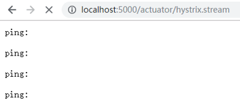
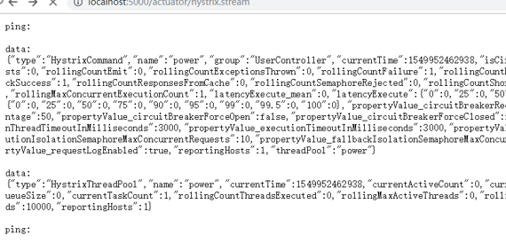
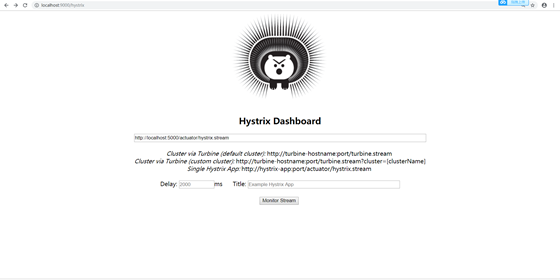
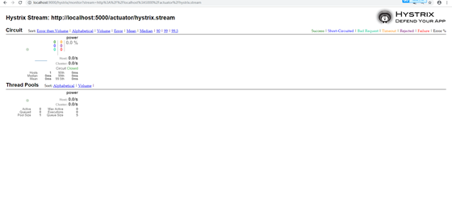

# HystrixDashbord
 Hystrix（注意 是单纯的Hystrix） 提供了对于微服务调用状态的监控（信息）， 但是，需要结合spring-boot-actuator 模块一起使用.
 
 在包含了 hystrix的项目中， 引入依赖：
```maven
<dependency> 
    <groupId>org.springframework.boot</groupId> 
    <artifactId>spring-boot-starter-actuator</artifactId> 
</dependency>
```
这时候访问/actuator/hystrix.stream 便可以看见微服务调用的状态信息



（需要注意的是， 在Spring Finchley 版本以前访问路径是/hystrix.stream，如果是Finchley 的话 还得在yml里面加入配置：
```yml
management: 
  endpoints: 
    web: 
      exposure: 
        include: '*'
```
因为spring Boot 2.0.x以后的Actuator **只暴露了info 和health 2个端点**,这里我们把所有端点开放。
） 
这里会发现没有任何信息， 因为我刚启动项目， 我们来调用几个接口看看:
 


这些密密麻麻的，就是我们的微服务监控的信息， 但是， 这种json格式的字符串， 难免会让人不太好阅读， 所以， 这时候需要我们的主角登场了：

HystrixDashbord

## 什么是HystrixDashbord/如何使用？
Dashbord 翻译一下的意思是 仪表盘， 顾名思义， hystrix监控信息的仪表盘， 那这个仪表盘到底是什么样子呢? 以及 怎么来使用呢？
我们新建一个项目 加入依赖:
```maven
<dependency> 
    <groupId>org.springframework.cloud</groupId> 
    <artifactId>spring-cloud-starter-netflix-hystrix-dashboard</artifactId> 
</dependency>
```
在spring boot启动类上面加入注解EnableHystrixDashboard
```java
@SpringBootApplication
@EnableHystrixDashboard
public class AppHystrixDashbord {

    public static void main(String[] args) {
        SpringApplication.run(AppHystrixDashbord.class);
    }

}
```
启动项目后访问/hystrix能看见一个类似tomcat的首页:



在中间这个输入框中，填入需要监控的微服务的监控地址 也就是/actuator/hystrix.stream点击按钮，就会跳转到仪表盘页面：
 


当然， 如果你微服务没有发生过调用， 那么这个页面就会一直显示加载中， 我这里是调用后的效果。

## Hystrix仪表盘解释：
实心圆：共有两种含义。它通过颜色的变化代表了实例的健康程度，它的健康度从绿色到红色，再到橙色。

该实心圆除了颜色的变化之外，它的大小也会根据实例的请求流量发生变化，流量越大该实心圆就越大。所以通过该实心圆的展示，就可以在大量的实例中快速的发现故障实例和高压力实例。

曲线：用来记录2分钟内流量的相对变化，可以通过它来观察到流量的上升和下降趋势。

整图解释：

