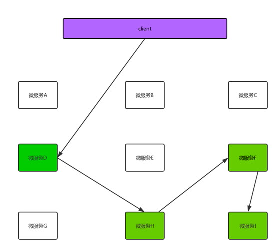
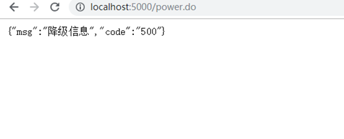

# hystrix与feign整合hystrix

**注意：**
feign 默认是支持hystrix的

# hystrix断路器:
## hystrix是什么？
 Hystrix是一个**用于处理分布式系统的延迟和容错的开源库**，在分布式系统里，许多依赖不可避免的会调用失败，比如超时、异常等，Hystrix能够保证在一个依赖出问题的情况下，不会导致整体服务失败，避免级联故障，以提高分布式系统的弹性。

“断路器”本身是一种开关装置，当某个服务单元发生故障之后，通过断路器的故障监控（类似熔断保险丝），向调用方返回一个符合预期的、可处理的备选响应（FallBack），而不是长时间的等待或者抛出调用方无法处理的异常，这样就保证了服务调用方的线程不会被长时间、不必要地占用，从而避免了故障在分布式系统中的蔓延，乃至雪崩。

## 大型项目中会出现的一些问题:
  典型的一个案例就是服务血崩效应 我们来看一张图:


 
  上图是一条微服务调用链， 正常的情况我们就不必在讨论了， 我们来说一下非正常情况， 假设现在 微服务H 响应时间过长,或者微服务H直接down机了如图:


## 雪崩
  来看下上图， 我们联想一下上图， 如果发生这种情况， 也就是说所有发给微服务D的请求 都会被卡在微服务H那， 就会导致线程一直累计在这里， 那么**其他的微服务（比如A，B，C...） 就没有可用线程了， 导致整个服务器崩溃**，这就是服务雪崩。
 导致服务雪崩的情况我们来总结一下，再看看怎么解决：
程序BUG，数据不匹配，响应时间过长，服务不可用等等.....

针对上面的问题，我们来看看有哪些解决方案 :
- 服务限流
- 超时监控
- 服务熔断
- 服务降级

## 降级，超时 :
 我们先来解释一下降级,降级是当我们的某个微服务响应时间过长，或者不可用了，讲白了也就是那个微服务调用不了了，我们不能吧错误信息返回出来，或者让他一直卡在那里，所以要在准备一个对应的策略（一个方法）当发生这种问题的时候我们直接调用这个方法来快速返回这个请求，不让他一直卡在那 。

讲了这么多,我们来看看具体怎么操作:

我们刚刚说了某个微服务调用不了了要做降级，也就是说，要在调用方做降级（不然那个微服务都down掉了再做降级也没什么意义了） 比如说我们 user 调用power 那么就在user 做降级

 先把hystrix的依赖加入:
```maven
<dependency>
    <groupId>org.springframework.cloud</groupId>
    <artifactId>spring-cloud-starter-netflix-hystrix</artifactId>
</dependency>
```
  启动类加入注解@EnableHystrix 或者@EnableCircuitBreaker(他们之间是一个继承关系，2个注解所描述的内容是完全一样的，可能看大家之前都是EnableXXX（比如eureka）这里专门再写一个EnableHystrix方便大家记吧)

然后在我们的controller上面加入注解@HystrixCommand(fallbackMethod就是我们刚刚说的方法的名字)
```java
@RequestMapping("/feignPower.do")
@HystrixCommand(fallbackMethod = "fallbackMethod")
public Object feignPower(String name){
    return powerServiceClient.power();
}
```
fallbackMethod：
这个R不重要，你看做一个Map就好了， 是我封装的一个返回值的类。
```java
public Object fallbackMethod(String name){
    System.out.println(name);
    return R.error("降级信息");
}
```
这里的这个降级信息具体内容得根据业务需求来， 比如说返回一个默认的查询信息，亦或是系统维护（因为有可能要暂时关闭某个微服务而吧资源让给其他服务）等等...

我们在power代码里面模拟一个异常
```java
@RequestMapping("/power.do")
public Object power(String name) throws Exception{
    Map<String,Object> map = new HashMap<String, Object>();
    map.put("power1","value");
    if (name==null)
        throw new Exception();

    return map;
}
```
然后启动服务调用一下看看结果：
 


我们来测试一下超时:
我们改动一下power的代码 让他故意等待一回儿（模拟响应超时）
```java
@RequestMapping("/power.do")
public Object power(String name) throws Exception{
    Map<String,Object> map = new HashMap<String, Object>();
    map.put("power1","value");
    Thread.sleep(2000);

    return map;
}
```
这里我就把返回值内容改一下方便大家看:
 


可能有些同学有疑问， 我这里什么都没干， 就让他休眠了一下 ， 怎么就知道我这里超时了呢？

因为hystrix他有默认的超时监听，当你这个**请求默认超过了1秒钟就会超时** 当然，这个可以配置的，至于怎么配置，待会儿我会把一些配置统一列出来

讲了这么多， 这个降级到底有什么用呢？ 

### 降级作用：
第一， 他可以**监听你的请求有没有超时**，第二，**报错了他这里直接截断了没有让请求一直卡在这里**

其实降级还有一个好处， 就是当你的系统马上迎来大量的并发(双十一秒杀这种 或者促销活动)  这时候如果发现系统马上承载不了这么大的并发时， 可以考虑先关闭一些不重要的微服务(在降级方法里面返回一个比较友好的信息)，吧资源让给主微服务,总结一下就是

**整体资源快不够了，忍痛将某些服务先关掉，待渡过难关，再开启回来。**

## 熔断,限流:
 讲完降级，我们来讲讲熔断，其实熔断，就好像我们生活中的跳闸一样， 比如说你的电路出故障了，为了防止出现大型事故 这里直接切断了你的电源以免意外继续发生, 把这个概念放在我们程序上也是如此， **当一个微服务调用多次出现问题时**（**默认是10秒内20次**当然 这个也能配置），hystrix就会采取熔断机制，不再继续调用你的方法（会在默认5秒钟内和电器短路一样，5秒钟后会试探性的先关闭熔断机制，但是如果这时候再失败一次{之前是20次} 那么又会重新进行熔断） 而是直接调用降级方法，这样就一定程度上避免了服务雪崩的问题

### 限流
 限流， 顾名思义， 就是限制你某个微服务的使用量（可用线程）

hystrix通过**线程池的方式来管理你的微服务调用**，他默认是**一个线程池**（10大小） 管理你的所有微服务，你可以给某个微服务开辟新的线程池：
```java
@RequestMapping("/feignOrder.do")
@HystrixCommand(fallbackMethod = "fallbackOrderMethod"  ,
        threadPoolKey = "order",
        threadPoolProperties ={@HystrixProperty(name = "coreSize",value = "2")
                              ,@HystrixProperty(name = "maxQueueSize",value = "1"})
public Object feignOrder(String name){
    System.out.println(1);
    return restTemplate.getForObject(ORDERURL+"/order.do",Object.class);
}
```
 threadPoolKey 就是在线程池唯一标识， hystrix 会拿你这个标识去计数，看线程占用是否超过了， **超过了就会直接降级该次调用**

比如， 这里coreSize给他值为2 那么假设你这个方法调用时间是3s执行完， 那么在3s内如果有超过2个请求进来的话， 剩下的请求则全部降级


# feign整合hystrix:
feign 默认是支持hystrix的， 但是在Spring - cloud Dalston 版本之后就默认关闭了， 因为不一定业务需求要用的到，
所以现在要使用首先得打开他，在yml文件加上如下配置:
```yml
feign:
  hystrix:
    enabled: true
```
加上配置之后降级方法怎么写呢？
```java
@FeignClient(value = "SERVER-POWER",fallback = PowerServiceFallBack.class)
public interface PowerServiceClient {

    @RequestMapping("/power.do")
    public Object power(@RequestParam("name") String name);

}
```
在feign客户端的注解上 有个属性叫fallback 然后指向一个类
PowerServiceFallBack 类：
```java
@Component
public class PowerServiceFallBack implements PowerServiceClient {
    @Override
    public Object power(String name) {
        return R.error("测试降级");
    }
}
```
这样子，方法降级就写好了

当然 可能你有这种需求， 需要拿到具体的错误信息， 那么可以这样写:
```java
@Component
public class PowerServiceClientFallBackFactory implements FallbackFactory<PowerServiceClient> {
    @Override
    public PowerServiceClient create(Throwable throwable) {
        return new PowerServiceClient() {
            @Override
            public Object power(String name) {
                String message = throwable.getMessage();
                return R.error("feign降级");
            }
        };
    }
}
```
客户端指定一个fallbackFactory就好了
```java
@FeignClient(value = "SERVER-POWER",fallbackFactory = PowerServiceClientFallBackFactory.class)
public interface PowerServiceClient {

    @RequestMapping("/power.do")
    public Object power(@RequestParam("name") String name);

}
```

这个message 就是拿到的错误信息
至此， 就完成了feign与hystrix的整合


# hystrix相关配置:

## Execution相关的属性的配置
hystrix.command.default.execution.isolation.strategy 隔离策略，默认是Thread, 可选Thread｜ Semaphor

hystrix.command.default.execution.isolation.thread.timeoutInMilliseconds 命令执行超时时 间，默认1000ms

hystrix.command.default.execution.timeout.enabled 执行是否启用超时，默认启用true

hystrix.command.default.execution.isolation.thread.interruptOnTimeout 发生超时是是否中断， 默认true

hystrix.command.default.execution.isolation.semaphore.maxConcurrentRequests 最大并发请求 数，默认10，该参数当使用ExecutionIsolationStrategy.SEMAPHORE策略时才有效。如果达到最大并发请求 数，请求会被拒绝。理论上选择semaphore size的原则和选择thread size一致，但选用semaphore时每次执行 的单元要比较小且执行速度快（ms级别），否则的话应该用thread。 semaphore应该占整个容器（tomcat）的线程池的一小部分。 Fallback相关的属性 这些参数可以应用于Hystrix的THREAD和SEMAPHORE策略

hystrix.command.default.fallback.isolation.semaphore.maxConcurrentRequests 如果并发数达到 该设置值，请求会被拒绝和抛出异常并且fallback不会被调用。默认10

hystrix.command.default.fallback.enabled 当执行失败或者请求被拒绝，是否会尝试调用

hystrixCommand.getFallback() 。默认true

## Circuit Breaker相关的属性 
hystrix.command.default.circuitBreaker.enabled 用来跟踪circuit的健康性，如果未达标则让request短路。默认true

hystrix.command.default.circuitBreaker.requestVolumeThreshold 一个rolling window内最小的请 求数。如果设为20，那么当一个rolling window的时间内（比如说1个rolling window是10秒）收到19个请求， 即使19个请求都失败，也不会触发circuit break。默认20

hystrix.command.default.circuitBreaker.sleepWindowInMilliseconds 触发短路的时间值，当该值设 为5000时，则当触发circuit break后的5000毫秒内都会拒绝request，也就是5000毫秒后才会关闭circuit。 默认5000

hystrix.command.default.circuitBreaker.errorThresholdPercentage错误比率阀值，如果错误率>=该 值，circuit会被打开，并短路所有请求触发fallback。默认50

hystrix.command.default.circuitBreaker.forceOpen 强制打开熔断器，如果打开这个开关，那么拒绝所 有request，默认false

hystrix.command.default.circuitBreaker.forceClosed 强制关闭熔断器 如果这个开关打开，circuit将 一直关闭且忽略circuitBreaker.errorThresholdPercentage

## Metrics相关参数

hystrix.command.default.metrics.rollingStats.timeInMilliseconds 设置统计的时间窗口值的，毫秒 值，circuit break 的打开会根据1个rolling window的统计来计算。若rolling window被设为10000毫秒， 则rolling window会被分成n个buckets，每个bucket包含success，failure，timeout，rejection的次数 的统计信息。默认10000

hystrix.command.default.metrics.rollingStats.numBuckets 设置一个rolling window被划分的数 量，若numBuckets＝10，rolling window＝10000，那么一个bucket的时间即1秒。必须符合rolling window  % numberBuckets == 0。默认10

hystrix.command.default.metrics.rollingPercentile.enabled 执行时是否enable指标的计算和跟踪， 默认true

hystrix.command.default.metrics.rollingPercentile.timeInMilliseconds 设置rolling  percentile window的时间，默认60000

hystrix.command.default.metrics.rollingPercentile.numBuckets 设置rolling percentile  window的numberBuckets。逻辑同上。默认6

hystrix.command.default.metrics.rollingPercentile.bucketSize 如果bucket size＝100，window ＝10s，若这10s里有500次执行，只有最后100次执行会被统计到bucket里去。增加该值会增加内存开销以及排序 的开销。默认100

hystrix.command.default.metrics.healthSnapshot.intervalInMilliseconds 记录health 快照（用 来统计成功和错误绿）的间隔，默认500ms


## Request Context 相关参数

hystrix.command.default.requestCache.enabled 默认true，需要重载getCacheKey()，返回null时不 缓存

 hystrix.command.default.requestLog.enabled 记录日志到HystrixRequestLog，默认true
 
 Collapser Properties 相关参数
 
 hystrix.collapser.default.maxRequestsInBatch 单次批处理的最大请求数，达到该数量触发批处理，默认 Integer.MAX_VALU
 
 hystrix.collapser.default.timerDelayInMilliseconds 触发批处理的延迟，也可以为创建批处理的时间 ＋该值，默认10
 
 hystrix.collapser.default.requestCache.enabled 是否对HystrixCollapser.execute() and  HystrixCollapser.queue()的cache，默认true
 
## ThreadPool 相关参数
 
 线程数默认值10适用于大部分情况（有时可以设置得更小），如果需要设置得更大，那有个基本得公式可以 follow： requests per second at peak when healthy × 99th percentile latency in seconds + some  breathing room 每秒最大支撑的请求数 (99%平均响应时间 + 缓存值) 比如：每秒能处理1000个请求，99%的请求响应时间是60ms，那么公式是： 1000 （0.060+0.012）
 
 基本得原则时保持线程池尽可能小，他主要是为了释放压力，防止资源被阻塞。 当一切都是正常的时候，线程池一般仅会有1到2个线程激活来提供服务
 
 hystrix.threadpool.default.coreSize 并发执行的最大线程数，默认10
 
 hystrix.threadpool.default.maxQueueSize BlockingQueue的最大队列数，当设为－1，会使用
 
 SynchronousQueue，值为正时使用LinkedBlcokingQueue。该设置只会在初始化时有效，之后不能修改threadpool的queue size，除非reinitialising thread executor。默认－1。
 
 hystrix.threadpool.default.queueSizeRejectionThreshold 即使maxQueueSize没有达到，达到 queueSizeRejectionThreshold该值后，请求也会被拒绝。因为maxQueueSize不能被动态修改，这个参数将允 许我们动态设置该值。if maxQueueSize == -1，该字段将不起作用 hystrix.threadpool.default.keepAliveTimeMinutes 如果corePoolSize和maxPoolSize设成一样（默认 实现）该设置无效。如果通过plugin（https://github.com/Netflix/Hystrix/wiki/Plugins）使用自定义 实现，该设置才有用，默认1.
 hystrix.threadpool.default.metrics.rollingStats.timeInMilliseconds 线程池统计指标的时间，默 认10000
 
 hystrix.threadpool.default.metrics.rollingStats.numBuckets 将rolling window划分为n个 buckets，默认10

