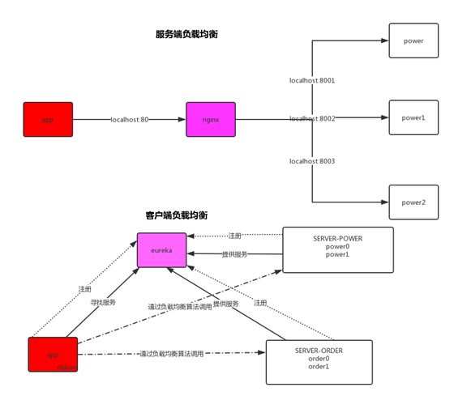
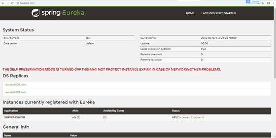
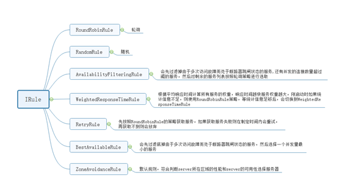

# ribbon与feign负载均衡

# ribbon:
## ribbon是什么?
 Spring Cloud Ribbon是基于Netflix Ribbon实现的一套**客户端负载均衡的工具**。
简单的说，Ribbon是Netflix发布的开源项目，主要功能是提供客户端的软件负载均衡算法，将Netflix的中间层服务连接在一起。Ribbon客户端组件提供一系列完善的配置项如连接超时，重试等。简单的说，就是在配置文件中列出Load Balancer（简称LB）后面所有的机器，Ribbon会自动的帮助你基于某种规则（如简单轮询，随机连接等）去连接这些机器。我们也很容易使用Ribbon实现自定义的负载均衡算法。

## 客户端负载均衡？？ 服务端负载均衡?? 
 我们用一张图来描述一下这两者的区别
 


这篇文章里面不会去解释nginx，如果不知道是什么的话，可以先忽略， 先看看这张图

 服务端的负载均衡是一个url先经过一个代理服务器（这里是nginx），然后通过这个代理服务器通过算法（轮询，随机，权重等等..）反向代理你的服务，l来完成负载均衡

 而客户端的负载均衡则是一个请求在客户端的时候已经声明了要调用哪个服务，然后通过具体的负载均衡算法来完成负载均衡
## 如何使用:
 首先，我们还是要引入依赖，但是，eureka已经把ribbon集成到他的依赖里面去了，所以这里不需要再引用ribbon的依赖：
 

要使用ribbon，只需要一个注解：
```java
@Bean
@LoadBalanced
public RestTemplate restTemplate(){
    RestTemplate restTemplate = new RestTemplate();
    return restTemplate;
}
```
在RestTemplate上面加入@LoadBalanced注解，这样子就已经有了负载均衡， 怎么来证明?
我们这里现在启动了eureka集群（3个eureka） 和Power集群（2个power） 和一个服务调用者（User）


但是我们的User仅仅只需要调用服务，不需要注册服务信息，所以需要改一下配置文件：
配置什么意思就不做过多解释了，上面讲eureka的时候有讲到过
```yml
server:
  port: 5000
eureka:

  client:
    registerWithEureka: false
    serviceUrl:
        defaultZone: http://localhost:3000/eureka/,http://eureka3001.com:3001/eureka,http://eureka3002.com:3002/eureka
```
然后启动起来的页面是这样子的
 


我们能看见 微服务名:SERVER-POWER 下面有2个微服务（power-1,power2），现在我们来通过微服务名调用这个服务
这是我们的user项目的调用代码 ：
```java
private static final String URL="http://SERVER-POWER";

@Autowired
private RestTemplate restTemplate;

@RequestMapping("/power.do")
public Object power(){
    return  restTemplate.getForObject(URL+"/power.do",Object.class);
}
```
我们来看看效果:
 


 
这里可能有点抽象，需要你们自己去写才能体会到，但是我们已经完成了负载均衡， 他默认的负载均衡是轮询策略，也就是一人一次，下一节我们来讲一下他还有哪些策略。

## 核心组件：IRule
IRule是什么? 它是Ribbon对于负载均衡策略实现的接口， 怎么理解这句话？ 说白了就是你实现这个接口，就能自定义负载均衡策略， 自定义我们待会儿来讲， 我们先来看看他有哪些默认的实现
 


这里是ribbon负载均衡默认的实现， 由于是笔记的关系，这里不好测试，只能你们自己去测试一下了， 具体怎么使用呢？
看代码:
```java
@Bean
public IRule iRule(){
    return  new RoundRobinRule();
}
```
 在Spring 的配置类里面把对应的实现作为一个Bean返回出去就行了。

## 自定义负载均衡策略：
我们刚刚讲过，只要实现了IRule就可以完成自定义负载均衡，至于具体怎么来，我们先看看他默认的实现
```java
/*
 *
 * Copyright 2013 Netflix, Inc.
 *
 * Licensed under the Apache License, Version 2.0 (the "License");
 * you may not use this file except in compliance with the License.
 * You may obtain a copy of the License at
 *
 * http://www.apache.org/licenses/LICENSE-2.0
 *
 * Unless required by applicable law or agreed to in writing, software
 * distributed under the License is distributed on an "AS IS" BASIS,
 * WITHOUT WARRANTIES OR CONDITIONS OF ANY KIND, either express or implied.
 * See the License for the specific language governing permissions and
 * limitations under the License.
 *
 */
package com.netflix.loadbalancer;

import java.util.List;
import java.util.Random;

import com.netflix.client.config.IClientConfig;

/**
 * A loadbalacing strategy that randomly distributes traffic amongst existing
 * servers.
 * 
 * @author stonse
 * 
 */
public class RandomRule extends AbstractLoadBalancerRule {
    
    Random rand;

    public RandomRule() {
        rand = new Random();
    }

    /**
     * Randomly choose from all living servers
     */
    @edu.umd.cs.findbugs.annotations.SuppressWarnings(value = "RCN_REDUNDANT_NULLCHECK_OF_NULL_VALUE")
    public Server choose(ILoadBalancer lb, Object key) {
        if (lb == null) {
            return null;
        }
        Server server = null;

        while (server == null) {
            
            if (Thread.interrupted()) {
                return null;
            }
            
            List<Server> upList = lb.getReachableServers();
          
            List<Server> allList = lb.getAllServers();
			
            int serverCount = allList.size();
            if (serverCount == 0) {
                /*
                 * No servers. End regardless of pass, because subsequent passes
                 * only get more restrictive.
                 */
                return null;
            }
		
            int index = rand.nextInt(serverCount);
            server = upList.get(index);

            if (server == null) {
                /*
                 * The only time this should happen is if the server list were
                 * somehow trimmed. This is a transient condition. Retry after
                 * yielding.
                 */
                Thread.yield();
                continue;
            }

            if (server.isAlive()) {
                return (server);
            }

            // Shouldn't actually happen.. but must be transient or a bug.
            server = null;
            Thread.yield();
        }

        return server;

    }

   @Override
   public Server choose(Object key) {
      return choose(getLoadBalancer(), key);
   }

   @Override
   public void initWithNiwsConfig(IClientConfig clientConfig) {
      // TODO Auto-generated method stub
      
   }
}
```

我们来看看这个类AbstractLoadBalancerRule
```java
public abstract class AbstractLoadBalancerRule implements IRule, IClientConfigAware {

    private ILoadBalancer lb;
        
    @Override
    public void setLoadBalancer(ILoadBalancer lb){
        this.lb = lb;
    }
    
    @Override
    public ILoadBalancer getLoadBalancer(){
        return lb;
    }      
}
```
这里我们能发现，还是我们上面所说过的 实现了IRule就能够自定义负载均衡即使是他默认的策略也实现了IRule
我们可以直接把代码copy过来改动一点:

```java

import com.netflix.client.config.IClientConfig;
import com.netflix.loadbalancer.AbstractLoadBalancerRule;
import com.netflix.loadbalancer.ILoadBalancer;
import com.netflix.loadbalancer.Server;

import java.util.List;
import java.util.Random;

public class LubanRule extends AbstractLoadBalancerRule {

    //原来是纯随机策略 我们现在改为。 如果一个下标已经被随机到了2次了，第三次还是同样的下标的话，那就再随机一次
    Random rand;

    private int lastIndex = -1;
    private int nowIndex = -1;
    private int skipIndex = -1;

    public LubanRule() {
        rand = new Random();
    }

    /**
     * Randomly choose from all living servers
     */
    public Server choose(ILoadBalancer lb, Object key) {
        if (lb == null) {
            return null;
        }
        Server server = null;

        while (server == null) {
            if (Thread.interrupted()) {
                return null;
            }
            List<Server> upList = lb.getReachableServers();
            List<Server> allList = lb.getAllServers();

            int serverCount = allList.size();
            if (serverCount == 0) {
                /*
                 * No servers. End regardless of pass, because subsequent passes
                 * only get more restrictive.
                 */
                return null;
            }


            int index = rand.nextInt(serverCount);
            System.out.println("当前下标为:"+index);
            if (skipIndex>=0&&index == skipIndex) {
                System.out.println("跳过");
                index = rand.nextInt(serverCount);
                System.out.println("跳过后的下标:"+index);
            }
            skipIndex=-1;

            nowIndex = index;
            if (nowIndex == lastIndex) {
                System.out.println("下一次需要跳过的下标"+nowIndex);
                skipIndex = nowIndex;
            }
            lastIndex = nowIndex;
            server = upList.get(index);

            if (server == null) {
                /*
                 * The only time this should happen is if the server list were
                 * somehow trimmed. This is a transient condition. Retry after
                 * yielding.
                 */
                Thread.yield();
                continue;
            }

            if (server.isAlive()) {
                return (server);
            }

            // Shouldn't actually happen.. but must be transient or a bug.
            server = null;
            Thread.yield();
        }

        return server;

    }

    @Override
    public Server choose(Object key) {
        return choose(getLoadBalancer(), key);
    }

    @Override
    public void initWithNiwsConfig(IClientConfig clientConfig) {
        // TODO Auto-generated method stub

    }

}
```
这里我们就把自己写的Rule给new出来交给spring 就好了
```java
@Bean
public IRule iRule(){
    return new LubanRule();
}
```

# feign负载均衡：
## feign是什么 :
 Feign是一个声明式WebService客户端。使用Feign能让编写Web Service客户端更加简单, 它的使用方法是定义一个接口，然后在上面添加注解，同时也支持JAX-RS标准的注解。Feign也支持可拔插式的编码器和解码器。Spring Cloud对Feign进行了封装，使其支持了Spring MVC标准注解和HttpMessageConverters。Feign可以与Eureka和Ribbon组合使用以支持负载均衡。
## feign 能干什么：
**Feign旨在使编写Java Http客户端变得更容易。** 前面在使用**Ribbon+RestTemplate**时，利用RestTemplate对http请求的封装处理，形成了一套模版化的调用方法。但是在实际开发中，由于对服务依赖的调用可能不止一处，往往一个接口会被多处调用，所以通常都会针对每个微服务自行封装一些客户端类来包装这些依赖服务的调用。所以，Feign在此基础上做了进一步封装，由他来帮助我们定义和实现依赖服务接口的定义。在Feign的实现下，我们只需创建一个接口并使用注解的方式来配置它(以前是Dao接口上面标注Mapper注解,现在是一个微服务接口上面标注一个Feign注解即可)，即可完成对服务提供方的接口绑定，简化了使用Spring cloud Ribbon时，自动封装服务调用客户端的开发量。

## 如何使用？
在客户端(User)引入依赖：
```maven
<dependency>
    <groupId>org.springframework.cloud</groupId>
    <artifactId>spring-cloud-starter-openfeign</artifactId>
</dependency>
```
在启动类上面加上注解:@EnableFeignClients
然后编写一个service类加上@FeignClient()注解 参数就是你的微服务名字
```java
@FeignClient("SERVER-POWER")
public interface PowerServiceClient {

    @RequestMapping("/power.do")
    public Object power();

}
```
下面是调用代码：

```java
import com.luban.service.OrderServiceClient;
import com.luban.service.PowerServiceClient;
import org.springframework.beans.factory.annotation.Autowired;
import org.springframework.web.bind.annotation.RequestMapping;
import org.springframework.web.bind.annotation.RestController;
import org.springframework.web.client.RestTemplate;


@RestController
public class UserController {

    private static final String URL="http://SERVER-POWER";

    @Autowired
    private RestTemplate restTemplate;

    @Autowired
    PowerServiceClient powerServiceClient;


    @RequestMapping("/power.do")
    public Object power(){
        return  restTemplate.getForObject(URL+"/power.do",Object.class);
    }

    @RequestMapping("/feignPower.do")
    public Object feignPower(){
        return powerServiceClient.power();
    }
}
```
这里拿了RestTemplate做对比 可以看看2者区别

## Feign集成了Ribbon
**利用Ribbon维护了服务列表信息，并且融合了Ribbon的负载均衡配置**，也就是说之前自定义的负载均衡也有效，这里需要你们自己跑一遍理解一下。而与Ribbon不同的是，通过feign只需要定义服务绑定接口且以声明式的方法，优雅而简单的实现了服务调用
