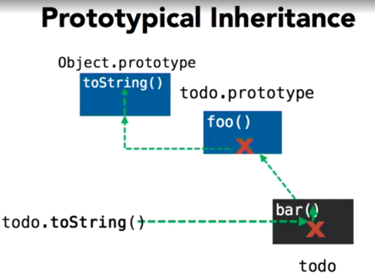

## TypeScript Essential Training

### Introduction

#### What you should know before watching this course

typescript是javascript的超集，扩展了新特性和语法


#### Introducing TypeScript

typescript是javascript的超集，添加了新特性（静态类型）

可以在需要的时候使用**静态类型**，也可以在需要的时候使用**动态类型**


#### Writing your first TypeScript function

```typescript
function speak(value: string): string {
    console.log(value);
    return value;
}

var greeted = "world";
var greeting = "Hello, ";
var whatToSay: string = greeting + greeted;

speak(whatToSay);

```


### 1.Configuring Your Environment

#### Choosing your TypeScript editor

VS code | webstorm | ts cli


#### Creating a TypeScript project

```
├── app.ts
├── index.html
└── tsconfig.json
```

```json
{
    "compilerOptions": {
        "target": "es5"
    }
}
```

tsc运行时，会在根目录下找tsconfig.json，如果找到了，会把这个目录当作一个project，这样就不需要指定编译哪个文件了，只需要`tsc -w`


### 2.ES6 Language Features

#### Default parameters

```typescript
var container = document.getElementById('container');

function countdown(initial, final = 0, interval = 1) {

    var current = initial;

    while (current > final) {
        container.innerHTML = current;
        current -= interval;
    }

}

countdown(10, 5, 2)
```


#### Template strings

```typescript
var container = document.getElementById('container');

var todo = {
    id: 123,
    name: 'Pick up drycleaning',
    completed: true
}

container.innerHTML = `
<div todo='${todo.id}' class="list-group-item}">
    <i class="${todo.completed ? "" : "hidden"} text-success glyphicon glyphicon-ok"></i>
    <span class="name">${todo.name}</span>
</div>
`
```


#### Let and const

```typescript
var container = document.getElementById('container');

for (var x = 0; x <= 5; x++) {
    const counter = x;
    // counter = 1; error const不能改变
}

// console.log(counter); error 外面不能访问
```


#### For...of loops

```typescript
var array = [
    "Pick up drycleaning",
    "Clean Batcave",
    "Save Gotham"
];

for (var value of array) {
    console.log(value);
}
```


#### Lambdas

```typescript
var container = document.getElementById('container');

function Counter(el) {

    this.count = 0;

    el.innerHTML = this.count;

    el.addEventListener('click',
        (event) => el.innerHTML = (this.count += 1))
}

new Counter(container);

var filtered = [1, 2, 3].filter(x => x > 0)
```


#### Destructuring

```typescript
// example 1
let array = [1, "1", false]
let [n, str, bool] = array;

// example 2
let a = 1;
let b = 2;
[a, b] = [b, a] // 交换值

// example 3
let todo = {
    id1: 123,
    title1: "Pick"
}
let {id1, title1} = todo;

// example 4
function getTodo() {
    return {
        id: 123,
        title: "Pick"
    };
}

let {title: myTitle, id} = getTodo();

// example 4
function countdown({
                       initial,
                       final: final = 0,
                       interval: interval = 1,
                       initial: current
                   }) {

    while (current > final) {
        console.log(current);
        current -= interval;
    }

}
```


#### The spread operator

```typescript
function calculate(action, ...values) {
    var total = 0;

    for (var value of values) {
        switch (action) {
            case 'add':
                total += value;
                break;

            case 'subtract':
                total -= value;
                break;
        }
    }

    return total;
}

calculate('add', 1, 2, 3, 4, 5)


var source = [3, 4, 5]
var target = [1, 2, ...source, 6, 7]


var list = [1, 2, 3]
var toAdd = [4, 5, 6];

list.push(...toAdd)
```


#### Computed properties

```typescript
const osPrefix = 'os_';

// 动态的属性名字
var support = {
    [osPrefix + 'Windows']: isSupported('Windows'),
    [osPrefix + 'iOS']: isSupported('iOS'),
    [osPrefix + 'Android']: isSupported('Android'),
}

function isSupported(os) {
    return Math.random() >= 0.5;
}

let v = support["os_Windows"]
```


### 3.Type Fundamentals

#### Introducing JavaScript types

不可变类型：
- boolean
- number
- string

- null / undefined
- object (可以想像成一个map，string作为key，内容可以改变)
  - prototype (prototypical inheritance)
    - function
    - array []
  - regex
  - object literals {name: "wang", age: 3}

```javascript
var animal = {
    name: "Fido",
    species: "Dog",
    age: 5,
    speak: function () {
        console.log('Woof!');
    }
}
```


#### Understanding type inference

类型推断：即使完全是js的语法，ts也能推断出一些类型

```typescript
var animal = {
    name: "Fido",
    species: "Dog",
    age: 5,
    speak: function () {
        console.log('Woof!');
    }
}
// animal.name = 1; ts报类型错误


// 自动类型推断出了，返回值为number
function func() {
    return 1;
}


// 这种函数，ts没法直接推断出具体类型
function totalLength(x, y) {
    const total = x.length + y.lengt;
    return total;
}
```


#### Specifying JavaScript types

```typescript
function totalLength(x: any[], y: string): number {
    const total: number = x.length + y.length;
    return total;
}
```


#### Specifying function parameter types

union type，组合类型

```typescript
function totalLength(x: (string | any[]), y: (string | any[])): number {

    const total: number = x.length + y.length;

    x.slice(0)

    if (x instanceof Array) {
        x.push('TypeScript')
    }

    if (x instanceof String) {
        x.substr(0)
    }

    return total;
}
```


#### Adding function overloads

方法重载，ts特有的方式

```typescript
function totalLength(x: string, y: string): number
function totalLength(x: any[], y: any[]): number
function totalLength(x: (string | any[]), y: (string | any[])): number {
    var total: number = x.length + y.length;

    x.slice(0)

    if (x instanceof Array) {
        x.push('TypeScript')
    }

    if (x instanceof String) {
        x.substr(0)
    }

    return total;
}
```


### 4.Custom Types

#### Defining custom types with interfaces

- interface
- class
- enum

由于ts只在编译时做检查，在运行时是纯js，所以如果调后台api，返回的类型变了，ts无可奈何

```typescript
interface Todo {
    name: string;
    completed?: boolean; // make it optional
}

interface ITodoService {
    add(todo: Todo): Todo;

    delete(todo: Todo): void;

    getAll(): Todo[];

    getById(todoId: number): Todo;
}

const todo1: Todo = {
    name: "Pick up drycleaning"
};

const todo2 = <Todo>{
    name: "Pick up drycleaning"
};
```


#### Using interfaces to describe functions

```typescript
interface jQuery {
    (selector: string): HTMLElement;

    version: number;
}


var $ = <jQuery>function (selector: string) {
    // Find DOM element
}

$.version = 1.18

var container = $('#container');
```


#### Extending interface definitions

js的function的重复会导致第二个定义的覆盖第一个定于的；但是ts的interface重复定义没有问题，会把之后的定义都附加到第一个定义里面；这样就可以不修改**别人**的原代码，而扩展了功能

```typescript
var $ = <jQuery>function (selector: string) {
    // Find DOM element
}

$.version = 1.18;


interface Todo {
    name: string;
    completed?: boolean;
}

interface jQuery {
    (selector: (string | any)): jQueryElement;

    fn: any;
    version: number;
}

interface jQueryElement {
    data(name: string): any;

    data(name: string, data: any): jQueryElement;
}

interface jQueryElement {
    todo(): Todo;

    todo(todo: Todo): jQueryElement;
}

$.fn.todo = function (todo?: Todo): Todo {

    if (todo) {
        $(this).data('todo', todo)
    } else {
        return $(this).data('todo');
    }

}

var todo = {name: "Pick up drycleaning"};
var container = $('#container');
container.data('todo', todo)
var savedTodo = container.data('todo');

container.todo(todo)
```


#### Defining constant values with enums

```typescript
interface Todo {
    name: string;
    state: TodoState;
}

enum TodoState {
    New = 1,
    Active,
    Complete,
    Deleted
}

let todo: Todo = {
    name: "Pick up drycleaning",
    state: TodoState.New
}

function delete1(todo: Todo) {
    if (todo.state != TodoState.Complete) {
        throw "Can't delete incomplete task!"
    }
}
```


#### Defining anonymous types

```typescript
let todo: { name: string };

// todo = {age: 41} 报错，因为没有name属性

// todo = {name: "w", age: 41} 报错，需要只有一个name属性

// 所有有length属性的都可以作为合法参数，string array等等
function totalLength(x: { length: number }, y: { length: number }): number {
    
    const total: number = x.length + y.length;
    return total;
}
```


### 5.Classes

#### Understanding prototypical inheritance

ts没有引入class的概念，es6引入了class的概念，是语法糖，js仍然是基于**对象**和**原型继承**的（基于原型的编程）

Prototype-based programming 起源于一个特殊的对象：prototype；没有class的概念，只有object实例，js中的object只是一堆动态的属性props

定义一个prototype，然后把实例link到prototype上来，就让实例拥有这个方法了

访问object中的一个member 比测试这个member是否存在更难

js会现在这个object中寻找，没有匹配的，就去prototype中找，再没有就再上去找，一直到root of everything：Object.prototype



Object.prototype是什么时候产生的，然后什么时候link到我的object的：简单版答案：js做的；复杂的答案：很多种方式让prototype被赋值

1. `let todo = {};`，此时js会自动把Object.prototype link 到todo上
2. `function`，此时js会自动把Function.prototype link 到todo上
3. `array`，此时js会自动把Array.prototype link 到todo上
4. `constructor function`，js做了三件事：创建一个对象，把prototype设置为constructor function的prototype，执行这个constructor function（在这个function里可以用`this`来指代这个新object）

```typescript
function TodoService() {
    this.todos = [];
}

TodoService.prototype.getAll = function () {
    return this.todos; // this 指代 对象实例
}

let service = new TodoService();
service.getAll()
```


#### Defining a class

```typescript
/* From the last video...

function TodoService() {
    this.todos = [];
}

TodoService.prototype.getAll = function() {
    return this.todos;
}

*/

class TodoService {

    // strs: string[] = [];

    // 声明、赋值 在同一个表达式里；类的属性，方法的参数 在同一个表达式里
    constructor(private todos: Todo[]) {
        // this.strs = [];
    }

    getAll() {
        return this.todos;
    }
}

interface Todo {
    name: string;
    state: TodoState;
}

enum TodoState {
    New = 1,
    Active,
    Complete,
    Deleted
}
```


#### Applying static properties

很久之前，js中实现静态变量是通过全局命名空间里的变量来实现的

之后，更加广为接受的方式是通过prototype link到object里

```typescript
class TodoService {

    static lastId: number = 0;

    constructor(private todos: Todo[]) {
    }

    add(todo: Todo) {
        var newId = TodoService.getNextId();
    }

    getAll() {
        return this.todos;
    }

    static getNextId() {
        return TodoService.lastId += 1;
    }
}

interface Todo {
    name: string;
    state: TodoState;
}

enum TodoState {
    New = 1,
    Active,
    Complete,
    Deleted
}

var todo = {
    name: "Pick up drycleaning",
    state: TodoState.Complete
}
```


#### Making properties smarter with accessors

```typescript
class TodoService {

    static lastId: number = 0;

    constructor(private todos: Todo[]) {
    }

    add(todo: Todo) {
        var newId = TodoService.getNextId();
    }

    getAll() {
        return this.todos;
    }

    static getNextId() {
        return TodoService.lastId += 1;
    }
}

interface Todo {
    name: string;
    state: TodoState;
}

enum TodoState {
    New = 1,
    Active,
    Complete,
    Deleted
}

class SmartTodo {

    _state: TodoState;

    name: string;

    get state() {
        return this._state;
    }

    set state(newState) {

        if (newState == TodoState.Complete) {

            var canBeCompleted =
                this.state == TodoState.Active
                || this.state == TodoState.Deleted;

            if (!canBeCompleted) {
                throw "Todo must be Active or Deleted in order to be marked Completed"
            }
        }

        this._state = newState;
    }

    constructor(name: string) {
        this.name = name;
    }
}

var todo = new SmartTodo("Pick up drycleaning");

todo.state = TodoState.Complete;

todo.state
```


#### Inheriting behavior from a base class

js和es6不支持创建和继承抽象类，ts支持

```typescript
interface Todo {
    name: string;
    state: TodoState;
}

enum TodoState {
    New = 1,
    Active,
    Complete,
    Deleted
}

class TodoStateChanger {

    constructor(private newState: TodoState) {
    }

    canChangeState(todo: Todo): boolean {
        return !!todo;
    }

    changeState(todo: Todo): Todo {
        if (this.canChangeState(todo)) {
            todo.state = this.newState;
        }

        return todo;
    }

}

class CompleteTodoStateChanger extends TodoStateChanger {

    constructor() {
        super(TodoState.Complete);
    }

    canChangeState(todo: Todo): boolean {
        return super.canChangeState(todo) && (
            todo.state == TodoState.Active
            || todo.state == TodoState.Deleted
        )
    }

}
```


#### Implementing an abstract class

抽象类不能直接实例化，只能被当作base class；抽象类中的抽象方法不能有实现，子类必须实现

```typescript
interface Todo {
    name: string;
    state: TodoState;
}

enum TodoState {
    New = 1,
    Active,
    Complete,
    Deleted
}

abstract class TodoStateChanger {

    constructor(private newState: TodoState) {
    }

    abstract canChangeState(todo: Todo): boolean;

    changeState(todo: Todo): Todo {
        if (this.canChangeState(todo)) {
            todo.state = this.newState;
        }

        return todo;
    }

}

class CompleteTodoStateChanger extends TodoStateChanger {

    constructor() {
        super(TodoState.Complete);
    }

    canChangeState(todo: Todo): boolean {
        return !!todo && (
            todo.state == TodoState.Active
            || todo.state == TodoState.Deleted
        )
    }

}
```


#### Controlling visibility with access modifiers

getter setter需要是同一种权限（都是private或者都不是）

- private 只有类内部可以访问
- protected 只有类内部和子类可以访问
- public 都可以访问，默认的js行为

命名习惯：如果以下划线开头，则说明不希望外部访问

```typescript
interface Todo {
    name: string;
    state: TodoState;
}

enum TodoState {
    New = 1,
    Active,
    Complete,
    Deleted
}


class TodoService {

    private static _lastId: number = 0;

    private get nextId() {
        return TodoService.getNextId();
    }

    private set nextId(nextId) {
        TodoService._lastId = nextId - 1;
    }

    constructor(private todos: Todo[]) {
    }

    add(todo: Todo) {
        var newId = this.nextId;
    }

    private getAll() {
        return this.todos;
    }

    static getNextId() {
        return TodoService._lastId += 1;
    }
}


abstract class TodoStateChanger {

    constructor(protected newState: TodoState) {
    }

    abstract canChangeState(todo: Todo): boolean;

    changeState(todo: Todo): Todo {
        if (this.canChangeState(todo)) {
            todo.state = this.newState;
        }

        return todo;
    }

}

class CompleteTodoStateChanger extends TodoStateChanger {

    constructor() {
        super(TodoState.Complete);
    }

    canChangeState(todo: Todo): boolean {
        return !!todo && (
            todo.state == TodoState.Active
            || todo.state == TodoState.Deleted
        )
    }

}


class SmartTodo {
    constructor(public name: string) {
    }
}
```


#### Implementing interfaces

```typescript
interface ITodoService {
    add(todo: Todo): Todo;

    delete(todoId: number): void;

    getAll(): Todo[];

    getById(todoId: number): Todo;
}

interface Todo {
    id: number;
    name: string;
    state: TodoState;
}

enum TodoState {
    New = 1,
    Active,
    Complete,
    Deleted
}

interface IIdGenerator {
    nextId: number;
}

class TodoService implements ITodoService, IIdGenerator {

    private static _lastId: number = 0;

    get nextId() {
        return TodoService._lastId += 1;
    }

    constructor(private todos: Todo[]) {
    }

    add(todo: Todo): Todo {
        todo.id = this.nextId;

        this.todos.push(todo);

        return todo;
    }

    delete(todoId: number): void {
        var toDelete = this.getById(todoId);

        var deletedIndex = this.todos.indexOf(toDelete);

        this.todos.splice(deletedIndex, 1);
    }

    getAll(): Todo[] {
        var clone = JSON.stringify(this.todos);
        return JSON.parse(clone);
    }

    getById(todoId: number): Todo {
        var filtered =
            this.todos.filter(x => x.id == todoId);

        if (filtered.length) {
            return filtered[0];
        }

        return null;
    }
}
```


### 6.Generics

#### Introducing generics

```typescript
function clone<T>(value: T): T {
    let serialized = JSON.stringify(value);
    return JSON.parse(serialized);
}

clone('Hello!')

clone(123)

let todo: Todo = {
    id: 1,
    name: 'Pick up drycleaning',
    state: TodoState.Active
};

clone(todo)

clone({name: 'Jess'})
```


#### Creating generic classes

ts把js的array看作是泛型类

```typescript
let array: number[] = [1, 2, 3]
let array2: Array<number> = [1, 2, 3]

class KeyValuePair<TKey, TValue> {

    constructor(
        public key: TKey,
        public value: TValue
    ) {
    }
    
}

let pair1 = new KeyValuePair<number, string>(1, 'First');
let pair2 = new KeyValuePair<string, Date>('Second', new Date(Date.now()));
let pair3 = new KeyValuePair(3, 'Third');

class KeyValuePairPrinter<T, U> {

    constructor(private pairs: KeyValuePair<T, U>[]) {
    }

    print() {

        for (let p of this.pairs) {
            console.log(`${p.key}: ${p.value}`)
        }
    }

}

let printer = new KeyValuePairPrinter([pair1, pair3])
printer.print();
```


#### Applying generic constraints

```typescript
function totalLength1<T extends { length: number }>(x: T, y: T) {
    let total: number = x.length + y.length;
    return total;
}

interface IHaveALength {
    length: number;
}

function totalLength<T extends IHaveALength>(x: T, y: T) {
    let total: number = x.length + y.length;
    return total;
}

class CustomArray<T> extends Array<T> {
}

let length1 = totalLength([1, 2, 3], new CustomArray<number>())
```


### 7.Modules

#### Understanding the need for modules in JavaScript

放在一个全局命名空间里是一个坏的习惯，但是js就是这样的，所以现在要用module来做组件之间的分割

js的封装方法大全（模块化的方式）：

- module pattern / revealing module pattern
- 命名空间
- es6 modules / module loaders


#### Organizing your code with namespaces

规则如下：

- 一个namespace可以分开成两份，每一份之间可以正常访问，而不通份之间则需要export才可以访问
- 不同namespace要访问，必须要一个export，一个import才能访问，也可以直接用带namespace的全路径名访问

```typescript
namespace TodoApp.Model {

    export interface Todo {
        id: number;
        name: string;
        state: TodoState;
    }

}

namespace TodoApp.Model {

    export enum TodoState {
        New = 1,
        Active,
        Complete,
        Deleted
    }
}

namespace DataAccess {

    import Model = TodoApp.Model;
    import Todo = Model.Todo;

    export interface ITodoService {
        add(todo: Todo): Todo;

        delete(todoId: number): void;

        getAll(): Todo[];

        getById(todoId: number): Todo;
    }
}
```


#### Using namespaces to encapsulate private members

js设计模式：`Immediately Invoked Function Expression` IIFE

ts的namespace就是IIFE的语法糖

同一个namespace写成了两份，就分别包在了两个不同的IIFE里，所以默认不能互相访问；export关键字就让这些namespace link到了object上，在应用里可以随便访问

```typescript
var jQuery = {
    version: 1.19,
    fn: {}
};

(function defineType($) {
    
    if( $.version < 1.15 )
        throw 'Plugin requires jQuery version 1.15+'
        
    $.fn.myPlugin = function() {
        // my plugin code
    }
    
    
})(jQuery)

/************************/

namespace TodoApp.Model {

    export enum TodoState {
        New = 1,
        Active,
        Complete,
        Deleted
    }
}

// 编译成了js的namespace代码
var TodoApp; // 顶级变量
(function (TodoApp) {
    var Model;
    (function (Model) {
        var TodoState; // 这一行代表export了
        (function (TodoState) {
            TodoState[TodoState["New"] = 1] = "New";
            TodoState[TodoState["Active"] = 2] = "Active";
            TodoState[TodoState["Complete"] = 3] = "Complete";
            TodoState[TodoState["Deleted"] = 4] = "Deleted";
        })(TodoState = Model.TodoState || (Model.TodoState = {}));
    })(Model = TodoApp.Model || (TodoApp.Model = {}));
})(TodoApp || (TodoApp = {}));

/************************/

namespace TodoApp.Model {

    export interface Todo {
        id: number;
        name: string;
        state: TodoState;
    }

}

namespace TodoApp.Model {

    export enum TodoState {
        New = 1,
        Active,
        Complete,
        Deleted
    }
}

/************************/

namespace DataAccess {

    import Model = TodoApp.Model;
    import Todo = Model.Todo;

    // 通过把这个变量挪出来，然后整个代码放在namespace里
    // 既通过namespace的IIFE变成了真正的私有，又因为是namespace，所以不是全局变量，缩小了范围
    // 之前可以访问，ts只警告，不要访问这个变量，现在是直接无法访问了
    let _lastId: number = 0;

    function generateTodoId() {
        return _lastId += 1;
    }


    export interface ITodoService {
        add(todo: Todo): Todo;
        delete(todoId: number): void;
        getAll(): Todo[];
        getById(todoId: number): Todo;
    }

    class TodoService implements ITodoService {

        constructor(private todos: Todo[]) {
        }

        add(todo: Todo): Todo {
            todo.id = generateTodoId();

            this.todos.push(todo);

            return todo;
        }

        delete(todoId: number): void {
            var toDelete = this.getById(todoId);

            var deletedIndex = this.todos.indexOf(toDelete);

            this.todos.splice(deletedIndex, 1);
        }

        getAll(): Todo[] {
            var clone = JSON.stringify(this.todos);
            return JSON.parse(clone);
        }

        getById(todoId: number): Todo {
            var filtered =
                this.todos.filter(x => x.id == todoId);

            if (filtered.length) {
                return filtered[0];
            }

            return null;
        }
    }
}
```


#### Understanding the difference between internal and external modules

- internal modules (namespace): namespace function scope
- external modules: file scope

都需要import和export

ts module import语法有两种，在es6出之前就已经实现了require语法；功能上是一样的，生成的代码也是一样的

- Require(like Node.js)
- es6


#### Switching from internal to external modules

#### Importing modules using CommonJS syntax


> model.ts

```typescript
export interface Todo {
    id: number;
    name: string;
    state: TodoState;
}

export enum TodoState {
    New = 1,
    Active,
    Complete,
    Deleted
}
```

> DataAccess.ts

```typescript
import Model = require('./model');
import Todo = Model.Todo;

// ts暂时不支持这种写法
// import Todo = require('./model').Todo;

let _lastId: number = 0;

function generateTodoId() {
    return _lastId += 1;
}


export interface ITodoService {
    add(todo: Todo): Todo;

    delete(todoId: number): void;

    getAll(): Todo[];

    getById(todoId: number): Todo;
}

class TodoService implements ITodoService {

    constructor(private todos: Todo[]) {
    }

    add(todo: Todo): Todo {
        todo.id = generateTodoId();

        this.todos.push(todo);

        return todo;
    }

    delete(todoId: number): void {
        var toDelete = this.getById(todoId);

        var deletedIndex = this.todos.indexOf(toDelete);

        this.todos.splice(deletedIndex, 1);
    }

    getAll(): Todo[] {
        var clone = JSON.stringify(this.todos);
        return JSON.parse(clone);
    }

    getById(todoId: number): Todo {
        var filtered =
            this.todos.filter(x => x.id == todoId);

        if (filtered.length) {
            return filtered[0];
        }

        return null;
    }
}
```

> tsconfig.json

```json
{
    "compilerOptions": {
        "target": "es5",
        "module": "system"
    }
}
```


#### Importing modules using EXMAScript 2015 syntax

```typescript
import * as Model from './model';
import {Todo as TodoTask, TodoState} from './model';
import './jQuery'

let todo: TodoTask;
```


#### Loading external modules

es6 模块化语法的两个问题：

- 还没有被广泛支持
- 没有载入模块的标准定义

在没有解决这两个问题之前，我们需要一个工具，Module Loader

- 有很多选项可以选择
- ts生成的代码几乎兼容所有的

System.js module loader

- 这个loader 尝试实现 es 倡议的 spec
- 如果幸运的话，等到浏览器原生支持module loader的时候，就可以直接丢掉system.js而不需要修改代码
- 这个loader支持es6语法

在使用module loader之前，我们需要把每一个js文件都写在html里当使用了loader，我们只需要

- 导入loader的js文件就可以了
- 或者 npm install systemjs

```html
<!doctype html>
<html lang="en">

<head>
    <title>TypeScript Todo App</title>
    <link rel="stylesheet" href="//maxcdn.bootstrapcdn.com/bootstrap/3.3.6/css/bootstrap.min.css">
</head>

<body>
<div id="container" class="container">
</div>
<script type="text/javascript" src="//cdnjs.cloudflare.com/ajax/libs/systemjs/0.19.22/system.js"></script>
<script type="text/javascript">
    System.defaultJSExtensions = true;
    System.import('app');
</script>
</body>

</html>
```

> app.ts

```typescript
import { Todo as TodoTask, TodoState } from './model';
import { TodoService } from './DataAccess';


let service = new TodoService([]);

service.add({
    id: 1,
    name: 'Pick up drycleaning',
    state: TodoState.New
});

let todos = service.getAll();

todos.forEach(todo =>
    console.log(`${todo.name} [${TodoState[todo.state]}]`) 
)
```

> tsconfig.json

```json
{
    "compilerOptions": {
        "target": "es5",
        "module": "system"
    }
}
```


### 8.Real-World Application Development

#### Introducing the sample JavaScript application

#### Converting existing JavaScript code to TypeScript

自己的js代码转换成ts的步骤：

- 修改js为ts后缀
- 添加tsconfig.json文件
- 可选：语法使用ts语法


#### Generating declaration files

第三方库，js转成ts的两种方法：

- declare var $: any; // 这么做了之后，没有利用到ts的类型系统，而仅仅是屏蔽了报错
- ts declaration file

> ts declaration file

- 这个文件用来描述一个没有用ts写的js lib，或者描述一个ts项目编译成的js lib分发版；很像c c++的头文件
- ts declaration file是使用ts特殊的语法写成的，但是可以不用学，ts可以自动生成

> tsconfig.json

```json
{
    "compilerOptions": {
        "target": "es5",
        "declaration": true
    }
}
```

`.ts` 生成 `.js` `.d.ts`


#### Referencing third-party libraries

- npm包 tsd
- typings install dt~angular --global
- npm install @types/<package>

```typescript

```

#### Converting to external modules

```typescript

```

#### Debugging TypeScript with source maps

```typescript

```


### 9.Decorators

#### Implementing method decorators

```typescript

```

#### implementing class decorators

```typescript

```

#### Implementing property decorators

```typescript

```

#### Implementing decorator factories

```typescript

```


### Conclusion

#### Next steps
