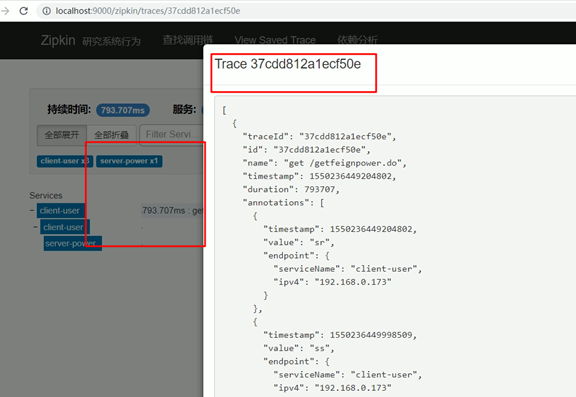
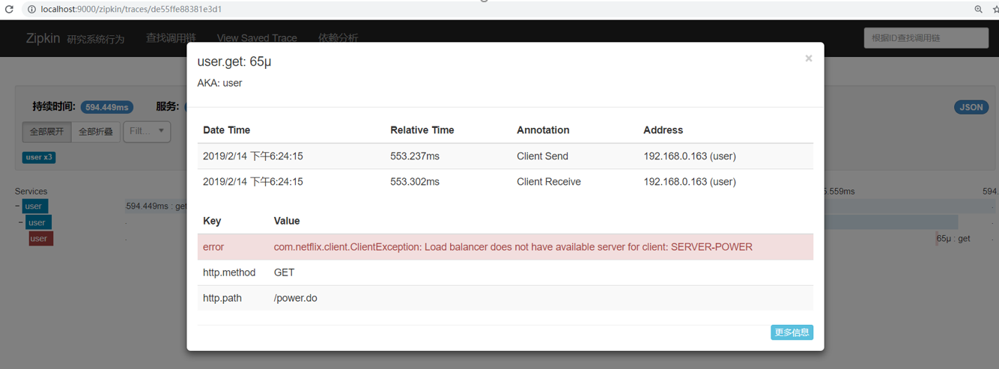
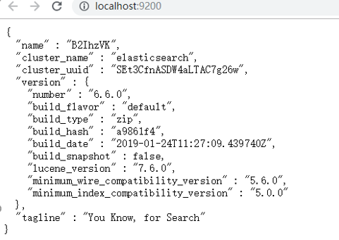

# spring -cloud -sleuth
## 分布式链路跟踪介绍

本节课来讨论微服务“跟踪"大家先看几个问题，对于一个大型的微服务架构系统，会有哪些常见问题？
如何串联调用链，快速定位问题
如何厘清微服务之间的依赖关系
如何进行各个服务接口的性能分折
如何跟踪业务流的处理

## sleuth介绍：
 spring Cloud Sleuth为 spring Cloud提供了分布式跟踪的解决方案，它大量借用了Google Dapper、 Twitter Zipkin和 Apache HTrace的设计，先来了解一下 Sleuth的术语， Sleuth借用了 Dapper的术语。

span（跨度）：基本工作单元。 span用一个64位的id唯一标识。除ID外，span还包含其他数据，例如描述、时间戳事件、键值对的注解（标签）， spanID、span父 ID等。 span被启动和停止时，记录了时间信息。初始化 span被称为"rootspan"，该 span的 id和 trace的 ID相等。

trace（跟踪）：一组共享"rootspan"的 span组成的树状结构称为 traceo trac也用一个64位的 ID唯一标识， trace中的所有 span都共享该 trace的 ID

annotation（标注）： annotation用来记录事件的存在，其中，核心annotation用来定义请求的开始和结束。

CS（ Client sent客户端发送）：客户端发起一个请求，该 annotation描述了span的开 始。 

SR（ server Received服务器端接收）：服务器端获得请求并准备处理它。如果用 SR减去 CS时间戳，就能得到网络延迟。c) 

SS（ server sent服务器端发送）：该 annotation表明完成请求处理（当响应发回客户端时）。如果用 SS减去 SR时间戳，就能得到服务器端处理请求所需的时间。

CR（ Client Received客户端接收）： span结束的标识。客户端成功接收到服务器端的响应。如果 CR减去 CS时间戳，就能得到从客户端发送请求到服务器响应的所需的时间

Spring Cloud Sleuth可以追踪10种类型的组件：async、Hystrix，messaging，websocket，rxjava，scheduling，web（Spring MVC Controller，Servlet），webclient（Spring RestTemplate）、Feign、Zuul

下面我们通过一张图来看一下一个简单的微服务调用链： 


这张图是spring cloud 官方给出的示例图

图片详细讲了我们上文所说的概念在调用链中 处于什么状态以及改变

# sleuth整合Zipkin实现分布式链路跟踪
## Zipkin简介:
Zipkin是 Twitter开源的分布式跟踪系统，基于 Dapper的论文设计而来。它的主要功能是收集系统的时序数据，从而追踪微服务架构的系统延时等问题。 Zipkin还提供了一个非常友好的界面，来帮助分析追踪数据。官网地址：http://zipkin.

## 为什么要Zipkin
因为sleuth对于分布式链路的跟踪仅仅是一些数据的记录， 这些数据我们人为来读取和处理难免会太麻烦了，所以我们一般吧这种数据上交给Zipkin Server 来统一处理.

## 编写一个Zipkin Server
我们新建一个项目，然后引入依赖:
```maven
<dependency> 
    <groupId>io.zipkin.java</groupId> 
    <artifactId>zipkin-autoconfigure-ui</artifactId> 
    <version>2.8.4</version> 
</dependency> 
<dependency> 
    <groupId>io.zipkin.java</groupId> 
    <artifactId>zipkin-server</artifactId> 
    <version>2.8.4</version> 
</dependency>
```
在启动类上加入注解:@EnableZipkinServer：
```java
@EnableZipkinServer
@SpringBootApplication
public class AppSleuth {
    public static void main(String[] args) {
        SpringApplication.run(AppSleuth.class);
    }
}
```
yml文件加上如下配置:
```yml
management: 
  metrics: 
    web: 
      server: 
        autoTimeRequests: false
```
这个配置解释一下： 在zipkin2.7.x以后便不支持自定义服务器需要使用官方的版本或者Docker 但是如果还是要使用的话就得加上这个配置。

完成上面的步骤之后，我们启动项目， 你会发现Zipkin 的专属图标， 而且细心的同学会发现 他是基于spring boot来的,
然后打开浏览器 访问: /zipkin/


看到这个页面， 基本上你的zipkin server搭建完毕了

这是用来查询分布式链路数据的页面， 这里列出了查询条件， 从第一行开始从左到右分别是：

微服务名称（就是你配置文件里面的application name） ， span（即上文所解释的）名称 ， 时间段 ，自定义查询条件，一次调用链的持续时间，一页数量，排序规则

目前来讲，我们肯定是查询不到数据的， 我们把我们自己的微服务和 sleuth整合 并把数据上传到zipkin server

（spring cloud 记录信息，zipkin client上报信息，zipkin server统计并展示信息）
如下图，左边是zipkin server展示的数据，数据来源就是右边的json数据，json数据是由cloud整理好的。




# sleuth微服务整合Zipkin
首先 我们需要依赖sleuth 和 sleuth与zipkin的整合依赖:
```maven
<dependency> 
    <groupId>org.springframework.cloud</groupId> 
    <artifactId>spring-cloud-starter-sleuth</artifactId> 
</dependency> 
 
 <dependency> 
     <groupId>org.springframework.cloud</groupId> 
     <artifactId>spring-cloud-starter-zipkin</artifactId> 
  </dependency>
```
然后在微服务中加入以下配置:
```yml
  spring: 
    zipkin: 
      base-url: http://localhost:9000  #指定Zipkin server地址 
    sleuth: 
      sampler: 
        probability: 1.0  #request采样的数量 默认是0.1 也即是10%  顾名思义 采取10%的请求数据  因为在分布式系统中，数据量可能会非常大，因此采样非常重要。我们示例数据少最好配置为1全采样 
```
然后启动微服务并模拟一次调用链 我这里是用user 微服务调用了power微服务 （注意，每个微服务都需要和zipkin整合）

调用完成之后 我们去zipkin server 页面去看看:


这里我模拟了2条请求 一个是正常的 一个是不正常的正常的就不看了 我们看看不正常的是什么样子的
 


他会显示你的微服务调用耗时并且在哪个阶段出了错误 还会把微服务名给显示出来（因为我这里就是在user这里出错的 所以这里显示的是user 如果是power微服务出错了 那么这个微服务名就会变成power） 而且可以点击进去查看详情：



他会把具体的错误信息给你展示出来 方便错误的定位。
其他的你们可以自己去测试看看

## zipkin server 数据持久化问题
刚刚我们介绍了如何把分布式链路调用信息上传到 zipkin server 但是 有一个问题：
**当zipkin重启后我们的分布式链路数据全部清空了。**

因为zipkin server 默认数据是存储在内存当中， 所以当你服务重启之后内存自然而然也就清空了。

## 使用Elasticsearch 做数据持久化
我们这里借用ES来做数据持久化， 当然 还可以用ELK来做， 我们这里演示ES

关于Elasticsearch 具体的介绍 我们本文暂时不讨论， 没学习过的同学可以把他当作mysql来看待
Elasticsearch 下载地址：https://www.elastic.co/cn/downloads/elasticsearch
下载完是个压缩包 解压出来 打开bin目录 找到elasticsearch.bat文件启动

等他启动一会儿然后在页面上输入localhost:9000看见如下信息说明Elasticsearch 启动好了：



zipkin 与 Elasticsearch整合：首先 我们在我们的zipkin server里面引入依赖:
```maven
<dependency> 
    <groupId>io.zipkin.java</groupId> 
    <artifactId>zipkin-autoconfigure-storage-elasticsearch-http</artifactId> 
    <version>2.3.1</version> 
</dependency>
```
然后在yml加入配置：
```yml
zipkin: 
  storage: 
    type: elasticsearch 
    elasticsearch: 
      cluster: elasticsearch 
      hosts: http://localhost:9200 
      index: zipkin
```
至此 zipkin的数据便和Elasticsearch整合起来了，现在再启动zipkin server 并且存储几条数据， 就算重启， 数据还会在上面。
