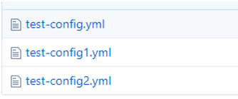
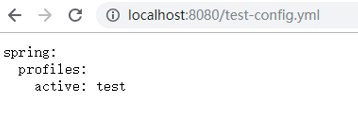
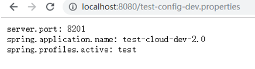
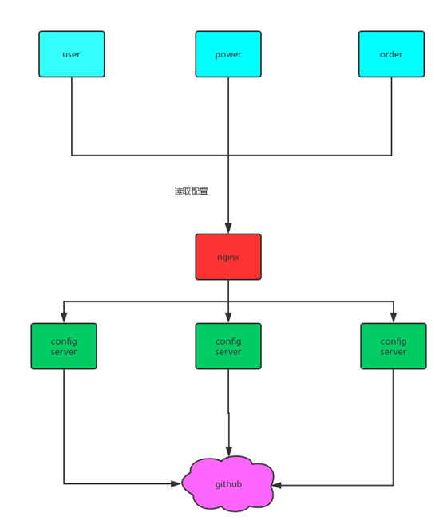
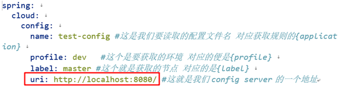

# Spring-Cloud-Config

# config是什么?
 我们既然要做项目， 那么就少不了配置，传统的项目还好，但是我们微服务项目， 每个微服务就要做独立的配置， 这样难免有点复杂， 所以， config项目出来了，它就是为了解决这个问题： 把你所有的微服务配置通过某个平台：

比如 github， gitlib 或者其他的git仓库 进行集中化管理（当然，也可以放在本地）.

可能这样讲有点抽象，我们来看一张图:
  


大概是这样一个关系

# 怎么使用config？
刚刚讲完理论， 那么我们来实践一下， 怎么配置这个confi呢？ 我们刚刚说过 由一个config server 来管理所有的配置文件， 那么我们现在新建一个config server 项目 然后引入依赖:
```maven
<dependency> 
    <groupId>org.springframework.cloud</groupId> 
    <artifactId>spring-cloud-config-server</artifactId> 
</dependency>
```
spring-cloud 的依赖我们就不提了
然后启动类上面加入注解EnableConfigServer:
```java
@SpringBootApplication
@EnableConfigServer
public class AppConfig {

    public static void main(String[] args) {
        SpringApplication.run(AppConfig.class);
    }
}
```
yml配置:
```yml
server: 
  port: 8080 
spring: 
  application: 
    name: test 
 
  cloud: 
    config: 
      server: 
        git: 
          uri: https://github.com/513667225/my-spring-cloud-config.git #配置文件在github上的地址 
 #         search-paths: foo,bar*,foo1/src  #Configserver会在 Git仓库根目录、 foo子目录，以及所有以 bar开头的子目录中查找配置文件。 
#          clone-on-start: true  #启动时就clone仓库到本地，默认是在配置被首次请求时，config server才会clone git仓库 
        #native: 
          #search-locations: classpath:/config #若配置中心在本地，本地的地址 
```
配置好以后，我们先试试通过config server来读取配置
这里我在github上有一些配置文件:



我们来看看test-config的内容：


那么如何通过config server来访问呢？ 
启动项目后， 我们可以通过名字来读取里面的配置信息：  



那我们要获取dev环境/或者test环境下的配置呢？ 通过-隔开即可。
我们现在来访问 test-config-dev：
 


同理 如果要访问test环境下的配置， 改为test即可
其实，config访问配置文件，是需要一个具体的访问规则的， 那么这个访问规则到底是什么呢？ 我们可以在官网找到：

/{application}/{profile}[/{label}] 
/{application}-{profile}.yml 
/{label}/{application}-{profile}.yml 
/{application}-{profile}.properties 
/{label}/{application}-{profile}.properties

**application就是配置文件的名字， profile就是对应的环境， label就是不同的分支**。
由这个规则可见， 我们使用的是第二种规则， 剩下的规则， 同学们可以自己去试试 ，  对于yml 和properties类型config可以完美转换， 也就是说你存的是yml 但是可以读取为properties类型的反过来也是如此：
 


# 客户端从config上获取配置
刚刚给大家简单演示了一下config 以及怎么读取配置， 不过实际开发中，更多的不是我们人为去获取，而是由微服务从config上加载配置， 那么， 怎么来加载呢?

首先，我们需要在我们的微服务加入一个依赖声明他是config的客户端:
```maven
<dependency> 
    <groupId>org.springframework.cloud</groupId> 
    <artifactId>spring-cloud-starter-config</artifactId> 
</dependency>
```
需要注意的是，这个依赖不包括spring -boot依赖， 也就是说， 假设你这个项目要当作spring boot来启动的话， 还得依赖spring boot 
启动类不需要做改动， 标准的spring boot启动类即可
需要注意的是yml文件
以前我们对于spring boot的配置 是在application.yml里面配置的,现在从config上读取配置的话，还得需要一个bootstrap.yml配置文件

解释一下这个bootstrap.yml:
spring cloud有一个“引导上下文"的概念，这是主应用程序的父上下文。引导上下文负责从配置服务器加载配置属性，以及解密外部配置文件中的属性。和主应用程序加载application.(yml或 properties)中的属性不同，引导上下文加载(bootstrap.)中的属性。配置在 bootstrap.*中的属性有更高的优先级，因此默认情况下它们不能被本地配置
那么我们application.yml配置文件里面 只需要做一些简单的配置就可以了：
```yml
spring:
  application:
    name: test-config
```
重点在于bootstrap.yml:
```yml
spring: 
  cloud: 
    config: 
      name: test-config #这是我们要读取的配置文件名 对应获取规则的{application} 
      profile: dev   #这个是要获取的环境 对应的便是{profile} 
      label: master #这个就是获取的节点 对应的是{label} 
      uri: http://localhost:8080/ #这就是我们config server的一个地址
```
那么 他就会获取到我们刚刚看到的那个配置:
```yml
server:
  port: 8201

spring:
  profiles: dev
  application:
    name: test-cloud-dev-2.0
```
测试一下 看看他会不会使用这个8201端口启动
 
这里 我们查看启动信息，能发现他现在使用的是我们从config server上读取到的配置。


# spring cloud config 高可用
config 高可用可以通过很多种方式， 比如说搭建一个nginx:
 


那么bootstrap.yml配置文件中的地址就可以直接写上nginx的地址即可。就可以用nginx实现负载均衡。
 


或者config server注册到eureka上，client端也注册到eureka上，则已经实现高可用
如何注册就不提了，需要注意的点就是当config server都注册完之后 client的配置文件进行以下改动：
```yml
spring: 
  cloud: 
    config: 
      name: test-config 
      profile: dev 
      label: master 
      discovery: 
        enabled: true #打开对服务注册中心的支持 
        service-id: test-config #eureka注册中心中config的服务名称
eureka: 
  client: 
    serviceUrl: 
      defaultZone: http://localhost:3000/eureka/
```
