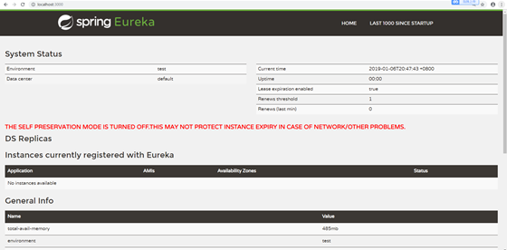
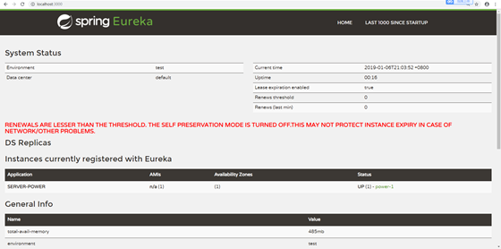
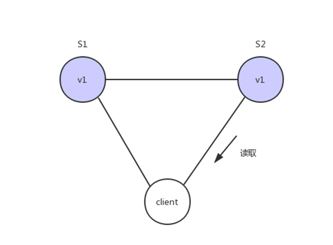

# eureka与CAP定理

# eureka：
## eureka是什么？
 eureka是Netflix的子模块之一，也是一个核心的模块，eureka里有2个组件，一个是EurekaServer(一个独立的项目) 这个是用于定位服务以实现中间层服务器的负载平衡和故障转移，另一个便是EurekaClient（我们的微服务） 它是用于与Server交互的，可以使得交互变得非常简单:只需要通过服务标识符即可拿到服务。

## eureka源码分析：
https://www.cnblogs.com/wuzhenzhao/p/9466752.html
https://www.jianshu.com/p/71a8bdbf03f4

## 与spring-cloud的关系：
Spring Cloud 封装了 Netflix 公司开发的 Eureka 模块来实现服务注册和发现(可以对比Zookeeper)。
Eureka 采用了 C-S 的设计架构。Eureka Server 作为服务注册功能的服务器，它是服务注册中心。
而系统中的其他微服务，使用 Eureka 的客户端连接到 Eureka Server并维持心跳连接。这样系统的维护人员就可以通过 Eureka Server 来监控系统中各个微服务是否正常运行。SpringCloud 的一些其他模块（比如Zuul）就可以通过 Eureka Server 来发现系统中的其他微服务，并执行相关的逻辑。

##角色关系图： 


## 如何使用？
 在spring-cloud项目里面加入依赖：
  eureka客户端：
```maven
		<dependency>
            <groupId>org.springframework.cloud</groupId>
            <artifactId>spring-cloud-starter-netflix-eureka-client</artifactId>
        </dependency>
```
  eureka服务端：
```maven
		<dependency>
            <groupId>org.springframework.cloud</groupId>
            <artifactId>spring-cloud-starter-netflix-eureka-server</artifactId>
        </dependency>
```
 eureka服务端项目里面加入以下配置：
```yml
server:
  port: 3000
eureka:
  server:
    enable-self-preservation: false  #关闭自我保护机制
    eviction-interval-timer-in-ms: 4000 #设置清理间隔（单位：毫秒 默认是60*1000）
  instance:
    hostname: localhost


  client:
    registerWithEureka: false #不把自己作为一个客户端注册到自己身上
    fetchRegistry: false  #不需要从服务端获取注册信息（因为在这里自己就是服务端，而且已经禁用自己注册了）
    serviceUrl:
      defaultZone: http://${eureka.instance.hostname}:${server.port}/eureka
```
 当然，不是全部必要的，这里只是把我这里的配置copy过来了
 然后在spring-boot启动项目上 加入注解:@EnableEurekaServer 就可以启动项目了
```java
@EnableEurekaServer
@SpringBootApplication
public class AppEureka {

    public static void main(String[] args) {
        SpringApplication.run(AppEureka.class);

    }
}
```
 如果看见这个图片，那么说明你就搭建好了:
 
 

这个警告只是说你把他的自我保护机制关闭了
eureka客户端配置:
```yml
server:
  port: 6000
eureka:
  client:
    serviceUrl:
        defaultZone: http://localhost:3000/eureka/  #eureka服务端提供的注册地址 参考服务端配置的这个路径
  instance:
  	
    instance-id: power-1 #此实例注册到eureka服务端的唯一的实例ID 
    prefer-ip-address: true #是否显示IP地址
    leaseRenewalIntervalInSeconds: 10 #eureka客户需要多长时间发送心跳给eureka服务器，表明它仍然活着,默认为30 秒 (与下面配置的单位都是秒)
    leaseExpirationDurationInSeconds: 30 #Eureka服务器在接收到实例的最后一次发出的心跳后，需要等待多久才可以将此实例删除，默认为90秒

spring:
  application:
    name: server-power #此实例注册到eureka服务端的name 
```
然后在客户端的spring-boot启动项目上 加入注解:@EnableEurekaClient 就可以启动项目了 这里就不截图了我们直接来看效果图：



这里我们能看见 名字叫server-power的（图中将其大写了） id为 power-1的服务 注册到我们的Eureka上面来了 至此，一个简单的eureka已经搭建好了。

# eureka集群:
## eureka集群原理
 服务启动后向Eureka注册，Eureka Server会将注册信息向其他Eureka Server进行同步，当服务消费者要调用服务提供者，则向服务注册中心获取服务提供者地址，然后会将服务提供者地址缓存在本地，下次再调用时，则直接从本地缓存中取，完成一次调用。
## eureka集群配置
 刚刚我们了解到 Eureka Server会将注册信息向其他Eureka Server进行同步 那么我们得声明有哪些server呢？
这里 假设我们有3个Eureka Server ：
eureka-server3000
eureka-server3001
eureka-server3002

现在怎么声明集群环境的server呢？ 我们看一张图：
 

 
可能看着有点抽象，我们来看看具体配置
```yml
server:
  port: 3000
eureka:
  server:
    enable-self-preservation: false
    eviction-interval-timer-in-ms: 4000
  instance:
    hostname: eureka3000.com


  client:
    registerWithEureka: false
    fetchRegistry: false
    serviceUrl:
      defaultZone: http://eureka3001.com:3001/eureka,http://eureka3002.com:3002/eureka
```
这里 方便理解集群 我们做了一个域名的映射(条件不是特别支持我使用三台笔记本来测试。。。) 至于域名怎么映射的话 这里简单提一下吧 修改你的hosts文件（win10的目录在C:\Windows\System32\drivers\etc 其他系统的话自行百度一下把）附上我的hosts文件：
   127.0.0.1  eureka3000.com
   127.0.0.1  eureka3001.com
   127.0.0.1  eureka3002.com

我们回到主题， 我们发现 集群配置与单体不同的点在于 原来是把服务注册到自己身上，而现在是注册到其它服务身上
至于为什么不注册自己了呢？，回到最上面我们说过，eureka的server会把自己的注册信息与其他的server同步，所以这里我们不需要注册到自己身上，因为另外两台服务器会配置本台服务器。(这里可能有点绕，可以参考一下刚刚那张集群环境的图，或者自己动手配置一下，另外两台eureka的配置与这个是差不多的，就不发出来了，只要注意是注册到其他的服务上面就好了)
当三台eureka配置好之后，全部启动一下就可以看见效果了: 


当然，我们这里仅仅是把服务端配置好了， 那客户端怎么配置呢？ 话不多说，上代码：
```yml
  client:
    serviceUrl:
        defaultZone: http://localhost:3000/eureka/,http://eureka3001.com:3001/eureka,http://eureka3002.com:3002/eureka
```
我们这里只截取了要改动的那一部分。 就是 原来是注册到那一个地址上面，现在是要写三个eureka注册地址，但是不是代表他会注册三次，因为我们eureka server的注册信息是同步的，这里只需要注册一次就可以了，但是为什么要写三个地址呢。因为这样就可以做到高可用的配置：打个比方有3台服务器。但是突然宕机了一台， 但是其他2台还健在，依然可以注册我们的服务，换句话来讲， 只要有一台服务还建在，那么就可以注册服务，这里 需要理解一下。
这里效果图就不发了， 和之前单机的没什么两样，只是你服务随便注册到哪个eureka server上其他的eureka server上都有该服务的注册信息。


# CAP定理的含义：

 

1998年，加州大学的计算机科学家 Eric Brewer 提出，分布式系统有三个指标。
Consistency   ---一致性
Availability   ---可用性
Partition tolerance  ---分区容错性
他们第一个字母分别是C,A,P
Eric Brewer 说，这三个指标不可能同时做到。这个结论就叫做 CAP 定理。

## Partition tolerance
中文叫做"分区容错"。
大多数分布式系统都分布在多个子网络。每个子网络就叫做一个区（partition）。分区容错的意思是，区间通信可能失败。比如，一台服务器放在本地，另一台服务器放在外地（可能是外省，甚至是外国），这就是两个区，它们之间可能无法通信。
 


上图中，S1 和 S2 是两台跨区的服务器。S1 向 S2 发送一条消息，S2 可能无法收到。系统设计的时候，必须考虑到这种情况。
一般来说，分区容错无法避免，因此可以认为 CAP 的 P 总是成立。CAP 定理告诉我们，剩下的 C 和 A 无法同时做到。

## Consistency
Consistency 中文叫做"一致性"。意思是，写操作之后的读操作，必须返回该值。举例来说，某条记录是 v0，用户向 S1 发起一个写操作，将其改为 v1。
 


接下来用户读操作就会得到v1。这就叫一致性。
 


问题是，用户有可能会向S2发起读取操作，由于G2的值没有发生变化，因此返回的是v0，所以S1和S2的读操作不一致，这就不满足一致性了
 


为了让S2的返回值与S1一致，所以我们需要在往S1执行写操作的时候，让S1给S2也发送一条消息，要求G2也变成v1
 


这样子用户向G2发起读操作，就也能得到v1
 


## Availability
 Availability 中文叫做"可用性"，意思是只要收到用户的请求，服务器就必须给出回应。
用户可以选择向 S1 或 S2 发起读操作。不管是哪台服务器，只要收到请求，就必须告诉用户，到底是 v0 还是 v1，否则就不满足可用性。

## Consistency 和 Availability 的矛盾
一致性和可用性，为什么不可能同时成立？答案很简单，因为可能通信失败（即出现分区容错）。
如果保证 S2 的一致性，那么 S1 必须在写操作时，锁定 S2 的读操作和写操作。只有数据同步后，才能重新开放读写。锁定期间，S2 不能读写，没有可用性不。
如果保证 S2 的可用性，那么势必不能锁定 S2，所以一致性不成立。
综上所述，S2 无法同时做到一致性和可用性。系统设计时只能选择一个目标。如果追求一致性，那么无法保证所有节点的可用性；如果追求所有节点的可用性，那就没法做到一致性。

# eureka对比Zookeeper：
 Zookeeper在设计的时候遵循的是**CP原则**，即一致性,Zookeeper会出现这样一种情况，当master节点因为网络故障与其他节点失去联系时剩余节点会重新进行leader选举，问题在于，选举leader的时间太长：30~120s，且选举期间整个Zookeeper集群是不可用的，这就导致在选举期间注册服务处于瘫痪状态，在云部署的环境下，因网络环境使Zookeeper集群失去master节点是较大概率发生的事情，虽然服务能够最终恢复，但是漫长的选举时间导致长期的服务注册不可用是不能容忍的。
 Eureka在设计的时候遵循的是**AP原则**，即可用性。Eureka各个节点（服务)是平等的， 没有主从之分，几个节点down掉不会影响正常工作，剩余的节点（服务） 依然可以提供注册与查询服务，而Eureka的客户端在向某个Eureka注册或发现连接失败，则会自动切换到其他节点，也就是说，只要有一台Eureka还在，就能注册可用（保证可用性）， 只不过查询到的信息不是最新的（不保证强一致），除此之外，Eureka还有自我保护机制，如果在15分钟内超过85%节点都没有正常心跳，那么eureka就认为客户端与注册中心出现了网络故障，此时会出现一下情况:
1: Eureka 不再从注册列表中移除因为长时间没有收到心跳而过期的服务。
2：Eureka 仍然能够接收新服务的注册和查询请求，但是不会被同步到其它节点上（即保证当前节点可用）
3： 当网络稳定后，当前实例新的注册信息会被同步到其它节点中

 
