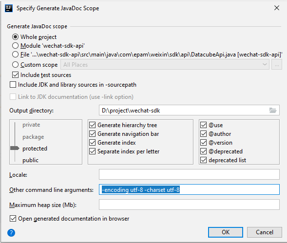

# intelliJ_idea

## 插件

​- snakeYaml plugin
​- alibaba cloud toolkit
​- alibaba Java coding guidelines
​- sonarLint
​- docker
​- maven helper
​- lombok
​- markdown
​- ideavim
​- shellcheck
​- database navigat
​- junit
​- bashsupport

## 配置

### 普通配置

- tab limit 设置为 100
- front 设置为15
- Font: Menlo
- show tabs in one row: false
- view - appearance - toolbar

开启 ide settings 同步

### 添加jdk并设置为新项目的默认选项

比如 /usr/local/Cellar/openjdk@11/11.0.7+10/libexec/openjdk.jdk

这样sourcepath会有东西，可以看见`java api的注释文档`

### 在idea中打开多个maven项目

File->Project Structure…->Modules可以添加Modules

https://jordanzheng.github.io/open-multi-module-in-one-project-for-idea/

### 配置java doc

打开 project structure，点击 SDKs，点击Document Path，点击从互联网添加

添加https://docs.oracle.com/en/java/javase/11/docs/api

apply

遇到一个不会的类，点击shift + f1，即可跳转到网页上的doc

## 问题和解决方案 problems

### maven reimport 一直报错，修改如下

Go to File > Settings > Build,Execution,Deployment> Build Tools > Maven > Importing .

Change VM options for importer to -Didea.maven3.use.compat.resolver

### 生成java doc -encoding utf-8 -charset utf-8

### 运行spring boot，如果命令行启动，需要编辑一下，如果maven启动，勾选profile

### 运行两个service实例

在configure里勾选 allow parallel run，改改server port