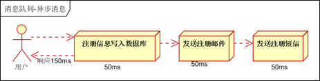
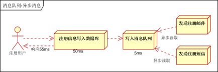
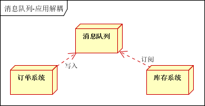
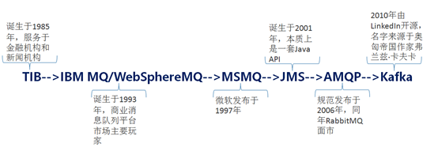

# 什么是消息中间件？
## 消息中间件(MQ)的定义
其实并没有标准定义。一般认为，消息中间件属于分布式系统中一个子系统，关注于数据的发送和接收，利用高效可靠的异步消息传递机制对分布式系统中的其余各个子系统进行集成。  

## 为什么要用消息中间件？
假设一个电商交易的场景，用户下单之后调用库存系统减库存，然后需要调用物流系统进行发货，如果交易、库存、物流是属于一个系统的，那么就是接口调用。但是随着系统的发展，各个模块越来越庞大、业务逻辑越来越复杂，必然是要做服务化和业务拆分的。这个时候就需要考虑这些系统之间如何交互，第一反应就是RPC（Remote Procedure Call）。系统继续发展，可能一笔交易后续需要调用几十个接口来执行业务，比如还有风控系统、短信服务等等。这个时候就需要消息中间件登场来解决问题了。
所以消息中间件主要解决分布式系统之间消息的传递，同时为分布式系统中其他子系统提供了伸缩性和扩展性。为系统带来了：

- 低耦合，不管是程序还是模块之间，使用消息中间件进行间接通信。
- 异步通信能力，使得子系统之间得以充分执行自己的逻辑而无需等待。
- 缓冲能力，消息中间件像是一个巨大的蓄水池，将高峰期大量的请求存储下来慢慢交给后台进行处理，对于秒杀业务来说尤为重要。

名称解释：
**伸缩性**，是指通过不断向集群中加入服务器的手段来缓解不断上升的用户并发访问压力和不断增长的数据存储需求。就像弹簧一样挂东西一样，用户多，伸一点，用户少，浅一点，啊，不对，缩一点。是伸缩，不是深浅。衡量架构是否高伸缩性的主要标准就是是否可用多台服务器构建集群，是否容易向集群中添加新的服务器。加入新的服务器后是否可以提供和原来服务器无差别的服务。集群中可容纳的总的服务器数量是否有限制。
**扩展性**，主要标准就是在网站增加新的业务产品时，是否可以实现对现有产品透明无影响，不需要任何改动或者很少改动既有业务功能就可以上线新产品。比如用户购买电影票的应用，现在我们要增加一个功能，用户买了铁血战士的票后，随机抽取用户送异形的限量周边。怎么做到不改动用户购票功能的基础上增加这个功能。熟悉设计模式的同学，应该很眼熟，这是设计模式中的开闭原则（对扩展开放，对修改关闭）在架构层面的一个原则。

## 和RPC有何区别？
RPC和消息中间件的场景的差异很大程度上在于就是“依赖性”和“同步性”。
比如短信通知服务并不是事交易环节必须的，并不影响下单流程，不是强依赖，所以交易系统不应该依赖短信服务。比如一些数据分析程序可能需要在拿到一天的总销售量，这个就只需要销售中心提供接口在需要时调用即可。
消息中间件出现以后对于交易场景可能是调用库存中心等强依赖系统执行业务，之后发布一条消息（这条消息存储于消息中间件中）。像是短信通知服务、数据统计服务等等都是依赖于消息中间件去消费这条消息来完成自己的业务逻辑。
RPC方式是典型的同步方式，让远程调用像本地调用。消息中间件方式属于异步方式。消息队列是系统级、模块级的通信。RPC是对象级、函数级通信。
**相同点：**都是分布式下面的通信方式。

## 消息中间件有些什么使用场景？
### 异步处理
场景说明：用户注册后，需要发注册邮件和注册短信。传统的做法有两种1.串行的方式；2.并行方式。
- 串行方式：将注册信息写入数据库成功后，发送注册邮件，再发送注册短信。以上三个任务全部完成后，返回给客户端。

- 并行方式：将注册信息写入数据库成功后，发送注册邮件的同时，发送注册短信。以上三个任务完成后，返回给客户端。与串行的差别是，并行的方式可以提高处理的时间。
假设三个业务节点每个使用50毫秒钟，不考虑网络等其他开销，则串行方式的时间是150毫秒，并行的时间可能是100毫秒。

小结：如以上案例描述，传统的方式系统的性能（并发量，吞吐量，响应时间）会有瓶颈。如何解决这个问题呢？
引入消息队列，将不是必须的业务逻辑，异步处理。

按照以上约定，用户的响应时间相当于是注册信息写入数据库的时间，也就是50毫秒。注册邮件，发送短信写入消息队列后，直接返回，因此写入消息队列的速度很快，基本可以忽略，因此用户的响应时间可能是50毫秒。因此架构改变后，系统的吞吐量提高到每秒20 QPS。比串行提高了3倍，比并行提高了两倍。

### 应用解耦
场景说明：用户下单后，订单系统需要通知库存系统。传统的做法是，订单系统调用库存系统的接口。
传统模式的缺点：
1）  假如库存系统无法访问，则订单减库存将失败，从而导致订单失败；
2）  订单系统与库存系统耦合；

如何解决以上问题呢？引入应用消息队列后的方案
订单系统：用户下单后，订单系统完成持久化处理，将消息写入消息队列，返回用户订单下单成功。
库存系统：订阅下单的消息，采用拉/推的方式，获取下单信息，库存系统根据下单信息，进行库存操作。

假如：在下单时库存系统不能正常使用。也不影响正常下单，因为下单后，订单系统写入消息队列就不再关心其他的后续操作了。实现订单系统与库存系统的应用解耦。

### 流量削峰
流量削峰也是消息队列中的常用场景，一般在秒杀或团抢活动中使用广泛。
应用场景：秒杀活动，一般会因为流量过大，导致流量暴增，应用挂掉。为解决这个问题，一般需要在应用前端加入消息队列：可以控制活动的人数；可以缓解短时间内高流量压垮应用。

用户的请求，服务器接收后，首先写入消息队列。假如消息队列长度超过最大数量，则直接抛弃用户请求或跳转到错误页面；秒杀业务根据消息队列中的请求信息，再做后续处理。

### 日志处理
日志处理是指将消息队列用在日志处理中，比如Kafka的应用，解决大量日志传输的问题。架构简化如下：

日志采集客户端，负责日志数据采集，定时写入Kafka队列：Kafka消息队列，负责日志数据的接收，存储和转发；日志处理应用：订阅并消费kafka队列中的日志数据；

### 消息通讯
消息通讯是指，消息队列一般都内置了高效的通信机制，因此也可以用在纯的消息通讯。比如实现点对点消息队列，或者聊天室等。
点对点通讯：客户端A和客户端B使用同一队列，进行消息通讯。
聊天室通讯：客户端A，客户端B，客户端N订阅同一主题，进行消息发布和接收。实现类似聊天室效果。

## 消息中间件的编年史 

 

卡夫卡与法国作家马塞尔·普鲁斯特，爱尔兰作家詹姆斯·乔伊斯并称为西方现代主义文学的先驱和大师。《变形记》是卡夫卡的短篇代表作，是卡夫卡的艺术成就中的一座高峰，被认为是20世纪最伟大的小说作品之一。

## 常见的消息中间件比较 

如果一般的业务系统要引入MQ，怎么选型：
用户访问量在ActiveMQ的可承受范围内，而且确实主要是基于解耦和异步来用的，可以考虑ActiveMQ，也比较贴近Java工程师的使用习惯。 
RabbitMQ，但是确实erlang语言阻止了我们去深入研究和掌控，对公司而言，几乎处于不可控的状态，但是确实是开源的，有比较稳定的支持，活跃度也高。
对自己公司技术实力有绝对自信的，可以用RocketMQ 。
所以中小型公司，技术实力较为一般，技术挑战不是特别高，用ActiveMQ、RabbitMQ是不错的选择；大型公司，基础架构研发实力较强，用RocketMQ是很好的选择
如果是大数据领域的实时计算、日志采集等场景，用Kafka是业内标准的，绝对没问题，社区活跃度很高，几乎是全世界这个领域的事实性规范。