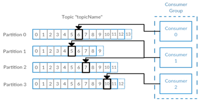
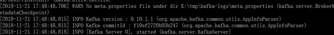
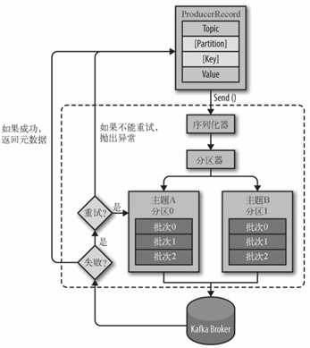
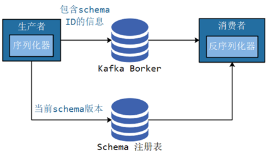
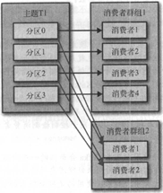

## 常用命令行

```bash

# kafka-consumer-groups
# 查看kafka topic列表
docker-compose exec broker kafka-topics --bootstrap-server localhost:9092 --list
docker-compose exec broker kafka-topics --zookeeper localhost:2181 --list
kafka-topics --zookeeper localhost:2181 --list

# kafka-consumer-groups
# 查看consumer group 列表
docker-compose exec broker kafka-consumer-groups --bootstrap-server localhost:9092 --list
kafka-consumer-groups --bootstrap-server localhost:9092 --list
# 查看某个consumer group的具体信息
docker-compose exec broker kafka-consumer-groups --bootstrap-server localhost:9092 --describe --group fooGroup
kafka-consumer-groups --bootstrap-server localhost:9092 --describe --group fooGroup


# kafka-console-consumer
# 查看某个topic的消息
docker-compose exec broker kafka-console-consumer \
  --bootstrap-server localhost:9092 \
  --topic \
  users \
  --from-beginning
  
docker-compose exec broker kafka-console-consumer \
  --bootstrap-server localhost:9092 \
  --topic \
  avroUsers \
  --from-beginning

kafka-console-consumer \
  --bootstrap-server [kafka-broker-export:9092] \
  --topic \
  trackTopicDEV \
  --from-beginning

kafka-console-consumer \
  --bootstrap-server [kafka-broker-export:9092] \
  --topic \
  trackTopicDEV

# 创建topic
kafka-topics \
  --create \
  --bootstrap-server localhost:9092 \
  --replication-factor 1 \
  --partitions 1 \
  --topic users

docker-compose exec broker kafka-topics \
  --create \
  --bootstrap-server localhost:9092 \
  --replication-factor 1 \
  --partitions 1 \
  --topic avroUsers
```

## Q&A

> 在消费之后msg会从kafka中删除吗？

不会，kafka中数据的删除跟有没有消费者消费完全无关。数据的删除，只跟kafka broker的这两个配置有关：

```
log.retention.hours=48 #数据最多保存48小时
log.retention.bytes=1073741824 #数据最多1G
```


# Kafka入门
## 什么是Kafka
kafka最初是LinkedIn的一个内部基础设施系统。最初开发的起因是，LinkedIn虽然有了数据库和其他系统可以用来存储数据，但是缺乏一个可以帮助处理持续数据流的组件。所以在设计理念上，开发者不想只是开发一个能够存储数据的系统，如关系数据库、Nosql数据库、搜索引擎等等，更希望把数据看成一个持续变化和不断增长的流，并基于这样的想法构建出一个数据系统，一个数据架构。
Kafka可以看成一个流平台，这个平台上可以发布和订阅数据流，并把他们保存起来，进行处理。Kafka有点像消息系统，允许发布和订阅消息流，但是它和传统的消息系统有很大的差异，首先，Kafka是个现代分布式系统，以集群的方式运行，可以自由伸缩。其次，Kafka可以按照要求存储数据，保存多久都可以，第三，流式处理将数据处理的层次提示到了新高度，消息系统只会传递数据，Kafka的流式处理能力可以让我们用很少的代码就能动态地处理派生流和数据集。所以Kafka不仅仅是个消息中间件。
同时在大数据领域，Kafka还可以看成实时版的Hadoop，Hadoop可以存储和定期处理大量的数据文件，往往以TB计数，而Kafka可以存储和持续处理大型的数据流。Hadoop主要用在数据分析上，而Kafka因为低延迟，更适合于核心的业务应用上。
本次课程，将会以kafka_2.11-0.10.1.1版本为主，其余版本不予考虑。
## Kafka中的基本概念
### 消息和批次
**消息**，Kafka里的数据单元，也就是我们一般消息中间件里的消息的概念。消息由字节数组组成。消息还可以包含键，用以对消息选取分区。
为了提高效率，消息被分批写入Kafka。**批次**就是一组消息，这些消息属于同一个主题和分区。如果只传递单个消息，会导致大量的网络开销，把消息分成批次传输可以减少这开销。但是，这个需要权衡，批次里包含的消息越多，单位时间内处理的消息就越多，单个消息的传输时间就越长。如果进行压缩，可以提升数据的传输和存储能力，但需要更多的计算处理。
### 主题和分区
Kafka里的消息用主题进行分类，主题下有可以被分为若干个分区。分区本质上是个提交日志，有新消息，这个消息就会以追加的方式写入分区，然后用先入先出的顺序读取。


但是因为主题会有多个分区，所以在整个主题的范围内，是无法保证消息的顺序的，单个分区则可以保证。
Kafka通过分区来实现数据冗余和伸缩性，因为分区可以分布在不同的服务器上，那就是说一个主题可以跨越多个服务器。
前面我们说Kafka可以看成一个流平台，很多时候，我们会把一个主题的数据看成一个流，不管有多少个分区。

### 生产者和消费者、偏移量、消费者群组
就是一般消息中间件里生产者和消费者的概念。一些其他的高级客户端API，像数据管道API和流式处理的Kafka Stream，都是使用了最基本的生产者和消费者作为内部组件，然后提供了高级功能。
生产者默认情况下把消息均衡分布到主题的所有分区上，如果需要指定分区，则需要使用消息里的消息键和分区器。
消费者订阅主题，一个或者多个，并且按照消息的生成顺序读取。消费者通过检查所谓的偏移量来区分消息是否读取过。偏移量是一种元数据，一个不断递增的整数值，创建消息的时候，Kafka会把他加入消息。在一个分区里，每个消息的偏移量是唯一的。每个分区最后读取的消息偏移量会保存到Zookeeper或者Kafka上，这样分区的消费者关闭或者重启，读取状态都不会丢失。
多个消费者可以构成一个消费者群组。怎么构成？共同读取一个主题的消费者们，就形成了一个群组。群组可以保证每个分区只被一个消费者使用。



消费者和分区之间的这种映射关系叫做消费者对分区的所有权关系，很明显，一个分区只有一个消费者，而一个消费者可以有多个分区。
### Broker和集群
一个独立的Kafka服务器叫Broker。broker的主要工作是，接收生产者的消息，设置偏移量，提交消息到磁盘保存；为消费者提供服务，响应请求，返回消息。在合适的硬件上，单个broker可以处理上千个分区和每秒百万级的消息量。
多个broker可以组成一个集群。每个集群中broker会选举出一个集群控制器。控制器会进行管理，包括将分区分配给broker和监控broker。
集群里，一个分区从属于一个broker，这个broker被称为首领。但是分区可以被分配给多个broker，这个时候会发生分区复制。


分区复制带来的好处是，提供了消息冗余。一旦首领broker失效，其他broker可以接管领导权。当然相关的消费者和生产者都要重新连接到新的首领上。
### 保留消息
在一定期限内保留消息是Kafka的一个重要特性，Kafka  broker默认的保留策略是：要么保留一段时间，要么保留一定大小。到了限制，旧消息过期并删除。但是每个主题可以根据业务需求配置自己的保留策略。
# 为什么选择Kafka 
## 优点
多生产者和多消费者
**基于磁盘的数据存储**，换句话说，Kafka的数据天生就是持久化的。
高伸缩性，Kafka一开始就被设计成一个具有灵活伸缩性的系统，对在线集群的伸缩丝毫不影响整体系统的可用性。
高性能，结合横向扩展生产者、消费者和broker，Kafka可以轻松处理巨大的信息流，同时保证亚秒级的消息延迟。
## 常见场景
### 活动跟踪
跟踪网站用户和前端应用发生的交互，比如页面访问次数和点击，将这些信息作为消息发布到一个或者多个主题上，这样就可以根据这些数据为机器学习提供数据，更新搜素结果等等。
### 传递消息
标准消息中间件的功能
收集指标和日志
收集应用程序和系统的度量监控指标，或者收集应用日志信息，通过Kafka路由到专门的日志搜索系统，比如ES。
### 提交日志
收集其他系统的变动日志，比如数据库。可以把数据库的更新发布到Kafka上，应用通过监控事件流来接收数据库的实时更新，或者通过事件流将数据库的更新复制到远程系统。
还可以当其他系统发生了崩溃，通过重放日志来恢复系统的状态。
### 流处理
操作实时数据流，进行统计、转换、复杂计算等等。随着大数据技术的不断发展和成熟，无论是传统企业还是互联网公司都已经不再满足于离线批处理，实时流处理的需求和重要性日益增长。
近年来业界一直在探索实时流计算引擎和API，比如这几年火爆的Spark Streaming、Kafka Streaming、Beam和Flink，其中阿里双11会场展示的实时销售金额，就用的是流计算，是基于Flink，然后阿里在其上定制化的Blink。

# Kafka的安装、管理和配置
## 安装
### 预备环境
Kafka是Java生态圈下的一员，用Scala编写，运行在Java虚拟机上，所以安装运行和普通的Java程序并没有什么区别。
安装Kafka官方说法，Java环境推荐Java8。
Kafka需要Zookeeper保存集群的元数据信息和消费者信息。Kafka一般会自带Zookeeper，但是从稳定性考虑，应该使用单独的Zookeeper，而且构建Zookeeper集群。
### 下载和安装Kafka
在http://kafka.apache.org/downloads上寻找合适的版本下载，我们这里选用的是kafka_2.11-0.10.1.1，下载完成后解压到本地目录。
### 运行
启动Zookeeper
进入Kafka目录下的bin\windows
执行kafka-server-start.bat ../../config/server.properties，出现以下画面表示成功
Linux下与此类似，进入bin后，执行对应的sh文件即可



### 基本的操作和管理
*列出所有主题*
kafka-topics.bat --zookeeper localhost:2181/kafka --list
*列出所有主题的详细信息*
kafka-topics.bat --zookeeper localhost:2181/kafka --describe
*创建主题 主题名 my-topic，1副本，8分区*
kafka-topics.bat --zookeeper localhost:2181/kafka --create --topic my-topic --replication-factor 1 --partitions 8
*增加分区，注意：分区无法被删除*
kafka-topics.bat --zookeeper localhost:2181/kafka --alter --topic my-topic --partitions 16
*删除主题*
kafka-topics.bat --zookeeper localhost:2181/kafka --delete --topic my-topic
*列出消费者群组（仅Linux）*
kafka-topics.sh --new-consumer --bootstrap-server localhost:9092/kafka --list
*列出消费者群组详细信息（仅Linux）*
kafka-topics.sh --new-consumer --bootstrap-server localhost:9092/kafka --describe --group 群组名
## Broker配置
配置文件放在Kafka目录下的config目录中，主要是server.properties文件
### 常规配置
#### *broker.id*
在单机时无需修改，但在集群下部署时往往需要修改。它是个每一个broker在集群中的唯一表示，要求是正数。当该服务器的IP地址发生改变时，broker.id没有变化，则不会影响consumers的消息情况
#### *listeners*
监听列表(以逗号分隔 不同的协议(如plaintext,trace,ssl、不同的IP和端口)),hostname如果设置为0.0.0.0则绑定所有的网卡地址；如果hostname为空则绑定默认的网卡。如果
没有配置则默认为java.net.InetAddress.getCanonicalHostName()。
如：PLAINTEXT://myhost:9092,TRACE://:9091或 PLAINTEXT://0.0.0.0:9092,
#### *zookeeper.connect*
zookeeper集群的地址，可以是多个，多个之间用逗号分割
#### *log.dirs*
Kafka把所有的消息都保存在磁盘上，存放这些数据的目录通过log.dirs指定。
#### *num.recovery.threads.per.data.dir*
每数据目录用于日志恢复启动和关闭时的线程数量。因为这些线程只是服务器启动和关闭时会用到。所以完全可以设置大量的线程来达到并行操作的目的。注意，这个参数指的是每个日志目录的线程数，比如本参数设置为8，而log.dirs设置为了三个路径，则总共会启动24个线程。
#### *auto.create.topics.enable*
是否允许自动创建主题。如果设为true，那么produce，consume或者fetch metadata一个不存在的主题时，就会自动创建。缺省为true。
### 主题配置
新建主题的默认参数
#### *num.partitions*
每个新建主题的分区个数。这个参数一般要评估，比如，每秒钟要写入和读取1GB数据，如果现在每个消费者每秒钟可以处理50MB的数据，那么需要20个分区，这样就可以让20个消费者同时读取这些分区，从而达到设计目标。
#### *log.retention.hours*
日志保存时间，默认为7天（168小时）。超过这个时间会清理数据。bytes和minutes无论哪个先达到都会触发。与此类似还有log.retention.minutes和log.retention.ms，都设置的话，优先使用具有最小值的那个。
#### *log.retention.bytes*
topic每个分区的最大文件大小，一个topic的大小限制 = 分区数*log.retention.bytes。-1没有大小限制。log.retention.bytes和log.retention.minutes任意一个达到要求，都会执行删除。
#### *log.segment.bytes*
分区的日志存放在某个目录下诸多文件中，这些文件将分区的日志切分成一段一段的，我们称为日志片段。这个属性就是每个文件的最大尺寸；当尺寸达到这个数值时，就会关闭当前文件，并创建新文件。被关闭的文件就开始等待过期。默认为1G。
如果一个主题每天只接受100MB的消息，那么根据默认设置，需要10天才能填满一个文件。而且因为日志片段在关闭之前，消息是不会过期的，所以如果log.retention.hours保持默认值的话，那么这个日志片段需要17天才过期。因为关闭日志片段需要10天，等待过期又需要7天。
#### *log.segment.ms*
作用和log.segment.bytes类似，只不过判断依据是时间。同样的，两个参数，以先到的为准。这个参数默认是不开启的。
#### *message.max.bytes*	
表示一个服务器能够接收处理的消息的最大字节数，注意这个值producer和consumer必须设置一致，且不要大于fetch.message.max.bytes属性的值。该值默认是1000000字节，大概900KB~1MB。
## 硬件配置对Kafka性能的影响
### 磁盘吞吐量/磁盘容量
磁盘吞吐量会影响生产者的性能。因为生产者的消息必须被提交到服务器保存，大多数的客户端都会一直等待，直到至少有一个服务器确认消息已经成功提交为止。也就是说，磁盘写入速度越快，生成消息的延迟就越低。
磁盘容量的大小，则主要看需要保存的消息数量。如果每天收到1TB的数据，并保留7天，那么磁盘就需要7TB的数据。
### 内存
Kafka本身并不需要太大内存，内存则主要是影响消费者性能。在大多数业务情况下，消费者消费的数据一般会从内存中获取，这比在磁盘上读取肯定要快的多。
### 网络
网络吞吐量决定了Kafka能够处理的最大数据流量。
### CPU
Kafka对cpu的要求不高，主要是用在对消息解压和压缩上。所以cpu的性能不是在使用Kafka的首要考虑因素。

# Kafka的集群


## 为何需要Kafka集群
本地开发，一台Kafka足够使用。在实际生产中，集群可以跨服务器进行负载均衡，再则可以使用复制功能来避免单独故障造成的数据丢失。同时集群可以提供高可用性。
## 如何估算Kafka集群中Broker的数量
要估量以下几个因素：
需要多少磁盘空间保留数据，和每个broker上有多少空间可以用。比如，如果一个集群有10TB的数据需要保留，而每个broker可以存储2TB，那么至少需要5个broker。如果启用了数据复制，则还需要一倍的空间，那么这个集群需要10个broker。
集群处理请求的能力。如果因为磁盘吞吐量和内存不足造成性能问题，可以通过扩展broker来解决。
## Broker如何加入Kafka集群
非常简单，只需要两个参数。第一，配置zookeeper.connect，第二，为新增的broker设置一个集群内的唯一性id。
# 第一个Kafka程序 
## 创建我们的主题
kafka-topics.bat --zookeeper localhost:2181/kafka --create --topic hello-kafka --replication-factor 1 --partitions 4
## 生产者发送消息
### 必选属性
创建生产者对象时有三个属性必须指定。
#### *bootstrap.servers*
该属性指定broker的地址清单，地址的格式为host：port。清单里不需要包含所有的broker地址，生产者会从给定的broker里查询其他broker的信息。不过最少提供2个broker的信息，一旦其中一个宕机，生产者仍能连接到集群上。
#### *key.serializer*
生产者接口允许使用参数化类型，可以把Java对象作为键和值传broker，但是broker希望收到的消息的键和值都是字节数组，所以，必须提供将对象序列化成字节数组的序列化器。key.serializer必须设置为实现org.apache.kafka.common.serialization.Serializer的接口类，Kafka的客户端默认提供了ByteArraySerializer,IntegerSerializer, StringSerializer，也可以实现自定义的序列化器。
#### *value.serializer*
同 key.serializer。
参见代码，模块kafka-no-spring下包hellokafka中
## 消费者接受消息
### 必选参数
bootstrap.servers、key.serializer、value.serializer含义同生产者
#### *group.id*
并非完全必需，它指定了消费者属于哪一个群组，但是创建不属于任何一个群组的消费者并没有问题。
参见代码，模块kafka-no-spring下包hellokafka中

# Kafka的生产者
## 生产者发送消息的基本流程



从创建一个ProducerRecord 对象开始， Producer Record 对象需要包含目标主题和要发送的内容。我们还可以指定键或分区。在发送ProducerReco rd 对象时，生产者要先把键和值对象序列化成字节数组，这样它们才能够在网络上传输。
接下来，数据被传给分区器。如果之前在Producer Record 对象里指定了分区，那么分区器就不会再做任何事情，直接把指定的分区返回。如果没有指定分区，那么分区器会根据Producer Record对象的键来选择一个分区。选好分区以后，生产者就知道该往哪个主题和分区发送这条记录了。紧接着，这条记录被添加到一个记录批次里，这个批次里的所有消息会被发送到相同的主题和分区上。有一个独立的线程负责把这些记录批次发送到相应的broker 上。
服务器在收到这些消息时会返回一个响应。如果消息成功写入Kafka ，就返回一个RecordMetaData 对象，它包含了主题和分区信息，以及记录在分区里的偏移量。如果写入失败， 则会返回一个错误。生产者在收到错误之后会尝试重新发送消息，几次之后如果还是失败，就返回错误信息。

## 使用Kafka生产者
###  三种发送方式
我们通过生成者的send方法进行发送。send方法会返回一个包含RecordMetadata的Future对象。RecordMetadata里包含了目标主题，分区信息和消息的偏移量。
#### 发送并忘记
忽略send方法的返回值，不做任何处理。大多数情况下，消息会正常到达，而且生产者会自动重试，但有时会丢失消息。
#### 同步非阻塞发送
获得send方法返回的Future对象，在合适的时候调用Future的get方法。参见代码，模块kafka-no-spring下包sendtype中。
#### 异步发送
实现接口org.apache.kafka.clients.producer.Callback，然后将实现类的实例作为参数传递给send方法。参见代码，模块kafka-no-spring下包sendtype中。
### 多线程下的生产者
KafkaProducer的实现是线程安全的，所以我们可以在多线程的环境下，安全的使用KafkaProducer的实例，如何节约资源的使用呢？参见代码，模块kafka-no-spring下包concurrent中
###  更多发送配置  
生产者有很多属性可以设置，大部分都有合理的默认值，无需调整。有些参数可能对内存使用，性能和可靠性方面有较大影响。可以参考org.apache.kafka.clients.producer包下的ProducerConfig类。
*acks：*
指定了必须要有多少个分区副本收到消息，生产者才会认为写入消息是成功的，这个参数对消息丢失的可能性有重大影响。
acks=0：生产者在写入消息之前不会等待任何来自服务器的响应，容易丢消息，但是吞吐量高。
acks=1：只要集群的首领节点收到消息，生产者会收到来自服务器的成功响应。如果消息无法到达首领节点（比如首领节点崩溃，新首领没有选举出来），生产者会收到一个错误响应，为了避免数据丢失，生产者会重发消息。不过，如果一个没有收到消息的节点成为新首领，消息还是会丢失。默认使用这个配置。
acks=all：只有当所有参与复制的节点都收到消息，生产者才会收到一个来自服务器的成功响应。延迟高。
*buffer.memory*
设置生产者内存缓冲区的大小，生产者用它缓冲要发送到服务器的消息。如果数据产生速度大于向broker发送的速度，导致生产者空间不足，producer会阻塞或者抛出异常。缺省33554432 (32M)
*max.block.ms*
指定了在调用send()方法或者使用partitionsFor()方法获取元数据时生产者的阻塞时间。当生产者的发送缓冲区已满，或者没有可用的元数据时，这些方法就会阻塞。在阻塞时间达到max.block.ms时，生产者会抛出超时异常。缺省60000ms
*retries*
发送失败时，指定生产者可以重发消息的次数。默认情况下，生产者在每次重试之间等待100ms，可以通过参数retry.backoff.ms参数来改变这个时间间隔。缺省0
*receive.buffer.bytes和send.buffer.bytes*
指定TCP socket接受和发送数据包的缓存区大小。如果它们被设置为-1，则使用操作系统的默认值。如果生产者或消费者处在不同的数据中心，那么可以适当增大这些值，因为跨数据中心的网络一般都有比较高的延迟和比较低的带宽。缺省102400
*batch.size*
当多个消息被发送同一个分区时，生产者会把它们放在同一个批次里。该参数指定了一个批次可以使用的内存大小，按照字节数计算。当批次内存被填满后，批次里的所有消息会被发送出去。但是生产者不一定都会等到批次被填满才发送，半满甚至只包含一个消息的批次也有可能被发送。缺省16384(16k)
*linger.ms*
指定了生产者在发送批次前等待更多消息加入批次的时间。它和batch.size以先到者为先。也就是说，一旦我们获得消息的数量够batch.size的数量了，他将会立即发送而不顾这项设置，然而如果我们获得消息字节数比batch.size设置要小的多，我们需要“linger”特定的时间以获取更多的消息。这个设置默认为0，即没有延迟。设定linger.ms=5，例如，将会减少请求数目，但是同时会增加5ms的延迟，但也会提升消息的吞吐量。
*compression.type*
producer用于压缩数据的压缩类型。默认是无压缩。正确的选项值是none、gzip、snappy。压缩最好用于批量处理，批量处理消息越多，压缩性能越好。snappy占用cpu少，提供较好的性能和可观的压缩比，如果比较关注性能和网络带宽，用这个。如果带宽紧张，用gzip，会占用较多的cpu，但提供更高的压缩比。
*client.id	*
当向server发出请求时，这个字符串会发送给server。目的是能够追踪请求源头，以此来允许ip/port许可列表之外的一些应用可以发送信息。这项应用可以设置任意字符串，因为没有任何功能性的目的，除了记录和跟踪。
*max.in.flight.requests.per.connection*	
指定了生产者在接收到服务器响应之前可以发送多个消息，值越高，占用的内存越大，当然也可以提升吞吐量。发生错误时，可能会造成数据的发送顺序改变,默认是5 (修改）。
如果需要保证消息在一个分区上的严格顺序，这个值应该设为1。不过这样会严重影响生产者的吞吐量。
*request.timeout.ms*
客户端将等待请求的响应的最大时间,如果在这个时间内没有收到响应，客户端将重发请求;超过重试次数将抛异常
*metadata.fetch.timeout.ms*
是指我们所获取的一些元数据的第一个时间数据。元数据包含：topic，host，partitions。此项配置是指当等待元数据fetch成功完成所需要的时间，否则会跑出异常给客户端
*timeout.ms*
此配置选项控制broker等待副本确认的最大时间。如果确认的请求数目在此时间内没有实现，则会返回一个错误。这个超时限制是以server端度量的，没有包含请求的网络延迟。这个参数和acks的配置相匹配。
*max.request.size*
控制生产者发送请求最大大小。假设这个值为1M，如果一个请求里只有一个消息，那这个消息不能大于1M，如果一次请求是一个批次，该批次包含了1000条消息，那么每个消息不能大于1KB。注意：broker具有自己对消息记录尺寸的覆盖，如果这个尺寸小于生产者的这个设置，会导致消息被拒绝。
#### 顺序保证
Kafka 可以保证同一个分区里的消息是有序的。也就是说，如果生产者一定的顺序发送消息， broker 就会按照这个顺序把它们写入分区，消费者也会按照同样的顺序读取它们。在某些情况下， 顺序是非常重要的。例如，往一个账户存入100 元再取出来，这个与先取钱再存钱是截然不同的！不过，有些场景对顺序不是很敏感。
如果把retires设为非零整数，同时把max.in.flight.request.per.connection设为比1 大的数，那么，如果第一个批次消息写入失败，而第二个批次写入成功， broker 会重试写入第一个批次。如果此时第一个批次也写入成功，那么两个批次的顺序就反过来了。
一般来说，如果某些场景要求消息是有序的，那么消息是否写入成功也是很关键的，所以不建议把retires设为0 。可以把max.in.flight.request.per.connection 设为1，这样在生产者尝试发送第一批消息时，就不会有其他的消息发送给broker 。不过这样会严重影响生产者的吞吐量，所以只有在对消息的顺序有严格要求的情况下才能这么做。

## 序列化
创建生产者对象必须指定序列化器，默认的序列化器并不能满足我们所有的场景。我们完全可以自定义序列化器。只要实现org.apache.kafka.common.serialization.Serializer接口即可。
如何实现，看模块kafka-no-spring下包selfserial中代码。
### 自定义序列化需要考虑的问题
自定义序列化容易导致程序的脆弱性。举例，在我们上面的实现里，我们有多种类型的消费者，每个消费者对实体字段都有各自的需求，比如，有的将字段变更为long型，有的会增加字段，这样会出现新旧消息的兼容性问题。特别是在系统升级的时候，经常会出现一部分系统升级，其余系统被迫跟着升级的情况。
解决这个问题，可以考虑使用自带格式描述以及语言无关的序列化框架。比如Protobuf，或者Kafka官方推荐的Apache Avro。
Avro会使用一个JSON文件作为schema来描述数据，Avro在读写时会用到这个schema，可以把这个schema内嵌在数据文件中。这样，不管数据格式如何变动，消费者都知道如何处理数据。
但是内嵌的消息，自带格式，会导致消息的大小不必要的增大，消耗了资源。我们可以使用schema注册表机制，将所有写入的数据用到的schema保存在注册表中，然后在消息中引用schema的标识符，而读取的数据的消费者程序使用这个标识符从注册表中拉取schema来反序列化记录。
注意：Kafka本身并不提供schema注册表，需要借助第三方，现在已经有很多的开源实现，比如Confluent Schema Registry，可以从GitHub上获取。如何使用参考如下网址：
https://cloud.tencent.com/developer/article/1336568



## 分区
我们在新增ProducerRecord对象中可以看到，ProducerRecord包含了目标主题，键和值，Kafka的消息都是一个个的键值对。键可以设置为默认的null。
键的主要用途有两个：一，用来决定消息被写往主题的哪个分区，拥有相同键的消息将被写往同一个分区，二，还可以作为消息的附加消息。
如果键值为null，并且使用默认的分区器，分区器使用轮询算法将消息均衡地分布到各个分区上。
如果键不为空，并且使用默认的分区器，Kafka对键进行散列（Kafka自定义的散列算法，具体算法原理不知），然后根据散列值把消息映射到特定的分区上。很明显，同一个键总是被映射到同一个分区。但是只有不改变主题分区数量的情况下，键和分区之间的映射才能保持不变，一旦增加了新的分区，就无法保证了，所以如果要使用键来映射分区，那就要在创建主题的时候把分区规划好，而且永远不要增加新分区。
### 自定义分区器
某些情况下，数据特性决定了需要进行特殊分区，比如电商业务，北京的业务量明显比较大，占据了总业务量的20%，我们需要对北京的订单进行单独分区处理，默认的散列分区算法不合适了， 我们就可以自定义分区算法，对北京的订单单独处理，其他地区沿用散列分区算法。或者某些情况下，我们用value来进行分区。
具体实现，先创建一个4分区的主题，然后观察模块kafka-no-spring下包SelfPartitionProducer中代码。
# Kafka的消费者
## 消费者和消费者群组、分区再均衡
消费者的含义，同一般消息中间件中消费者的概念。在高并发的情况下，生产者产生消息的速度是远大于消费者消费的速度，单个消费者很可能会负担不起，此时有必要对消费者进行横向伸缩，于是我们可以使用多个消费者从同一个主题读取消息，对消息进行分流。

**注意：**
**kafka没有消息推送概念，只有消费者从kafka拉取消息。（不断查询拉取）
kafka不只是个消息中间件，是一个使用了消息中间件来传递消息的数据系统。**

### 消费者群组
Kafka里消费者从属于消费者群组，一个群组里的消费者订阅的都是同一个主题，每个消费者接收主题一部分分区的消息。


如上图，主题T有4个分区，群组中只有一个消费者，则该消费者将收到主题T1全部4个分区的消息。


如上图，在群组中增加一个消费者2，那么每个消费者将分别从两个分区接收消息，上图中就表现为消费者1接收分区1和分区3的消息，消费者2接收分区2和分区4的消息。


如上图，在群组中有4个消费者，那么每个消费者将分别从1个分区接收消息。


但是，当我们增加更多的消费者，超过了主题的分区数量，就会有一部分的消费者被闲置，不会接收到任何消息。
往消费者群组里增加消费者是进行横向伸缩能力的主要方式。所以我们有必要为主题设定合适规模的分区，在负载均衡的时候可以加入更多的消费者。但是要记住，一个群组里消费者数量超过了主题的分区数量，多出来的消费者是没有用处的。
如果是多个应用程序，需要从同一个主题中读取数据，只要保证每个应用程序有自己的消费者群组就行了。如下图所示：



具体实现，先建立一个2分区的主题，看模块kafka-no-spring下包consumergroup中代码。

### 分区再均衡
当消费者群组里的消费者发生变化，或者主题里的分区发生了变化，都会导致再均衡现象的发生。从前面的知识中，我们知道，Kafka中，存在着消费者对分区所有权的关系，
这样无论是消费者变化，比如增加了消费者，新消费者会读取原本由其他消费者读取的分区，消费者减少，原本由它负责的分区要由其他消费者来读取，增加了分区，哪个消费者来读取这个新增的分区，这些行为，都会导致分区所有权的变化，这种变化就被称为再均衡。
再均衡对Kafka很重要，这是消费者群组带来高可用性和伸缩性的关键所在。不过一般情况下，尽量减少再均衡，因为再均衡期间，消费者是无法读取消息的，会造成整个群组一小段时间的不可用。
消费者通过向称为群组协调器的broker（不同的群组有不同的协调器）发送心跳来维持它和群组的从属关系以及对分区的所有权关系。如果消费者长时间不发送心跳，群组协调器认为它已经死亡，就会触发一次再均衡。
在0.10.1及以后的版本中，心跳由单独的线程负责，相关的控制参数为max.poll.interval.ms。
#### *消费者分区分配的过程*
消费者要加入群组时，会向群组协调器发送一个JoinGroup请求，第一个加入群主的消费者成为群主，群主会获得群组的成员列表，并负责给每一个消费者分配分区。分配完毕后，群组把分配情况发送给群组协调器，协调器再把这些信息发送给所有的消费者，每个消费者只能看到自己的分配信息，只有群主知道群组里所有消费者的分配信息。这个过程在每次再均衡时都会发生。

## 使用Kafka消费者
### 订阅
创建消费者后，使用subscribe()方法订阅主题，这个方法接受一个主题列表为参数，也可以接受一个正则表达式为参数；正则表达式同样也匹配多个主题。如果新创建了新主题，并且主题名字和正则表达式匹配，那么会立即触发一次再均衡，消费者就可以读取新添加的主题。比如，要订阅所有和test相关的主题，可以subscribe(“tets.*”)
### 轮询
为了不断的获取消息，我们要在循环中不断的进行轮询，也就是不停调用poll方法。
poll方法的参数为超时时间，控制poll方法的阻塞时间，它会让消费者在指定的毫秒数内一直等待broker返回数据。poll方法将会返回一个记录（消息）列表，每一条记录都包含了记录所属的主题信息，记录所在分区信息，记录在分区里的偏移量，以及记录的键值对。
poll方法不仅仅只是获取数据，在新消费者第一次调用时，它会负责查找群组，加入群组，接受分配的分区。如果发生了再均衡，整个过程也是在轮询期间进行的。
### 多线程下的消费者
KafkaConsumer的实现不是线程安全的，所以我们在多线程的环境下，使用KafkaConsumer的实例要小心，应该每个消费数据的线程拥有自己的KafkaConsumer实例，如何使用？参见代码，模块kafka-no-spring下包concurrent中
### 消费者配置  
消费者有很多属性可以设置，大部分都有合理的默认值，无需调整。有些参数可能对内存使用，性能和可靠性方面有较大影响。可以参考org.apache.kafka.clients.consumer包下ConsumerConfig类。
*fetch.min.bytes*
每次fetch请求时，server应该返回的最小字节数。如果没有足够的数据返回，请求会等待，直到足够的数据才会返回。缺省为1个字节。多消费者下，可以设大这个值，以降低broker的工作负载
*fetch.wait.max.ms*
如果没有足够的数据能够满足fetch.min.bytes，则此项配置是指在应答fetch请求之前，server会阻塞的最大时间。缺省为500个毫秒。和上面的fetch.min.bytes结合起来，要么满足数据的大小，要么满足时间，就看哪个条件先满足。
*max.partition.fetch.bytes*
指定了服务器从每个分区里返回给消费者的最大字节数，默认1MB。假设一个主题有20个分区和5个消费者，那么每个消费者至少要有4MB的可用内存来接收记录，而且一旦有消费者崩溃，这个内存还需更大。注意，这个参数要比服务器的message.max.bytes更大，否则消费者可能无法读取消息。
*session.timeout.ms*
如果consumer在这段时间内没有发送心跳信息，则它会被认为挂掉了。默认3秒。
*auto.offset.reset*
消费者在读取一个没有偏移量的分区或者偏移量无效的情况下，如何处理。默认值是latest，从最新的记录开始读取，另一个值是earliest，表示消费者从起始位置读取分区的记录。
注意：默认值是latest，意思是说，在偏移量无效的情况下，消费者将从最新的记录开始读取数据（在消费者启动之后生成的记录），可以先启动生产者，再启动消费者，观察到这种情况。观察代码，在模块kafka-no-spring下包hellokafka中。
*enable .auto.commit*
默认值true，表明消费者是否自动提交偏移。为了尽量避免重复数据和数据丢失，可以改为false，自行控制何时提交。
*partition.assignment.strategy*
分区分配给消费者的策略。系统提供两种策略。默认为Range。允许自定义策略。
*Range*
把主题的连续分区分配给消费者。例如，有主题T1和T2，各有3个分区，消费者C1和C2，则可能的分配形式为：
C1: T1(0，1),T2(0,，1)
C2: T1(2),T2(2)
*RoundRobin*
把主题的分区循环分配给消费者。例如，有主题T1和T2，各有3个分区，消费者C1和C2，则可能的分配形式为：
C1: T1(0，2),T2(1)
C2: T1(1),T2(0，2)
*自定义策略*
extends 类AbstractPartitionAssignor，然后在消费者端增加参数：
properties.put(ConsumerConfig.PARTITION_ASSIGNMENT_STRATEGY_CONFIG, 类.class.getName());即可。
*client.id*
当向server发出请求时，这个字符串会发送给server。目的是能够追踪请求源头，以此来允许ip/port许可列表之外的一些应用可以发送信息。这项应用可以设置任意字符串，因为没有任何功能性的目的，除了记录和跟踪。
*max.poll.records*
控制每次poll方法返回的的记录数量。
*receive.buffer.bytes和send.buffer.bytes*
指定TCP socket接受和发送数据包的缓存区大小。如果它们被设置为-1，则使用操作系统的默认值。如果生产者或消费者处在不同的数据中心，那么可以适当增大这些值，因为跨数据中心的网络一般都有比较高的延迟和比较低的带宽。

