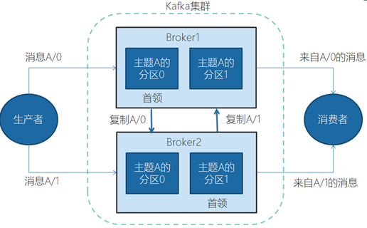

## 常用命令行

```bash

# kafka-consumer-groups
# 查看kafka topic列表
kafka-topics --zookeeper kafka-zookeeper-headless:2181 --list


# kafka-consumer-groups
# 查看consumer group 列表
kafka-consumer-groups --bootstrap-server kafka-broker-export:9092 --list
# 查看某个consumer group的具体信息
kafka-consumer-groups --bootstrap-server kafka-broker-export:9092 --describe --group com.example.wechat


# kafka-console-consumer
# 查看某个topic的消息
kafka-console-consumer --bootstrap-server kafka-broker-export:9092 --topic trackTopicDEV --from-beginning
kafka-console-consumer --bootstrap-server kafka-broker-export:9092 --topic trackTopicDEV


```

# Kafka入门
## 什么是Kafka
kafka最初是LinkedIn的一个内部基础设施系统。最初开发的起因是，LinkedIn虽然有了数据库和其他系统可以用来存储数据，但是缺乏一个可以帮助处理持续数据流的组件。所以在设计理念上，开发者不想只是开发一个能够存储数据的系统，如关系数据库、Nosql数据库、搜索引擎等等，更希望把数据看成一个持续变化和不断增长的流，并基于这样的想法构建出一个数据系统，一个数据架构。
Kafka可以看成一个流平台，这个平台上可以发布和订阅数据流，并把他们保存起来，进行处理。Kafka有点像消息系统，允许发布和订阅消息流，但是它和传统的消息系统有很大的差异，首先，Kafka是个现代分布式系统，以集群的方式运行，可以自由伸缩。其次，Kafka可以按照要求存储数据，保存多久都可以，第三，流式处理将数据处理的层次提示到了新高度，消息系统只会传递数据，Kafka的流式处理能力可以让我们用很少的代码就能动态地处理派生流和数据集。所以Kafka不仅仅是个消息中间件。
同时在大数据领域，Kafka还可以看成实时版的Hadoop，Hadoop可以存储和定期处理大量的数据文件，往往以TB计数，而Kafka可以存储和持续处理大型的数据流。Hadoop主要用在数据分析上，而Kafka因为低延迟，更适合于核心的业务应用上。
本次课程，将会以kafka_2.11-0.10.1.1版本为主，其余版本不予考虑。
## Kafka中的基本概念
### 消息和批次
**消息**，Kafka里的数据单元，也就是我们一般消息中间件里的消息的概念。消息由字节数组组成。消息还可以包含键，用以对消息选取分区。
为了提高效率，消息被分批写入Kafka。**批次**就是一组消息，这些消息属于同一个主题和分区。如果只传递单个消息，会导致大量的网络开销，把消息分成批次传输可以减少这开销。但是，这个需要权衡，批次里包含的消息越多，单位时间内处理的消息就越多，单个消息的传输时间就越长。如果进行压缩，可以提升数据的传输和存储能力，但需要更多的计算处理。
### 主题和分区
Kafka里的消息用主题进行分类，主题下有可以被分为若干个分区。分区本质上是个提交日志，有新消息，这个消息就会以追加的方式写入分区，然后用先入先出的顺序读取。


但是因为主题会有多个分区，所以在整个主题的范围内，是无法保证消息的顺序的，单个分区则可以保证。
Kafka通过分区来实现数据冗余和伸缩性，因为分区可以分布在不同的服务器上，那就是说一个主题可以跨越多个服务器。
前面我们说Kafka可以看成一个流平台，很多时候，我们会把一个主题的数据看成一个流，不管有多少个分区。

### 生产者和消费者、偏移量、消费者群组
就是一般消息中间件里生产者和消费者的概念。一些其他的高级客户端API，像数据管道API和流式处理的Kafka Stream，都是使用了最基本的生产者和消费者作为内部组件，然后提供了高级功能。
生产者默认情况下把消息均衡分布到主题的所有分区上，如果需要指定分区，则需要使用消息里的消息键和分区器。
消费者订阅主题，一个或者多个，并且按照消息的生成顺序读取。消费者通过检查所谓的偏移量来区分消息是否读取过。偏移量是一种元数据，一个不断递增的整数值，创建消息的时候，Kafka会把他加入消息。在一个分区里，每个消息的偏移量是唯一的。每个分区最后读取的消息偏移量会保存到Zookeeper或者Kafka上，这样分区的消费者关闭或者重启，读取状态都不会丢失。
多个消费者可以构成一个消费者群组。怎么构成？共同读取一个主题的消费者们，就形成了一个群组。群组可以保证每个分区只被一个消费者使用。


消费者和分区之间的这种映射关系叫做消费者对分区的所有权关系，很明显，一个分区只有一个消费者，而一个消费者可以有多个分区。
### Broker和集群
一个独立的Kafka服务器叫Broker。broker的主要工作是，接收生产者的消息，设置偏移量，提交消息到磁盘保存；为消费者提供服务，响应请求，返回消息。在合适的硬件上，单个broker可以处理上千个分区和每秒百万级的消息量。
多个broker可以组成一个集群。每个集群中broker会选举出一个集群控制器。控制器会进行管理，包括将分区分配给broker和监控broker。
集群里，一个分区从属于一个broker，这个broker被称为首领。但是分区可以被分配给多个broker，这个时候会发生分区复制。



分区复制带来的好处是，提供了消息冗余。一旦首领broker失效，其他broker可以接管领导权。当然相关的消费者和生产者都要重新连接到新的首领上。
### 保留消息
在一定期限内保留消息是Kafka的一个重要特性，Kafka  broker默认的保留策略是：要么保留一段时间，要么保留一定大小。到了限制，旧消息过期并删除。但是每个主题可以根据业务需求配置自己的保留策略。
# 为什么选择Kafka 
## 优点
多生产者和多消费者
**基于磁盘的数据存储**，换句话说，Kafka的数据天生就是持久化的。
高伸缩性，Kafka一开始就被设计成一个具有灵活伸缩性的系统，对在线集群的伸缩丝毫不影响整体系统的可用性。
高性能，结合横向扩展生产者、消费者和broker，Kafka可以轻松处理巨大的信息流，同时保证亚秒级的消息延迟。
## 常见场景
### 活动跟踪
跟踪网站用户和前端应用发生的交互，比如页面访问次数和点击，将这些信息作为消息发布到一个或者多个主题上，这样就可以根据这些数据为机器学习提供数据，更新搜素结果等等。
### 传递消息
标准消息中间件的功能
收集指标和日志
收集应用程序和系统的度量监控指标，或者收集应用日志信息，通过Kafka路由到专门的日志搜索系统，比如ES。
### 提交日志
收集其他系统的变动日志，比如数据库。可以把数据库的更新发布到Kafka上，应用通过监控事件流来接收数据库的实时更新，或者通过事件流将数据库的更新复制到远程系统。
还可以当其他系统发生了崩溃，通过重放日志来恢复系统的状态。
### 流处理
操作实时数据流，进行统计、转换、复杂计算等等。随着大数据技术的不断发展和成熟，无论是传统企业还是互联网公司都已经不再满足于离线批处理，实时流处理的需求和重要性日益增长。
近年来业界一直在探索实时流计算引擎和API，比如这几年火爆的Spark Streaming、Kafka Streaming、Beam和Flink，其中阿里双11会场展示的实时销售金额，就用的是流计算，是基于Flink，然后阿里在其上定制化的Blink。

# Kafka的安装、管理和配置
## 安装
### 预备环境
Kafka是Java生态圈下的一员，用Scala编写，运行在Java虚拟机上，所以安装运行和普通的Java程序并没有什么区别。
安装Kafka官方说法，Java环境推荐Java8。
Kafka需要Zookeeper保存集群的元数据信息和消费者信息。Kafka一般会自带Zookeeper，但是从稳定性考虑，应该使用单独的Zookeeper，而且构建Zookeeper集群。
### 下载和安装Kafka
在http://kafka.apache.org/downloads上寻找合适的版本下载，我们这里选用的是kafka_2.11-0.10.1.1，下载完成后解压到本地目录。
### 运行
启动Zookeeper
进入Kafka目录下的bin\windows
执行kafka-server-start.bat ../../config/server.properties，出现以下画面表示成功
Linux下与此类似，进入bin后，执行对应的sh文件即可


基本的操作和管理
##列出所有主题
kafka-topics.bat --zookeeper localhost:2181/kafka --list
##列出所有主题的详细信息
kafka-topics.bat --zookeeper localhost:2181/kafka --describe
##创建主题 主题名 my-topic，1副本，8分区
kafka-topics.bat --zookeeper localhost:2181/kafka --create --topic my-topic --replication-factor 1 --partitions 8
##增加分区，注意：分区无法被删除
kafka-topics.bat --zookeeper localhost:2181/kafka --alter --topic my-topic --partitions 16
##删除主题
kafka-topics.bat --zookeeper localhost:2181/kafka --delete --topic my-topic
##列出消费者群组（仅Linux）
kafka-topics.sh --new-consumer --bootstrap-server localhost:9092/kafka --list
##列出消费者群组详细信息（仅Linux）
kafka-topics.sh --new-consumer --bootstrap-server localhost:9092/kafka --describe --group 群组名
Broker配置
配置文件放在Kafka目录下的config目录中，主要是server.properties文件
常规配置
broker.id
在单机时无需修改，但在集群下部署时往往需要修改。它是个每一个broker在集群中的唯一表示，要求是正数。当该服务器的IP地址发生改变时，broker.id没有变化，则不会影响consumers的消息情况
listeners
监听列表(以逗号分隔 不同的协议(如plaintext,trace,ssl、不同的IP和端口)),hostname如果设置为0.0.0.0则绑定所有的网卡地址；如果hostname为空则绑定默认的网卡。如果
没有配置则默认为java.net.InetAddress.getCanonicalHostName()。
如：PLAINTEXT://myhost:9092,TRACE://:9091或 PLAINTEXT://0.0.0.0:9092,
zookeeper.connect
zookeeper集群的地址，可以是多个，多个之间用逗号分割
log.dirs
Kafka把所有的消息都保存在磁盘上，存放这些数据的目录通过log.dirs指定。
num.recovery.threads.per.data.dir
每数据目录用于日志恢复启动和关闭时的线程数量。因为这些线程只是服务器启动和关闭时会用到。所以完全可以设置大量的线程来达到并行操作的目的。注意，这个参数指的是每个日志目录的线程数，比如本参数设置为8，而log.dirs设置为了三个路径，则总共会启动24个线程。
auto.create.topics.enable
是否允许自动创建主题。如果设为true，那么produce，consume或者fetch metadata一个不存在的主题时，就会自动创建。缺省为true。
主题配置
新建主题的默认参数
num.partitions
每个新建主题的分区个数。这个参数一般要评估，比如，每秒钟要写入和读取1GB数据，如果现在每个消费者每秒钟可以处理50MB的数据，那么需要20个分区，这样就可以让20个消费者同时读取这些分区，从而达到设计目标。
log.retention.hours
日志保存时间，默认为7天（168小时）。超过这个时间会清理数据。bytes和minutes无论哪个先达到都会触发。与此类似还有log.retention.minutes和log.retention.ms，都设置的话，优先使用具有最小值的那个。
log.retention.bytes
topic每个分区的最大文件大小，一个topic的大小限制 = 分区数*log.retention.bytes。-1没有大小限制。log.retention.bytes和log.retention.minutes任意一个达到要求，都会执行删除。
log.segment.bytes	
分区的日志存放在某个目录下诸多文件中，这些文件将分区的日志切分成一段一段的，我们称为日志片段。这个属性就是每个文件的最大尺寸；当尺寸达到这个数值时，就会关闭当前文件，并创建新文件。被关闭的文件就开始等待过期。默认为1G。
如果一个主题每天只接受100MB的消息，那么根据默认设置，需要10天才能填满一个文件。而且因为日志片段在关闭之前，消息是不会过期的，所以如果log.retention.hours保持默认值的话，那么这个日志片段需要17天才过期。因为关闭日志片段需要10天，等待过期又需要7天。
log.segment.ms
作用和log.segment.bytes类似，只不过判断依据是时间。同样的，两个参数，以先到的为准。这个参数默认是不开启的。
message.max.bytes	
表示一个服务器能够接收处理的消息的最大字节数，注意这个值producer和consumer必须设置一致，且不要大于fetch.message.max.bytes属性的值。该值默认是1000000字节，大概900KB~1MB。
硬件配置对Kafka性能的影响
磁盘吞吐量/磁盘容量
磁盘吞吐量会影响生产者的性能。因为生产者的消息必须被提交到服务器保存，大多数的客户端都会一直等待，直到至少有一个服务器确认消息已经成功提交为止。也就是说，磁盘写入速度越快，生成消息的延迟就越低。
磁盘容量的大小，则主要看需要保存的消息数量。如果每天收到1TB的数据，并保留7天，那么磁盘就需要7TB的数据。
内存
Kafka本身并不需要太大内存，内存则主要是影响消费者性能。在大多数业务情况下，消费者消费的数据一般会从内存中获取，这比在磁盘上读取肯定要快的多。
网络
网络吞吐量决定了Kafka能够处理的最大数据流量。
CPU
Kafka对cpu的要求不高，主要是用在对消息解压和压缩上。所以cpu的性能不是在使用Kafka的首要考虑因素。
Kafka的集群
