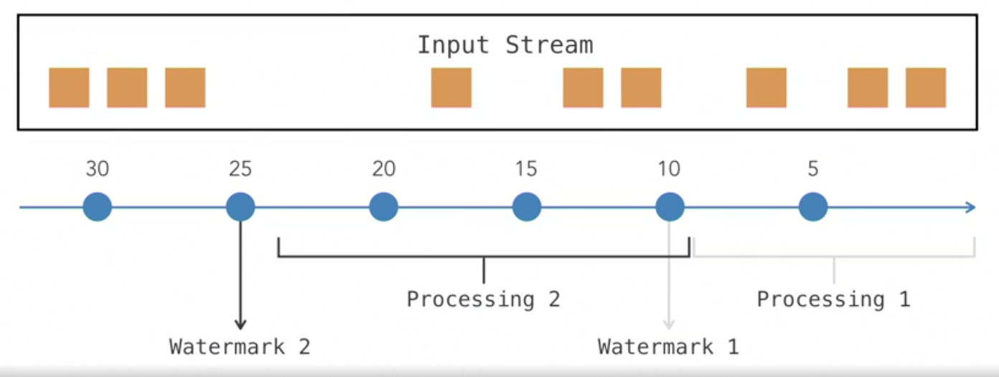

## Lynda: Apache Flink: Real-Time Data Engineering

### Apache Flink

##### what is apache Flink

flink是分布式流处理框架

和spark、storm竞争


##### streaming with apache flink

无限制数量的数据

计算出的结果很快就会过期，不能体现最新的数据status

状态管理

延迟，从数据进来到出来结果，毫秒级别，ms，不需要batch，是真正的流

支持array of connectors，让不通的流、源，进来数据

event time processing：time stamp

exactly once consistency

高可用：快照，持久化，并从中回复


##### DataStream API

event流进来，就一个一个处理

支持map reduce操作

支持windowing


##### Related prerequisite courses

keyby 分割数据

windowsing 聚合数据

split、merge 分离、合并数据


##### setting up5 exercise files

很多包的scope是provided，因为部署的时候，flink已经提供了这些包


### DataStream API

##### setting up the Flink environment

不断地创建只含有一条数据的CSV文件

kafka


##### reading from a stream source

建立从文件到datastream的连接，源源不断地拿到string，然后map到pojo dataset


##### processing streaming data

可以在时间窗口内的数据聚合操作

代码在示例中


##### writing to a stream sink

##### using keyed streams

可以把数据按照一定规格进行分割，同样类型的放在同样的task slot中，类似于批处理的group by，分开之后可以进行基于window的聚合操作


##### processFunction

processFunction是底层的处理函数，map filter是上层的函数，开箱即用，但是缺乏一些灵活性；processFunction有更多的灵活性，可以接触到更多的资源，但是需要更强的功力

processFunction可以接触到的资源包括：

​	events

​	state

​	timers

​	side outputs

Runtime context: processFunction可以获取到Runtime context

Runtime context能接触到

​	accumulators

​	broadcast variables

​	cache

​	configuration

​	state

processFunction可以输出side output，通常情况下只有一个主流，可以用output side来吧流横切或者竖切，一半去主流，一半去边流

一个input可以有0、1、2个output


##### Splitting a stream

把数据分成两条，如果用filter，需要用多个，而直接split会简单一些


##### Merging multiple streams


### windowing

##### windowing concepts

windowing可以让一段时间内的数据进行聚合操作

window类型：

- tumbling window（时间10）：固定时间的window，例如每5秒钟是一个window；默认就是这个
- sliding windows（时间10，slide by5）：后一个window可能会重合前一个window的一部分
- session windows（5s gap）： 五秒之内的都是一个window，超过五秒，则window结束
- global window：所有的是一个window
- 用户可以自定义逻辑来决定window的边界


##### Using a Kafka streaming source

```xml
<dependency>
   <groupId>org.apache.flink</groupId>
   <artifactId>flink-connector-kafka_2.11</artifactId>
   <version>1.9.0</version>
</dependency>
```

 

##### Using sliding windows

##### Using session windows

##### window joins

是相乘的关系


### Event Time Prcessing

##### Time attributes in Flink

时间戳在流处理中非常重要，比如说window

时间属性有三个


flink可以使用任意一种时间属性来做windowing

使用event time是最合适的，也是app产生时就带的时间；在产生和处理之间会有延迟，同样的事件时间从不同的app发出来，被process func处理的时间可能不同，可能到达顺序不是时间顺序；解决方法是watermark

processing time是基于flink所在的node的系统时间的；默认是processing time

ingestion，到达时间，很少在flink中使用


##### watermarks

event time是最常用的用来做window的时间属性，但是因为有延迟，怎么能知道时间范围内的都已经到了flink了呢？解决方案是watermark

watermark用于event time的处理中，可以决定什么时候处理event；所有到达的event要等待watermark发生，发生时，从上一个watermark到这一个之间的event要被处理

watermark可以是周期的，也可以定制逻辑

watermark（2s delay）可以有延迟缓存，delay buffer，用来cover从数据源到flink 节点的延迟

event time是基于app时间的，watermark是基于flink系统时间的

watermark保证了一致性，但是也会带来延迟，要权衡




##### setting up event time

flink默认是processing time

选择event time之后要设置event time，assignTimestampsAndWatermarks()

periodic 的 watermark，周期性出现

Punctuated 的 watermark，可以定制内部逻辑

extractTimestamp，每次event进来之后都会调用这个方法来获取event time

checkAndGetNextWatermark，每次调用完extractTimestamp就会调用这个方法，来产生下一个watermark，只有返回的watermark大于上一次返回的，才会有效；这个watermark的意思是，任何小于watermark的值的event都不会再来了，可以执行了


##### processing with event time

使用event time的原因是为了能处理迟到的数据，在watermark之后的数据


##### writing to a kafka sink


### State Management

##### state management in Flink

application和element state是很重要的角色

【keyed state】：基于特定的key保存状态，比如keyby之后，为每个都保存一份state，保存的数据类型有很多种：value，list，map，reducing，aggregate；

【operator state】：由并行的操作者保存


##### Defining states

##### Using states

##### Advanced state management

【resetting state】可以调用clear()来删除state，也可以自动reset state

使用快照和还原来保存state信息，当flink到checkpoint的时候，state会自动持久化，然后重启后还原，快照和还原方法可以被覆盖，这样可以用外部的持久化


### Use Case Project

##### Problem defination

##### computing summary counts

##### conputing activity durations


### Conclusion

