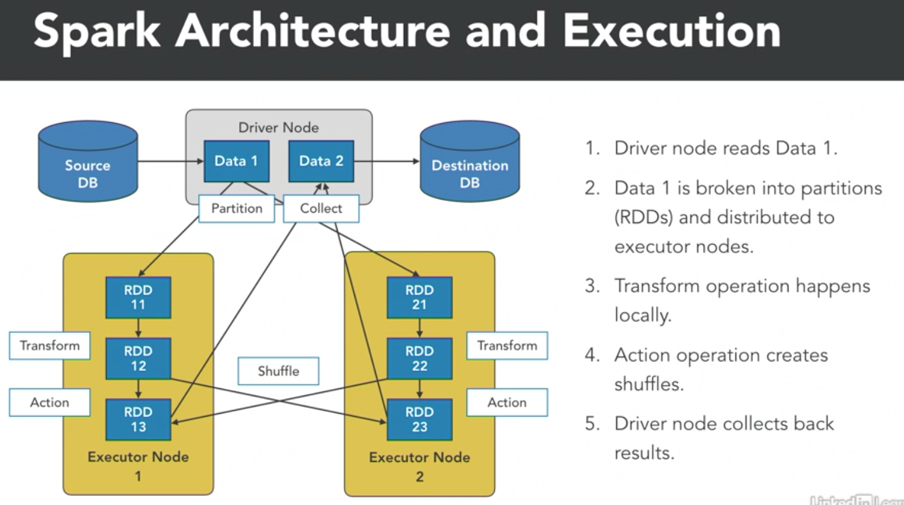

## Lynda: Big Data Analytics with Hadoop and Apache Spark

### introduction and setup

##### apache hadoop overview

##### apache spark overview

##### integrating hadoop and spark

spark和hadoop集成的很棒：

- 并行性
- 优化性
- 缓存
- YARN


##### setting up the environment

下载HDP sandbox，docker版本

```bash
vi /etc/hosts
# 添加
127.0.0.1 sandbox-hdp
127.0.0.1 sandbox-hdp.hortonworks.com

sh docker-deploy-hdp30.sh

# 有许多镜像要下载，然后启动大概需要30min，访问 localhost:8080

ambari
username: raj_ops
password: raj_ops

# 访问 sandbox-hdp:1080 选择右下角shell ui
login as raj_ops
hdfs dfs -chmod 777 /user/raj_ops

# 访问 sandbox-hdp:9995 Zeppelin
Zeppelin notebooks
```


```python
%spark2

//Check if everything is installed and working correctly
println("Current installed version of Spark is " + spark.version)
```


### hdfs data modeling for analytics

##### storage formats

hadoop的存储格式：

- Raw text (blobs) ---文本文件
- Structured text files (CSV, XML, JSON) ---文本文件
- Sequence files ---文本文件
- Avro ---Avro
- ORC
- Parquet ---Parquet


文本文件：读写简单；性能低；需要更多存储；没有schema == 【不推荐使用】

Avro：语言无关的序列化，从一种语言序列化，可以从另一种语言反序列化；基于row；支持自描述schema，可以对数据实施约束；可以压缩，优化存储空间；可以分区，从而支持并行读写 == 【适合支持多语言】

Parquet：基于colum，像columnar DB，意味着每个列可以分别从disk读取，不需要读取无关的列，并行化，也节省IO；支持schema；可压缩（列的级别），可拆分 分区；支持数据嵌套结构 == 【适合批处理任务】


##### compression

hadoop 压缩选项（编解码器 codec）：

- Snappy：google开发的；可以普通的压缩；出色的处理性能；压缩整个文件，而不是一个一个元素的压缩；不可拆分，也就不能并行操作
- LZO：可以普通的压缩；出色的处理性能；可拆分，从而可并行操作；需要单独的license
- GZIP：很好的压缩效果；普通的处理性能；不可拆分；和Parquet结合得很好，每个列可以单独压缩，从而不需要拆分；适合和Parquet结合使用，适合容器类型的分析的应用
- bzip2：很好的压缩效果；很差的处理性能；可拆分；适合archival类型的应用，适合：只需写一次，备份场景，转发备份


选择哪一个推荐做POC验证，看看压缩比和处理性能的实际影响


##### partitioning

传统数据库通过做index来加速where语句的速度，hdfs没有index的概念，即使读取一行，整个文件都会被读来抽取出那一行，严重损害IO；分区可以只读取数据的子集，基于partition key，就像index的作用一样；可以把多个属性用于构建partitioning

把数据存到hdfs里，指定一个partition key，hadoop会为分区创建一个个单独的目录；基于属性的值，把数据拆分到各个对应的目录里；比如产品=鼠标，产品=键盘，产品=摄像头，是三个目录

选择分区的属性：值是可枚举的有限长度列表，在filter中经常被使用，数据最好均匀分布在这些分区中


##### bucketing

partition的代替项，bucketing；partition要求属性的值是一个小集合，如果要对一个值是个大集合的属性做分区，就选择bucketing

bucketing很像partitioning，但是不是直接用value，而是用hash(value)，这样数量就可以控制住；

选择bucketing的属性：值是大量的列表，在filter中经常被使用，数据最好均匀分布在这些分区中


##### best practices for data storage

首先要理解数据的读写模式：读敏感，写敏感，读写敏感

要决定什么需要优化，什么可以妥协

小心选择，因为之后不容易修改

在真实数据上进行测试，来看性能和存储的实际情况

选择合适的partition bucketing key，因为会损失写性能


### data ingestion with spark

##### reading external files into spark

```python
01. Reading Files into Spark
Data can be read into Apache Spark data frames from a variety of data sources.

examples :

A flat file on a local disk
A file from HDFS
A Kafka Topic
In this example, we will read a CSV file in a HDFS folder into a Spark Data Frame.


%spark2

"""
Read the raw CSV file int a Spark DataFrame
    Use inferSchema to infer the schema automatically from the CSV file
"""

val rawSalesData = spark
                .read
                .option("inferSchema", "true")
                .option("header", "true")
                .csv("/user/raj_ops/raw_data/sales_orders.csv");

# Print the schema for verification
rawSalesData.printSchema();

# Print the first 5 records for verification
rawSalesData.show(5)
```


##### writing to hdfs

```python
02.Writing to HDFS
Write the rawSalesData Data Frame into HDFS as a Parquet file. Use Parquet as the format since it enables splitting and filtering. Use GZIP as the compression codec.

On completion, verify if the files are correctly through HDFS command line or Ambari

%spark2

//Write to Sales Data to HDFS for future processing

rawSalesData.write
            .format("parquet")
            .mode("overwrite")
            .option("compression", "gzip")
            .save("/user/raj_ops/raw_parquet");
```


##### parallel writes with partitioning

```python
03. Writing to HDFS with Partitioning
Write a partitioned Parquet file in HDFS. Partition will be done by Product. This will create one directory per unique product available in the raw CSV. Verify through HDFS command line or Ambari

%spark2

rawSalesData.write
            .format("parquet")
            .mode("overwrite")
            .option("compression", "gzip")
            .partitionBy("Product")
            .save("/user/raj_ops/partitioned_parquet")
```


##### parallel writes with bucketing

```python
04. Writing to Hive with Bucketing
Create a Bucketed Hive table for orders. Bucketing will be done by Product. It will create 3 buckets based on the hash generated by Product. Hive tables can be queried through SQL.

%spark2

//Create a Hive Table for sales data with 2 buckets.
rawSalesData.write
            .format("parquet")
            .mode("overwrite")
            .bucketBy(3, "Product")
            .saveAsTable("product_bucket_table")
            
//Data goes in here.
println("Hive Data Stored in : " + sc.getConf.get("spark.sql.warehouse.dir") + "\n")
            
    
//Read through SQL
sql("SELECT * FROM product_bucket_table where Product='Mouse'").show(5)
```


##### best practices for ingestion

开启并行化来获取最大的写性能

对于增量的数据注入，使用append

读取外部的数据，使用能提供并行的数据源：JDBC，KAFKA，从disk读就把大文件拆成小文件


### data extraction with spark

##### how spark works

transform是并行的

groupby reduce的时候，需要shuffle，会导致IO和内存的瓶颈




spark execution plan：会自己优化性能和资源消耗

懒执行：当reduce或者collect要执行时，就分析前面的所有步骤，开始优化，并执行；

spark 优化器会产生一份计划：降低IO，降低shuffling，减少内存使用

spark executor会直接读写外部数据源，如果源支持并行IO，如（HDFS，KAFKA，JDBC）


##### reading hdfs files with schema

```python
02. Read Parquet Files into Spark
Read a non-partitioned Parquet file into Spark. Measure the time taken. Also look at the execution plan.

%spark2

//Read the file
val salesParquet = spark.read
                        .parquet("/user/raj_ops/raw_parquet")

//Display the results and time the operation                     
spark.time(salesParquet.show(5))

//Show the execution Plan
println("\n-------------------------------EXPLAIN------------------------------------")
salesParquet.explain
println("-------------------------------END EXPLAIN--------------------------------\n")
```


##### reading partitioned data

```python
03.Read Partitioned Data into Spark

%spark2

//Read all the partitions. Use basePath to have partition key as part of data
val salesPartitioned = spark.read
                            .option("basePath", "/user/raj_ops/partitioned_parquet/")
                            .parquet("/user/raj_ops/partitioned_parquet/*")
                            
//Display the results and time the operation                     
spark.time(salesPartitioned.show(5))

//Show the execution Plan
println("\n-------------------------------EXPLAIN------------------------------------")
salesPartitioned.explain
println("-------------------------------END EXPLAIN--------------------------------\n")


%spark2

//Read a specific partition only
val salesHeadset = spark.read
                            .parquet("/user/raj_ops/partitioned_parquet/Product=Headset")

//Display the results and time the operation                     
spark.time(salesHeadset.show(5))

//Show the execution Plan
println("\n-------------------------------EXPLAIN------------------------------------")
salesHeadset.explain
println("-------------------------------END EXPLAIN--------------------------------\n")

```


##### reading bucketed data

```python
04. Read Bucketed Data into Spark

%spark2

//Read data from Hive
val salesBucketed = sql("SELECT * FROM product_bucket_table")

//Display the results and time the operation                     
spark.time(salesBucketed.show(5))

//Show the execution Plan
println("\n-------------------------------EXPLAIN------------------------------------")
salesBucketed.explain
println("-------------------------------END EXPLAIN--------------------------------\n")
```


##### best practices for data extraction

减少把数据读入内存：使用基于partition key的过滤；只读取需要的列

使用支持并行操作的数据源和文件格式

保持spark的partition的数量 >= num of executors * num of cores per executor；这样可以达到最大的并发


### optimizing spark processing

##### pushing down projections

```python
01. Pushing down Projections
When downstream queries/processing only looks for a subset of columns, Spark optimizer is smart enough to identify them and only read those columns into the in-memory data frame. This saves on I/O and memory. This is called Projection Push down. While building data pipelines, it helps to be aware of how Spark works and take advantage of this for optimization.

%spark2

//Read sales data from partitioned parquet file
val salesData = spark.read
                .option("basePath", "/user/raj_ops/partitioned_parquet/")
                .parquet("/user/raj_ops/partitioned_parquet/*")
                
//Projection gets pushed down to the file scan
println("-------------------------------EXPLAIN------------------------------------")
salesData.select("Product","Quantity").explain
println("-------------------------------END EXPLAIN--------------------------------\n")

```


##### pushing down filters

```python
02. Pushing down Filters
When downstream queries/processing only looks for a subset of subset, Spark optimizer is smart enough to identify them and only read those columns into the in-memory data frame. This saves on I/O and memory. This is called Filter Push down. This works for both partition columns and non-partition columns. While building data pipelines, it helps to be aware of how Spark works and take advantage of this for optimization.

%spark2

val mouse = salesData.where($"Product" === "Mouse")

println("-------------------------------EXPLAIN Filter by Partition------------------------------------")
mouse.explain
println("-------------------------------END EXPLAIN--------------------------------\n")


val google=salesData.where( $"Customer" === "Google")

println("-------------------------------EXPLAIN Filter without Partition------------------------------------")
google.explain
println("-------------------------------END EXPLAIN--------------------------------\n")

println();
```


##### managing partitions

这里的partition不是hdfs里的partition，是spark的partition

```python
03.Partitioning and coalescing
While performing actions, Spark creates results with the default partition count. In the case of Local mode, its usually equal to the number of cores. In the case of Clusters, the default is 200. This can be too much, if the number of cores in the cluster is significantly less than the number of partitions. So repartitioning helps to set the optimal number of partitions.

Repartition does a full reshuffle and can be used for increasing/decreasing partitions.

Coalasce simply consolidates existing partitions and avoids a full reshuffle. It can be used to decrease the number of partitions.

Repartition and Coalasce themselves take significant time and resources. Do them only if multiple steps downstream will benefit from them.

%spark2
println("Default parallelism : " + sc.defaultParallelism + "\n")
//Optimal number of partitions = # of cores available.

println("Partitions in SalesData from Parquet : " + salesData.rdd.getNumPartitions + "\n")

//Read file without parallelizing
val rawSalesData = spark
                .read
                .option("inferSchema", "true")
                .option("header", "true")
                .csv("/user/raj_ops/raw_data/sales_orders.csv");
                
println("Partitions in raw CSV Read :" + rawSalesData.rdd.getNumPartitions + "\n")

//Repartition to 8 partitions
val partitionedSalesData = rawSalesData.repartition(8)

println("Partitions after repartitioning :" + partitionedSalesData.rdd.getNumPartitions + "\n")

//Coalesce to 3 partitions
val coalasedSalesData = partitionedSalesData.coalesce(3)

println("Partitions after coalese :" + coalasedSalesData.rdd.getNumPartitions + "\n")
```


##### managing shuffling

```python
04.Managing Shuffling
Actions trigger shuffling. Shuffling takes time, memory and bandwidth. While building pipelines focus on

Minimize number of shuffles
Do actions late in the pipeline after data has been filtered.
Use aggregations by partition key as much as possible, as records with the same partition key stays in the same executor node.

%spark2


val wordsRDD=spark.sparkContext
                .parallelize(Seq("Google", "Apple", "Apple", "Google", 
                    "Google", "Apple", "Apple", "Apple", "Apple", "Apple"))
                    

//Doing groupBy first. Shuffling has more data. Check DAG

print("For using group by key : ")
val groupRDD = spark.time(
                wordsRDD.map( word => (word, 1) )
                    .groupByKey()
                    .map( words => (words._1, words._2.sum ))
                    .collect())

//Doing reduce. Shuffling has less data. Check DAG
print("For using reduce : ")
var reduceRDD = spark.time(
                wordsRDD.map( word => (word, 1) )
                    .reduceByKey(_+_).collect())

                
//See content generated by groupByKey and reduceByKey
println("\nData shuffled after Group by Key : ")
wordsRDD.map( word => (word, 1) )
                    .groupByKey()
                    .collect()
                    .foreach(println)

println("\nData shuffled after Reduce by Key: ")                    
wordsRDD.map( word => (word, 1) )
                    .reduceByKey(_+_)
                    .collect()
                    .foreach(println)

```


##### improving joins

```python
05. Optimizing Joins
By default, joining two data frames require a lot of shuffling. If one data frame is considerably small, a better option is to broadcast that data frame to all the executors and then use those copies to join locally. Spark Optimizer chooses Broadcast joins when possible. Data frames within spark.sql.autoBroadcastJoinThreshold are automatically broadcasted

%spark2

val products = spark
                .read
                .option("inferSchema", "true")
                .option("header", "true")
                .csv("/user/raj_ops/raw_data/product_vendor.csv");
                
products.show()

import org.apache.spark.sql.functions.broadcast
println("-------------------------------EXPLAIN------------------------------------")
salesData.join(broadcast(products),"Product").explain
println("-------------------------------END EXPLAIN--------------------------------\n")
```


##### storing intermediate results

```python
06.Storing Intermediate Results
By default, every time an action is performed, Spark executes all the previous steps right from the data read. This can end up being very expensive, especially while using Spark in a development or interactive mode. A better option is to cache intermediate results. Spark can cache in memory. It can also persist in both memory and disk. While running under YARN, persistance happens in HDFS by default.

%spark2

//In memory only
wordsRDD.cache()
//Trigger an action for caching
wordsRDD.collect()

println("\nPlan before caching intermediate results :")
val dataBefore = coalasedSalesData.where($"Product" === "Mouse")
dataBefore.explain

//Store on disk
import org.apache.spark.storage.StorageLevel
coalasedSalesData.persist(StorageLevel.DISK_ONLY)

//Trigger an action for persisting.
coalasedSalesData.count()

println("\nPlan after caching :")
val dataAfter = coalasedSalesData.where($"Product" === "Mouse")
dataAfter.explain
```


##### best practices for data processing

push down filters and projections

choose partition keys, 基于最常用来被筛选和聚合的列

如果多个变换可以获益，那就使用拆分和合并spark分区

慎重使用join

使用spark.time() 来看执行时间

合理使用缓存

使用explain来理解plan


### use case project

##### problem definition


##### data loading

```python
6.2. Data Loading
Read CSV File

%spark2

//Read the raw CSV file int a Spark DataFrame
val rawStudentData = spark
                .read
                .option("inferSchema", "true")
                .option("header", "true")
                .csv("/user/raj_ops/raw_data/student_scores.csv")
                .withColumnRenamed("Class Score","ClassScore")
                .withColumnRenamed("Test Score","TestScore");

//Check Schema
rawStudentData.printSchema();

//Check Data
rawStudentData.show(5)


Create Partitioned HDFS Store

%spark2
//Store CSV as Paraquet file in HDFS for better performance.
//Partition by Subject - provides limited list of partitions

rawStudentData.write
            .format("parquet")
            .mode("overwrite")
            .option("compression", "gzip")
            .partitionBy("Subject")
            .save("/user/raj_ops/partitioned_student")
            
            
Read partitioned data into Data Frame
%spark
val studentData = spark.read
                    .parquet("/user/raj_ops/partitioned_student")

println("Partitions in student data : " + studentData.rdd.getNumPartitions)
```


##### total score analytics

```python
6.3. Total Score Analytics
Compute Total Score by Student and Subject

%spark2

//Transform / Map operation to add up columns for each row
val totalScore = studentData.withColumn("TotalScore", 
                            studentData.col("ClassScore") 
                            + studentData.col("TestScore"))
                            
totalScore.show(5)

println("-------------------------------EXPLAIN------------------------------------")
totalScore.explain
println("-------------------------------END EXPLAIN--------------------------------\n")


Print Total Score for Physics for all Students
%spark2


//Filter use  case. This should trigger a filter pushdown for the subject partition
val physicsScore = totalScore.filter($"Subject" === "Physics")

physicsScore.show()

println("-------------------------------EXPLAIN------------------------------------")
physicsScore.explain
println("-------------------------------END EXPLAIN--------------------------------\n")


```


##### average score analytics

```python
6.4. Compute Average Total Score for each student across Subjects

%spark2

//Cache the totalScore data frame so TotalScore does not get recomputed each time
totalScore.cache()

//Group by Key operation. 
val avgScore = totalScore
                    .groupBy("Student")
                    .avg("TotalScore")
                    
avgScore.show()

println("-------------------------------EXPLAIN------------------------------------")
avgScore.explain
println("-------------------------------END EXPLAIN--------------------------------\n")

```


##### top student analytics

```python
6.5. Find Top Student by Subject

%spark2

//Find the top score for each subject
val topScore = totalScore.groupBy("Subject")
                    .agg(max("TotalScore").alias("TopScore"))


topScore.show()

//Find the student who scored the top score.
val topStudent = totalScore.as("a")
                    .join(topScore.as("b"), 
                            $"b.TopScore" === $"a.TotalScore"
                            &&  $"b.Subject" === $"a.Subject"  )
                    .select("a.Subject","a.Student","TopScore")
                    
topStudent.show()

println("-------------------------------EXPLAIN------------------------------------")
topStudent.explain
println("-------------------------------END EXPLAIN--------------------------------\n")
```


### conclusion
