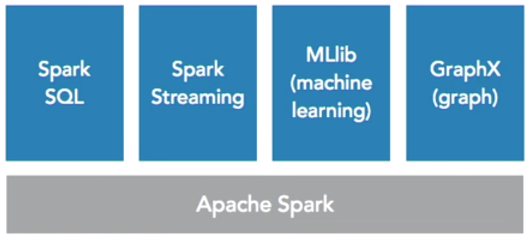
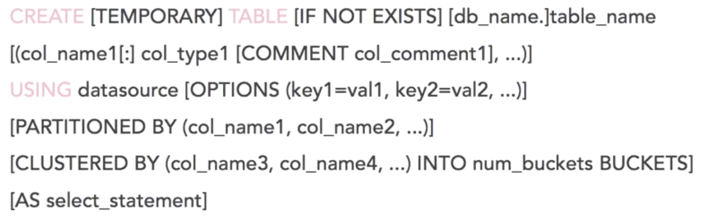

## Lynda教程：Apache Spark Essential Training

### introducing apache spark

##### understanding spark

快的、普适的、面对大规模数据的处理；曾经主要用来处理数据科学的问题，但是也可以处理很多其他的东西，比如实时事件流式处理

选择spark的主要原因：

- 速度：基于内存，比mapreduce快100倍；基于硬盘，比mapreduce快10倍
- 易用性：原生支持java scala python R SQL；支持80个高级操作；并行、流式；可以在shell里交互执行，或者从其他流行的interface里执行，如 Jupyter Notebooks, Apache Zeppelin，命令行；流行的分析平台 Tableau可以使用SparkSQL直接连接
- 普适性：
- 跨平台：hadoop, hbase, cassandra, mesos, hive；在spark2，可以直接使用dataframe连接关系数据库


##### origins of spark

2003：开发Nutch，分布式计算平台

2006：Yahoo雇佣原班人马，发布了hadoop；同时，google发布了java 接口的mapreduce

2008: fabebook发布Hive

「mapreduce基于java，面向批处理，很慢；Hive是mapreduce的SQL抽象包装」

2009: UCB开始开发spark

2010: spark开源 BSD license

2014: spark成为apache顶级项目


##### overview of spark components


spark core：最基础的组件，分布式任务、调度、输入输出

spark SQL: 支持标准SQL，要先在spark里创建表结构才能使用SQL；tableau可以容易集成spark；dataframes to spark is pandas to python， dataframes可以看作是一个table

spark streaming: 是micro batches；函数式架构

MLlib: apache mahout是一个基于disk的ML库，spark比它快9倍，MLlib有很多常用的ML函数

GraphX: 图处理，比如图数据库，寻找关系；是内存版的apache Giraph；基于dataframe RDD；不是一个真的图数据库实现

sparkR: 分布式dataframes；R package for spark，spark可以和R studio集成


##### where spark shines

spark的用武之地：

- data integration：ETL，把数据从一个地方挪到另一个地方，并清洗和标准化
- 机器学习：
- 实时处理：
- 推荐系统：
- BI/analytics：


应该把spark看作是一些工具的集合，而不是单独的东西

使用spark的语言排名：scala，python，sql，java，R

使用spark的产品排名：商业分析，数据仓库，实时流处理，推荐系统，日志系统


##### overview of databricks

databricks是一个基于云的运行spark的管理平台

容易搭建，让学习更简单

databricks是一个spark的实现


databricks专业术语：

- 工作区：所有文件的集合地方
- notebook：一个文件，scala python java markdown sql可以写在一个文件里
- 库：就是库
- 表：数据库中的表
- 集群：
- 任务：


网站入口：community.cloud.databricks.com


##### introduction to notebooks and pyspark

notebooks可以运行 scala python java sql

notebook里有cell，一个cell里是独立的代码


### analyzing data in spark

##### understanding data interfaces

RDD 弹性 分布式 数据集：最底层的数据api，可以看成是一个容器，来处理各种类型的数据对象

dataframe：基于RDD，但是只包含row类型；就像pandas python、table sql

dataset：最新的api，是RDD和dataframe的结合，可以像RDD那样有类型，像dataframe那样query；是spark未来的方向


统一 spark2.0 API：


dataset操作：

​	action：立刻执行

​	transformation：懒执行，只有在被action调用才执行

| action  | transformation |
| ------- | -------------- |
| show    | select         |
| count   | distinct       |
| collect | groupBy        |
| save    | sum            |
|         | orderBy        |
|         | filter         |
|         | limit          |


file: spark streaming, ETL

dataframe: spark ML

table: spark SQL


##### working with text files

schema-nerver file：普通文本

schema-later file 半结构化：Json

schema-first file 结构化：database，csv


pyspark

以下这些代码都可以在databricks已经import的文件夹里看到

```python
# Now let's create a simple list with 10000 integers
# xrange() is more memory efficient so let's use that

data = xrange(1, 10001)


# So far we've done just basic Python, now let's use Spark
# Start by using 'sc' to tell Spark we want to use the SparkContext
# Then we use parallelize() to create a Dataset and spread it across
# the cluster partitions

ds = sc.parallelize(data, 8)
# more info on parallelize here 
# help(sc.parallelize)

# show what we have in ds using the collect() action
print ds.collect() # we don't need to use "print" here, but it's better for formatting

# Let's browse the file system to start
%fs ls

# Now checkout some sample data
%fs ls /databricks-datasets/bikeSharing/README.md

# Next, read in a file and count the lines in a document
path = "/databricks-datasets/bikeSharing/README.md"
data = sc.textFile(path) # use the sc context to read in a text file
data.count()

# Take a look at the first line
data.first()

# Show the top 20 lines
data.take(20)


# read in file from above
logFile = path 

# cache the data in memory
logData = sc.textFile(logFile).cache()

# get number of times "bike" shows up
# use lambda function and lower() to convert the line to lowercase
# use count to figure out how many times this is true
numBikes = logData.filter(lambda s: 'bike' in s.lower()).count()

# show results
print("Lines with 'bike': %i" % (numBikes))

# Find a Directory with CSVs
%fs ls /databricks-datasets/Rdatasets/data-001/csv/datasets/

# Read in Directory of Files with wholeTextFiles()
# read in directory looking for anything ending in .csv
path = "/databricks-datasets/Rdatasets/data-001/csv/datasets/*.csv"

# use wholeTextFiles to get each file listed separately with {filename, content}
files = sc.wholeTextFiles(path) 

# count how many files there are
files.count()

# Convert List of Files to DataFrame
# use toDF to convert object to data frame with column names
filenames = files.toDF(['name', 'data'])

# show entire DataFrame
display(filenames)

# Show only the names using select()
display(filenames.select('name'))
```


##### loading CSV data into dataframes

```python
# Find a Directory with CSVs
%fs ls /databricks-datasets/online_retail/data-001/

# specify path
path = "/databricks-datasets/online_retail/data-001/data.csv"

# load as text，没有用sc，因为这是spark2的写法，api融合在了一起
data = spark.read.csv(path) 

# show sample
data.take(20)


# Read in Data to DataFrame with Column Headers
# read in file using csv format
df = spark.read.load(path,
                    format='com.databricks.spark.csv', 
                    header='true',
                    inferSchema='true')

# show 20 rows
display(df)


# Show Countries
# For this we'll need a few functions
display( # shows the results in a grid
   df 
    .select("Country") # chooses just the 1 column
    .distinct() # removes duplicates
    .orderBy("Country") # sorts results in ascending
)
```


##### exploring data in dataframes

```python
# Find a Directory with CSVs
%fs ls /databricks-datasets/online_retail/data-001/


# Read in Data to DataFrame with Column Headers
# specify path
path = "/databricks-datasets/online_retail/data-001/data.csv"

# read in file using csv format
df = spark.read.load(path,
                    format='com.databricks.spark.csv', 
                    header='true',
                    inferSchema='true')

# show 20 rows
display(df)


# Show DataFrame Schema
# take a look at our schema
df.printSchema()


# Select Just 1 Column
# show just the countries
df.select("Country").show()


# Remove Duplicates from Column and Sort
# For this we'll need a few functions
display( # shows the results in a grid
   df 
    .select("Country") # chooses just the 1 column
    .distinct() # removes duplicates
    .orderBy("Country") # sorts results in ascending
)


# Calculate Order Totals
display(
  df
    .select(df["InvoiceNo"],df["UnitPrice"]*df["Quantity"])
    .groupBy("InvoiceNo")
    .sum()
  )


# Inspect Results with Filter，where语句
df.filter(df["InvoiceNo"]==536596).show()


# Show Top 10 Products in the UK
display(
  df
    .select(df["Country"], df["Description"],(df["UnitPrice"]*df["Quantity"]).alias("Total"))
    .groupBy("Country", "Description")
    .sum()
    .filter(df["Country"]=="United Kingdom") # 如果用了单引号相当于赋值
    .sort("sum(Total)", ascending=False)
    .limit(10)
  )
```


##### saving your results

```python
# dataframewriter可以在spark里把dataframe作为一个表保存，如果连接了hive，会自动创建hive中的表作为已管理的表


# Read in Data to DataFrame with Column Headers
# specify path
path = "/databricks-datasets/online_retail/data-001/data.csv"

# read in file using csv format
df = spark.read.load(path,
                    format='com.databricks.spark.csv', 
                    header='true',
                    inferSchema='true')

# show 20 rows
display(df)


# Show Top Products in the UK
display(
  df
    .select(df["Country"], df["Description"],(df["UnitPrice"]*df["Quantity"]).alias("Total"))
    .groupBy("Country", "Description")
    .sum()
    .filter(df["Country"]=="United Kingdom")
    .sort("sum(Total)", ascending=False)
  )


# Calculate Product Sales by Country
r1 = df.select(df["Country"], df["Description"],(df["UnitPrice"]*df["Quantity"]).alias("Total"))

display(r1)


# Save Results as Table
r1.write.saveAsTable("product_sales_by_country")

# 相当于告诉spark，这是一个table；可以在其上运行spark SQL
```


### using Spark SQL to analyze data

##### creating tables

spark SQL的语法：




```sql
/* Find a CSV */
%fs ls /databricks-datasets/samples/population-vs-price/


/* Create Table w/o Schema */
CREATE TABLE IF NOT EXISTS population_v_price
USING CSV
OPTIONS (path "/databricks-datasets/samples/population-vs-price/data_geo.csv", header "true", inferSchema "true");

/* check results */
select * from population_v_price limit 100;


/* Create Table w/ Schema */
CREATE TABLE IF NOT EXISTS online_retail(
InvoiceNo string,
StockCode string,
Description string,
Quantity int,
InvoiceDate string,
UnitPrice double,
CustomerID int,
Country string)
USING CSV
OPTIONS (path "/databricks-datasets/online_retail/data-001/data.csv", header "true");

/* check results */
select * from online_retail limit 100;

/* 可以在databricks的table页面上传csv，通过ui创建table */
```


##### querying data with spark SQL

```sql
/* Take a look at our sale table */
select *
from cogsley_sales
limit 100;

/* Calculate Sales Totals */
select CompanyName, round(sum(SaleAmount)) as Sales
from cogsley_sales
group by CompanyName
order by 2 desc

/* Join to get Client Info */
select CompanyName, IPOYear, Symbol, round(sum(SaleAmount)) as Sales
from cogsley_sales
left join cogsley_clients on CompanyName = Name
group by CompanyName, IPOYear, Symbol
order by 1

/* Join to get State Info */
select i.StateCode, round(sum(s.SaleAmount)) as Sales
from cogsley_sales s
join state_info i on s.State = i.State
group by i.StateCode
```


##### visualizing data in databricks notebooks

```sql
/* databricks 上点点按钮，拖拽一下指标，就自动生成了 */

/* Basic Bar Chart */
select *
from cogsley_sales
limit 100;

/* Basic Line Chart */
select *
from cogsley_sales
limit 100;

/* Build a Map */
/* requires 2char state code */
select i.StateCode, round(sum(s.SaleAmount)) as Sales
from cogsley_sales s
join state_info i on s.State = i.State
group by i.StateCode

/* Box Plot (bonus!) */
select *
from cogsley_sales
limit 100;
```


### running machine learning algorithms using MLlib

##### introduction to machine learning with spark

有监督训练模型：已经知道了结果，就在训练的时候，看哪个模型最匹配

无监督训练模型：没有已知的结果，也就没有人的偏见


有监督训练模型：

​	分类：垃圾邮件分类

​	回归：变量之间的关系

无监督训练模型：

​	聚类：不同客户的聚类，事先不知道有什么种类


##### preparing data for machine learning

databricks上的社区版集群，60min不用，就会自动释放

使用spark1.6，因为不是所有的功能都上了spark2.0

```python
# Download the file with curl
%sh curl -O 'https://raw.githubusercontent.com/bsullins/bensullins.com-freebies/master/CogsleyServices-SalesData-US.csv'
# saves file to file:/databricks/driver/CogsleyServices-SalesData-US.csv


# Read in and Cleanse Data
path = 'file:/databricks/driver/CogsleyServices-SalesData-US.csv'
# path = "/databricks-datasets/samples/population-vs-price/data_geo.csv"

# Use the Spark CSV datasource with options specifying:
# - First line of file is a header
# - Automatically infer the schema of the data
data = sqlContext.read.format("csv")\
  .option("header", "true")\
  .option("inferSchema", "true")\
  .load(path)
 
data.cache() # Cache data for faster reuse
data = data.dropna() # drop rows with missing values
 
# Register table so it is accessible via SQL Context
# For Apache Spark = 2.0
# data.createOrReplaceTempView("data_geo")

display(data)


# Aggregate and Convert
# Get monthly sales totals，csv转成dataframe
summary = data.select("OrderMonthYear", "SaleAmount").groupBy("OrderMonthYear").sum().orderBy("OrderMonthYear").toDF("OrderMonthYear","SaleAmount")

# Convert OrderMonthYear to integer type
results = summary.map(lambda r: (int(r.OrderMonthYear.replace('-','')), r.SaleAmount)).toDF(["OrderMonthYear","SaleAmount"])


# Convert DataFrame to Features and Labels
# convenience for specifying schema
# feature.value = x, lable = y; LabeledPoint(y,x)
from pyspark.mllib.regression import LabeledPoint
 
data = results.select("OrderMonthYear", "SaleAmount")\
  .map(lambda r: LabeledPoint(r[1], [r[0]]))\
  .toDF()
  
display(data)
```


##### building a linear regression model

```python
# Download the file with curl
%sh curl -O 'https://raw.githubusercontent.com/bsullins/bensullins.com-freebies/master/CogsleyServices-SalesData-US.csv'
# saves file to file:/databricks/driver/CogsleyServices-SalesData-US.csv


# Read in and Cleanse Data
path = 'file:/databricks/driver/CogsleyServices-SalesData-US.csv'
# path = "/databricks-datasets/samples/population-vs-price/data_geo.csv"

# Use the Spark CSV datasource with options specifying:
# - First line of file is a header
# - Automatically infer the schema of the data
data = sqlContext.read.format("csv")\
  .option("header", "true")\
  .option("inferSchema", "true")\
  .load(path)
 
data.cache() # Cache data for faster reuse
data = data.dropna() # drop rows with missing values
 
# Register table so it is accessible via SQL Context
# For Apache Spark = 2.0
# data.createOrReplaceTempView("data_geo")

display(data)


# Aggregate and Convert
# Get monthly sales totals
summary = data.select("OrderMonthYear", "SaleAmount").groupBy("OrderMonthYear").sum().orderBy("OrderMonthYear").toDF("OrderMonthYear","SaleAmount")

# Convert OrderMonthYear to integer type
results = summary.map(lambda r: (int(r.OrderMonthYear.replace('-','')), r.SaleAmount)).toDF(["OrderMonthYear","SaleAmount"])


# Convert DataFrame to Features and Labels
# convenience for specifying schema
from pyspark.mllib.regression import LabeledPoint
 
data = results.select("OrderMonthYear", "SaleAmount")\
  .map(lambda r: LabeledPoint(r[1], [r[0]]))\
  .toDF()
  
display(data)


# Build Linear Regression Model
# Import LinearRegression class
from pyspark.ml.regression import LinearRegression
 
# Define LinearRegression algorithm
lr = LinearRegression()
 
# Fit 2 models, using different regularization parameters
modelA = lr.fit(data, {lr.regParam:0.0})
modelB = lr.fit(data, {lr.regParam:100.0})

# Make predictions
predictionsA = modelA.transform(data)
predictionsB = modelB.transform(data)

display(predictionsA)
```


##### evaluating a linear regression model

```python
# Download the file with curl
%sh curl -O 'https://raw.githubusercontent.com/bsullins/bensullins.com-freebies/master/CogsleyServices-SalesData-US.csv'
# saves file to file:/databricks/driver/CogsleyServices-SalesData-US.csv


# Read in and Cleanse Data
path = 'file:/databricks/driver/CogsleyServices-SalesData-US.csv'
# path = "/databricks-datasets/samples/population-vs-price/data_geo.csv"

# Use the Spark CSV datasource with options specifying:
# - First line of file is a header
# - Automatically infer the schema of the data
data = sqlContext.read.format("csv")\
  .option("header", "true")\
  .option("inferSchema", "true")\
  .load(path)
 
data.cache() # Cache data for faster reuse
data = data.dropna() # drop rows with missing values
 
# Register table so it is accessible via SQL Context
# For Apache Spark = 2.0
# data.createOrReplaceTempView("data_geo")

display(data)


# Aggregate and Convert
# Get monthly sales totals
summary = data.select("OrderMonthYear", "SaleAmount").groupBy("OrderMonthYear").sum().orderBy("OrderMonthYear").toDF("OrderMonthYear","SaleAmount")

# Convert OrderMonthYear to integer type
results = summary.map(lambda r: (int(r.OrderMonthYear.replace('-','')), r.SaleAmount)).toDF(["OrderMonthYear","SaleAmount"])


# Convert DataFrame to Features and Labels
# convenience for specifying schema
from pyspark.mllib.regression import LabeledPoint
 
data = results.select("OrderMonthYear", "SaleAmount")\
  .map(lambda r: LabeledPoint(r[1], [r[0]]))\
  .toDF()
  
display(data)


# Build Linear Regression Model
# Import LinearRegression class
from pyspark.ml.regression import LinearRegression
 
# Define LinearRegression algorithm
lr = LinearRegression()
 
# Fit 2 models, using different regularization parameters
modelA = lr.fit(data, {lr.regParam:0.0})
modelB = lr.fit(data, {lr.regParam:100.0})

# Make predictions
predictionsA = modelA.transform(data)
predictionsB = modelB.transform(data)

display(predictionsA)


# Check Models for Accuracy
from pyspark.ml.evaluation import RegressionEvaluator
evaluator = RegressionEvaluator(metricName="rmse")

RMSE = evaluator.evaluate(predictionsA)
print("ModelA: Root Mean Squared Error = " + str(RMSE)) 

RMSE = evaluator.evaluate(predictionsB)
print("ModelB: Root Mean Squared Error = " + str(RMSE))
```


##### visualizing a linear regression model

```python
# Download the file with curl
%sh curl -O 'https://raw.githubusercontent.com/bsullins/bensullins.com-freebies/master/CogsleyServices-SalesData-US.csv'
# saves file to file:/databricks/driver/CogsleyServices-SalesData-US.csv


# Read in and Cleanse Data
path = 'file:/databricks/driver/CogsleyServices-SalesData-US.csv'
# path = "/databricks-datasets/samples/population-vs-price/data_geo.csv"

# Use the Spark CSV datasource with options specifying:
# - First line of file is a header
# - Automatically infer the schema of the data
data = sqlContext.read.format("csv")\
  .option("header", "true")\
  .option("inferSchema", "true")\
  .load(path)
 
data.cache() # Cache data for faster reuse
data = data.dropna() # drop rows with missing values
 
# Register table so it is accessible via SQL Context
# For Apache Spark = 2.0
# data.createOrReplaceTempView("data_geo")

display(data)


# Aggregate and Convert
# Get monthly sales totals
summary = data.select("OrderMonthYear", "SaleAmount").groupBy("OrderMonthYear").sum().orderBy("OrderMonthYear").toDF("OrderMonthYear","SaleAmount")

# Convert OrderMonthYear to integer type
results = summary.map(lambda r: (int(r.OrderMonthYear.replace('-','')), r.SaleAmount)).toDF(["OrderMonthYear","SaleAmount"])


# Convert DataFrame to Features and Labels
# convenience for specifying schema
from pyspark.mllib.regression import LabeledPoint
 
data = results.select("OrderMonthYear", "SaleAmount")\
  .map(lambda r: LabeledPoint(r[1], [r[0]]))\
  .toDF()
  
display(data)


# Build Linear Regression Model
# Import LinearRegression class
from pyspark.ml.regression import LinearRegression
 
# Define LinearRegression algorithm
lr = LinearRegression()
 
# Fit 2 models, using different regularization parameters
modelA = lr.fit(data, {lr.regParam:0.0})
modelB = lr.fit(data, {lr.regParam:100.0})

# Make predictions
predictionsA = modelA.transform(data)
predictionsB = modelB.transform(data)

display(predictionsA)


# Check Models for Accuracy
from pyspark.ml.evaluation import RegressionEvaluator
evaluator = RegressionEvaluator(metricName="rmse")
RMSE = evaluator.evaluate(predictionsA)
print("ModelA: Root Mean Squared Error = " + str(RMSE)) 

RMSE = evaluator.evaluate(predictionsB)
print("ModelB: Root Mean Squared Error = " + str(RMSE))


# Create Tables with Predictions

# define column names
cols = ["OrderMonthYear", "SaleAmount", "Prediction"]

# use parallelize to create an RDD
# use map() with lambda to parse features
tableA = sc.parallelize(\
            predictionsA.map(lambda r: (float(r.features[0]), r.label, r.prediction)).collect()\
         ).toDF(cols) 

# repeate for modelB
tableB = sc.parallelize(\
            predictionsB.map(lambda r: (float(r.features[0]), r.label, r.prediction)).collect()\
         ).toDF(cols) 

# check results
# display(tableA)

# save results as tables
tableA.write.saveAsTable('predictionsA', mode='overwrite')
print "Created predictionsA table"

tableB.write.saveAsTable('predictionsB', mode='overwrite')
print "Created predictionsB table"


# Simple Visualization
%sql 
select 
    a.OrderMonthYear,
    a.SaleAmount,
    a.prediction as ModelA,
    b.prediction as ModelB
from predictionsA a
join predictionsB b on a.OrderMonthYear = b.OrderMonthYear
```


### real-time data analysis with Spark Streaming

##### introduction to streaming analytics

micro bath


##### streaming context setup

```python
# Download Sales Data
%sh 
curl -O 'https://raw.githubusercontent.com/bsullins/bensullins.com-freebies/master/sales_log.zip'
file sales_log.zip

%sh unzip sales_log.zip

%fs ls 'file:/databricks/driver/sales_log/'


# Read in Data
from pyspark.sql.types import *

path = "file:/databricks/driver/sales_log/"

# create schema for data so stream processing is faster
salesSchema = StructType([
  StructField("OrderID", DoubleType(), True),
  StructField("OrderDate", StringType(), True),
  StructField("Quantity", DoubleType(), True),
  StructField("DiscountPct", DoubleType(), True),
  StructField("Rate", DoubleType(), True),
  StructField("SaleAmount", DoubleType(), True),
  StructField("CustomerName", StringType(), True),
  StructField("State", StringType(), True),
  StructField("Region", StringType(), True),
  StructField("ProductKey", StringType(), True),
  StructField("RowCount", DoubleType(), True),
  StructField("ProfitMargin", DoubleType(), True)])

# Static DataFrame containing all the files in sales_log
data = (
  spark
    .read
    .schema(salesSchema)
    .csv(path)
)

# create table so we can use SQL, temp的不会存在于table菜单里
data.createOrReplaceTempView("sales")

display(data)


# Check Table，在python notebook里使用sql，需要加%sql
%sql select * from sales


# Build a Chart
%sql 
select 
  ProductKey as Products,
  round(sum(SaleAmount)) as TotalSales
from sales
group by ProductKey
order by 2 desc
limit 100


# Streaming Setup
from pyspark.sql.functions import *

# Similar to definition of staticInputDF above, just using `readStream` instead of `read`
streamingInputDF = (
  spark
    .readStream                       
    .schema(salesSchema)              # Set the schema for our feed
    .option("maxFilesPerTrigger", 1)  # Treat a sequence of files as a stream by picking one file at a time
    .csv(path)
)

# Same query as staticInputDF
streamingCountsDF = (                 
  streamingInputDF
    .select("ProductKey", "SaleAmount")
    .groupBy("ProductKey")
    .sum()
)

# Is this DF actually a streaming DF?
streamingCountsDF.isStreaming
```


##### querying streaming data

```python
# Download Sales Data
%sh 
curl -O https://raw.githubusercontent.com/bsullins/bensullins.com-freebies/master/sales_log.zip
file sales_log.zip

%sh unzip sales_log.zip

# If already exists, check directory
%fs ls 'file:/databricks/driver/sales_log/'


# Read in Data
from pyspark.sql.types import *

path = "file:/databricks/driver/sales_log/"

# create schema for data so stream processing is faster
salesSchema = StructType([
  StructField("OrderID", DoubleType(), True),
  StructField("OrderDate", StringType(), True),
  StructField("Quantity", DoubleType(), True),
  StructField("DiscountPct", DoubleType(), True),
  StructField("Rate", DoubleType(), True),
  StructField("SaleAmount", DoubleType(), True),
  StructField("CustomerName", StringType(), True),
  StructField("State", StringType(), True),
  StructField("Region", StringType(), True),
  StructField("ProductKey", StringType(), True),
  StructField("RowCount", DoubleType(), True),
  StructField("ProfitMargin", DoubleType(), True)])

# Static DataFrame containing all the files in sales_log
data = (
  spark
    .read
    .schema(salesSchema)
    .csv(path)
)

# create table so we can use SQL
data.createOrReplaceTempView("sales")

display(data)


# Check Table
%sql select * from sales

# Build a Chart
%sql 
select 
  ProductKey as Products,
  round(sum(SaleAmount)) as TotalSales
from sales
group by ProductKey
order by 2 desc
limit 100


# Streaming Setup
from pyspark.sql.functions import *

# Similar to definition of staticInputDF above, just using `readStream` instead of `read`
streamingInputDF = (
  spark
    .readStream                       
    .schema(salesSchema)              # Set the schema for our feed
    .option("maxFilesPerTrigger", 1)  # Treat a sequence of files as a stream by picking one file at a time
    .csv(path)
)

# Same query as staticInputDF
streamingCountsDF = (                 
  streamingInputDF
    .select("ProductKey", "SaleAmount")
    .groupBy("ProductKey")
    .sum()
)

# Is this DF actually a streaming DF?
streamingCountsDF.isStreaming


# Create Streaming Table
query = (
  streamingCountsDF
    .writeStream
    .format("memory")        # memory = store in-memory table (for testing only in Spark 2.0)
    .queryName("sales_stream")     # counts = name of the in-memory table
    .outputMode("complete")  # complete = all the counts should be in the table
    .start()
)

%sql 
select *  
from sales_stream
order by 2 desc
limit 100

# 重大发现，这里的stream的聚合不是针对时间窗的，像flink那样，而是针对所有已有的数据的
```


### connecting BI tools to spark

##### setting up spark locally

```python
# 去apache spark官网下载spark

# 解压，执行
./bin/pyspark

sc
```


##### connecting Jupyter notebooks to spark

安装Anaconda2

conda install jupyter

conda update jupyter


```bash
For Mac:

# 1) Set path for Spark and adjust to the correct path to Spark
echo “export PATH=$PATH:/path_to_downloaded_spark/spark-1.6.0/bin” >> .profile

# 2) Setting up PySpark driver
echo “export PYSPARK_DRIVER_PYTHON=ipython” >> .profile

# 3) Specifies PySpark options
echo “export PYSPARK_DRIVER_PYTHON_OPTS=‘notebook’ pyspark” >> .profile

source .profile

cd /notebook
pyspark 自动打开jupyter网页


# For Windows
# 1) Puts Spark in a path variable so you can execute commandlets from that directory.  Adjust to your own directory.
$env:Path += “;C:\Users\bsullins\spark\bin\”

# 2) Set vars for PySpark
$env:PYSPARK_DRIVER_PYTHON=“ipython”

# 3) Specifies PySpark options
$env:PYSPARK_DRIVER_PYTHON_OPTS=“notebook”

# Enter in the following commands instead of source .profile
cd ../
cd .\notebooks\
pyspark
```


##### other connection options

| BI Tools  |
| :-------: |
| JDBC/ODBC |
| Spark SQL |


### conclusion


## Lynda教程：Introduction to Spark SQL and DataFrames

### introduction to spark dataframes

##### introduction to dataframes


##### sql for dataframes


### installing spark

##### install spark

##### install pyspark

##### using jupyter notebooks with pyspark


### getting started with spark dataframes

##### set up jupyter notebook

##### load data into dataframes: csv files

##### load data into dataframes: JSON files

##### basic dataframe operations

##### filter data with dataframe api

##### aggregate data with dataframe api

##### sample data from dataframes

##### save data from dataframes


### SQL for dataframes

##### querying dataframes with sql

##### filtering dataframes with sql

##### aggregating data with sql

##### joining dataframes with sql

##### eliminating duplicates in dataframes

##### working with NA values in dataframes


### data analysis with spark

##### exploratory data analysis with dataframes

##### exploratory data analysis with spark sql

##### timeseries analysis with dataframes

##### basic machine learning with dataframes, part1

##### basic machine learning with dataframes, part2


### conclusion


## Lynda教程：Big Data Analytics with Hadoop and Apache Spark

### introduction and setup

##### apache hadoop overview

##### apache spark overview

##### integrating hadoop and spark

spark和hadoop集成的很棒：

- 并行性
- 优化性
- 缓存
- YARN


##### setting up the environment

下载HDP sandbox，docker版本

```bash
vi /etc/hosts
# 添加
127.0.0.1 sandbox-hdp
127.0.0.1 sandbox-hdp.hortonworks.com

sh docker-deploy-hdp30.sh

# 有许多镜像要下载，然后启动大概需要30min，访问 localhost:8080

ambari
username: raj_ops
password: raj_ops

# 访问 sandbox-hdp:1080 选择右下角shell ui
login as raj_ops
hdfs dfs -chmod 777 /user/raj_ops

# 访问 sandbox-hdp:9995 Zeppelin
Zeppelin notebooks
```


```python
%spark2

//Check if everything is installed and working correctly
println("Current installed version of Spark is " + spark.version)
```


### hdfs data modeling for analytics

##### storage formats

hadoop的存储格式：

- Raw text (blobs) ---文本文件
- Structured text files (CSV, XML, JSON) ---文本文件
- Sequence files ---文本文件
- Avro ---Avro
- ORC
- Parquet ---Parquet


文本文件：读写简单；性能低；需要更多存储；没有schema == 【不推荐使用】

Avro：语言无关的序列化，从一种语言序列化，可以从另一种语言反序列化；基于row；支持自描述schema，可以对数据实施约束；可以压缩，优化存储空间；可以分区，从而支持并行读写 == 【适合支持多语言】

Parquet：基于colum，像columnar DB，意味着每个列可以分别从disk读取，不需要读取无关的列，并行化，也节省IO；支持schema；可压缩（列的级别），可拆分 分区；支持数据嵌套结构 == 【适合批处理任务】


##### compression

hadoop 压缩选项（编解码器 codec）：

- Snappy：google开发的；可以普通的压缩；出色的处理性能；压缩整个文件，而不是一个一个元素的压缩；不可拆分，也就不能并行操作
- LZO：可以普通的压缩；出色的处理性能；可拆分，从而可并行操作；需要单独的license
- GZIP：很好的压缩效果；普通的处理性能；不可拆分；和Parquet结合得很好，每个列可以单独压缩，从而不需要拆分；适合和Parquet结合使用，适合容器类型的分析的应用
- bzip2：很好的压缩效果；很差的处理性能；可拆分；适合archival类型的应用，适合：只需写一次，备份场景，转发备份


选择哪一个推荐做POC验证，看看压缩比和处理性能的实际影响


##### partitioning

传统数据库通过做index来加速where语句的速度，hdfs没有index的概念，即使读取一行，整个文件都会被读来抽取出那一行，严重损害IO；分区可以只读取数据的子集，基于partition key，就像index的作用一样；可以把多个属性用于构建partitioning

把数据存到hdfs里，指定一个partition key，hadoop会为分区创建一个个单独的目录；基于属性的值，把数据拆分到各个对应的目录里；比如产品=鼠标，产品=键盘，产品=摄像头，是三个目录

选择分区的属性：值是可枚举的有限长度列表，在filter中经常被使用，数据最好均匀分布在这些分区中


##### bucketing

partition的代替项，bucketing；partition要求属性的值是一个小集合，如果要对一个值是个大集合的属性做分区，就选择bucketing

bucketing很像partitioning，但是不是直接用value，而是用hash(value)，这样数量就可以控制住；

选择bucketing的属性：值是大量的列表，在filter中经常被使用，数据最好均匀分布在这些分区中


##### best practices for data storage

首先要理解数据的读写模式：读敏感，写敏感，读写敏感

要决定什么需要优化，什么可以妥协

小心选择，因为之后不容易修改

在真实数据上进行测试，来看性能和存储的实际情况

选择合适的partition bucketing key，因为会损失写性能


### data ingestion with spark

##### reading external files into spark

```python
01. Reading Files into Spark
Data can be read into Apache Spark data frames from a variety of data sources.

examples :

A flat file on a local disk
A file from HDFS
A Kafka Topic
In this example, we will read a CSV file in a HDFS folder into a Spark Data Frame.


%spark2

"""
Read the raw CSV file int a Spark DataFrame
    Use inferSchema to infer the schema automatically from the CSV file
"""

val rawSalesData = spark
                .read
                .option("inferSchema", "true")
                .option("header", "true")
                .csv("/user/raj_ops/raw_data/sales_orders.csv");

# Print the schema for verification
rawSalesData.printSchema();

# Print the first 5 records for verification
rawSalesData.show(5)
```


##### writing to hdfs

```python
02.Writing to HDFS
Write the rawSalesData Data Frame into HDFS as a Parquet file. Use Parquet as the format since it enables splitting and filtering. Use GZIP as the compression codec.

On completion, verify if the files are correctly through HDFS command line or Ambari

%spark2

//Write to Sales Data to HDFS for future processing

rawSalesData.write
            .format("parquet")
            .mode("overwrite")
            .option("compression", "gzip")
            .save("/user/raj_ops/raw_parquet");
```


##### parallel writes with partitioning

```python
03. Writing to HDFS with Partitioning
Write a partitioned Parquet file in HDFS. Partition will be done by Product. This will create one directory per unique product available in the raw CSV. Verify through HDFS command line or Ambari

%spark2

rawSalesData.write
            .format("parquet")
            .mode("overwrite")
            .option("compression", "gzip")
            .partitionBy("Product")
            .save("/user/raj_ops/partitioned_parquet")
```


##### parallel writes with bucketing

```python
04. Writing to Hive with Bucketing
Create a Bucketed Hive table for orders. Bucketing will be done by Product. It will create 3 buckets based on the hash generated by Product. Hive tables can be queried through SQL.

%spark2

//Create a Hive Table for sales data with 2 buckets.
rawSalesData.write
            .format("parquet")
            .mode("overwrite")
            .bucketBy(3, "Product")
            .saveAsTable("product_bucket_table")
            
//Data goes in here.
println("Hive Data Stored in : " + sc.getConf.get("spark.sql.warehouse.dir") + "\n")
            
    
//Read through SQL
sql("SELECT * FROM product_bucket_table where Product='Mouse'").show(5)
```


##### best practices for ingestion

开启并行化来获取最大的写性能

对于增量的数据注入，使用append

读取外部的数据，使用能提供并行的数据源：JDBC，KAFKA，从disk读就把大文件拆成小文件


### data extraction with spark

##### how spark works

transform是并行的

groupby reduce的时候，需要shuffle，会导致IO和内存的瓶颈


spark execution plan：会自己优化性能和资源消耗

懒执行：当reduce或者collect要执行时，就分析前面的所有步骤，开始优化，并执行；

spark 优化器会产生一份计划：降低IO，降低shuffling，减少内存使用

spark executor会直接读写外部数据源，如果源支持并行IO，如（HDFS，KAFKA，JDBC）


##### reading hdfs files with schema

```python
02. Read Parquet Files into Spark
Read a non-partitioned Parquet file into Spark. Measure the time taken. Also look at the execution plan.

%spark2

//Read the file
val salesParquet = spark.read
                        .parquet("/user/raj_ops/raw_parquet")

//Display the results and time the operation                     
spark.time(salesParquet.show(5))

//Show the execution Plan
println("\n-------------------------------EXPLAIN------------------------------------")
salesParquet.explain
println("-------------------------------END EXPLAIN--------------------------------\n")
```


##### reading partitioned data

```python
03.Read Partitioned Data into Spark

%spark2

//Read all the partitions. Use basePath to have partition key as part of data
val salesPartitioned = spark.read
                            .option("basePath", "/user/raj_ops/partitioned_parquet/")
                            .parquet("/user/raj_ops/partitioned_parquet/*")
                            
//Display the results and time the operation                     
spark.time(salesPartitioned.show(5))

//Show the execution Plan
println("\n-------------------------------EXPLAIN------------------------------------")
salesPartitioned.explain
println("-------------------------------END EXPLAIN--------------------------------\n")


%spark2

//Read a specific partition only
val salesHeadset = spark.read
                            .parquet("/user/raj_ops/partitioned_parquet/Product=Headset")

//Display the results and time the operation                     
spark.time(salesHeadset.show(5))

//Show the execution Plan
println("\n-------------------------------EXPLAIN------------------------------------")
salesHeadset.explain
println("-------------------------------END EXPLAIN--------------------------------\n")

```


##### reading bucketed data

```python
04. Read Bucketed Data into Spark

%spark2

//Read data from Hive
val salesBucketed = sql("SELECT * FROM product_bucket_table")

//Display the results and time the operation                     
spark.time(salesBucketed.show(5))

//Show the execution Plan
println("\n-------------------------------EXPLAIN------------------------------------")
salesBucketed.explain
println("-------------------------------END EXPLAIN--------------------------------\n")
```


##### best practices for data extraction

减少把数据读入内存：使用基于partition key的过滤；只读取需要的列

使用支持并行操作的数据源和文件格式

保持spark的partition的数量 >= num of executors * num of cores per executor；这样可以达到最大的并发


### optimizing spark processing

##### pushing down projections

```python
01. Pushing down Projections
When downstream queries/processing only looks for a subset of columns, Spark optimizer is smart enough to identify them and only read those columns into the in-memory data frame. This saves on I/O and memory. This is called Projection Push down. While building data pipelines, it helps to be aware of how Spark works and take advantage of this for optimization.

%spark2

//Read sales data from partitioned parquet file
val salesData = spark.read
                .option("basePath", "/user/raj_ops/partitioned_parquet/")
                .parquet("/user/raj_ops/partitioned_parquet/*")
                
//Projection gets pushed down to the file scan
println("-------------------------------EXPLAIN------------------------------------")
salesData.select("Product","Quantity").explain
println("-------------------------------END EXPLAIN--------------------------------\n")

```


##### pushing down filters

```python
02. Pushing down Filters
When downstream queries/processing only looks for a subset of subset, Spark optimizer is smart enough to identify them and only read those columns into the in-memory data frame. This saves on I/O and memory. This is called Filter Push down. This works for both partition columns and non-partition columns. While building data pipelines, it helps to be aware of how Spark works and take advantage of this for optimization.

%spark2

val mouse = salesData.where($"Product" === "Mouse")

println("-------------------------------EXPLAIN Filter by Partition------------------------------------")
mouse.explain
println("-------------------------------END EXPLAIN--------------------------------\n")


val google=salesData.where( $"Customer" === "Google")

println("-------------------------------EXPLAIN Filter without Partition------------------------------------")
google.explain
println("-------------------------------END EXPLAIN--------------------------------\n")

println();
```


##### managing partitions

这里的partition不是hdfs里的partition，是spark的partition

```python
03.Partitioning and coalescing
While performing actions, Spark creates results with the default partition count. In the case of Local mode, its usually equal to the number of cores. In the case of Clusters, the default is 200. This can be too much, if the number of cores in the cluster is significantly less than the number of partitions. So repartitioning helps to set the optimal number of partitions.

Repartition does a full reshuffle and can be used for increasing/decreasing partitions.

Coalasce simply consolidates existing partitions and avoids a full reshuffle. It can be used to decrease the number of partitions.

Repartition and Coalasce themselves take significant time and resources. Do them only if multiple steps downstream will benefit from them.

%spark2
println("Default parallelism : " + sc.defaultParallelism + "\n")
//Optimal number of partitions = # of cores available.

println("Partitions in SalesData from Parquet : " + salesData.rdd.getNumPartitions + "\n")

//Read file without parallelizing
val rawSalesData = spark
                .read
                .option("inferSchema", "true")
                .option("header", "true")
                .csv("/user/raj_ops/raw_data/sales_orders.csv");
                
println("Partitions in raw CSV Read :" + rawSalesData.rdd.getNumPartitions + "\n")

//Repartition to 8 partitions
val partitionedSalesData = rawSalesData.repartition(8)

println("Partitions after repartitioning :" + partitionedSalesData.rdd.getNumPartitions + "\n")

//Coalesce to 3 partitions
val coalasedSalesData = partitionedSalesData.coalesce(3)

println("Partitions after coalese :" + coalasedSalesData.rdd.getNumPartitions + "\n")
```


##### managing shuffling

```python
04.Managing Shuffling
Actions trigger shuffling. Shuffling takes time, memory and bandwidth. While building pipelines focus on

Minimize number of shuffles
Do actions late in the pipeline after data has been filtered.
Use aggregations by partition key as much as possible, as records with the same partition key stays in the same executor node.

%spark2


val wordsRDD=spark.sparkContext
                .parallelize(Seq("Google", "Apple", "Apple", "Google", 
                    "Google", "Apple", "Apple", "Apple", "Apple", "Apple"))
                    

//Doing groupBy first. Shuffling has more data. Check DAG

print("For using group by key : ")
val groupRDD = spark.time(
                wordsRDD.map( word => (word, 1) )
                    .groupByKey()
                    .map( words => (words._1, words._2.sum ))
                    .collect())

//Doing reduce. Shuffling has less data. Check DAG
print("For using reduce : ")
var reduceRDD = spark.time(
                wordsRDD.map( word => (word, 1) )
                    .reduceByKey(_+_).collect())

                
//See content generated by groupByKey and reduceByKey
println("\nData shuffled after Group by Key : ")
wordsRDD.map( word => (word, 1) )
                    .groupByKey()
                    .collect()
                    .foreach(println)

println("\nData shuffled after Reduce by Key: ")                    
wordsRDD.map( word => (word, 1) )
                    .reduceByKey(_+_)
                    .collect()
                    .foreach(println)

```


##### improving joins

```python
05. Optimizing Joins
By default, joining two data frames require a lot of shuffling. If one data frame is considerably small, a better option is to broadcast that data frame to all the executors and then use those copies to join locally. Spark Optimizer chooses Broadcast joins when possible. Data frames within spark.sql.autoBroadcastJoinThreshold are automatically broadcasted

%spark2

val products = spark
                .read
                .option("inferSchema", "true")
                .option("header", "true")
                .csv("/user/raj_ops/raw_data/product_vendor.csv");
                
products.show()

import org.apache.spark.sql.functions.broadcast
println("-------------------------------EXPLAIN------------------------------------")
salesData.join(broadcast(products),"Product").explain
println("-------------------------------END EXPLAIN--------------------------------\n")
```


##### storing intermediate results

```python
06.Storing Intermediate Results
By default, every time an action is performed, Spark executes all the previous steps right from the data read. This can end up being very expensive, especially while using Spark in a development or interactive mode. A better option is to cache intermediate results. Spark can cache in memory. It can also persist in both memory and disk. While running under YARN, persistance happens in HDFS by default.

%spark2

//In memory only
wordsRDD.cache()
//Trigger an action for caching
wordsRDD.collect()

println("\nPlan before caching intermediate results :")
val dataBefore = coalasedSalesData.where($"Product" === "Mouse")
dataBefore.explain

//Store on disk
import org.apache.spark.storage.StorageLevel
coalasedSalesData.persist(StorageLevel.DISK_ONLY)

//Trigger an action for persisting.
coalasedSalesData.count()

println("\nPlan after caching :")
val dataAfter = coalasedSalesData.where($"Product" === "Mouse")
dataAfter.explain
```


##### best practices for data processing

push down filters and projections

choose partition keys, 基于最常用来被筛选和聚合的列

如果多个变换可以获益，那就使用拆分和合并spark分区

慎重使用join

使用spark.time() 来看执行时间

合理使用缓存

使用explain来理解plan


### use case project

##### problem definition


##### data loading

```python
6.2. Data Loading
Read CSV File

%spark2

//Read the raw CSV file int a Spark DataFrame
val rawStudentData = spark
                .read
                .option("inferSchema", "true")
                .option("header", "true")
                .csv("/user/raj_ops/raw_data/student_scores.csv")
                .withColumnRenamed("Class Score","ClassScore")
                .withColumnRenamed("Test Score","TestScore");

//Check Schema
rawStudentData.printSchema();

//Check Data
rawStudentData.show(5)


Create Partitioned HDFS Store

%spark2
//Store CSV as Paraquet file in HDFS for better performance.
//Partition by Subject - provides limited list of partitions

rawStudentData.write
            .format("parquet")
            .mode("overwrite")
            .option("compression", "gzip")
            .partitionBy("Subject")
            .save("/user/raj_ops/partitioned_student")
            
            
Read partitioned data into Data Frame
%spark
val studentData = spark.read
                    .parquet("/user/raj_ops/partitioned_student")

println("Partitions in student data : " + studentData.rdd.getNumPartitions)
```


##### total score analytics

```python
6.3. Total Score Analytics
Compute Total Score by Student and Subject

%spark2

//Transform / Map operation to add up columns for each row
val totalScore = studentData.withColumn("TotalScore", 
                            studentData.col("ClassScore") 
                            + studentData.col("TestScore"))
                            
totalScore.show(5)

println("-------------------------------EXPLAIN------------------------------------")
totalScore.explain
println("-------------------------------END EXPLAIN--------------------------------\n")


Print Total Score for Physics for all Students
%spark2


//Filter use  case. This should trigger a filter pushdown for the subject partition
val physicsScore = totalScore.filter($"Subject" === "Physics")

physicsScore.show()

println("-------------------------------EXPLAIN------------------------------------")
physicsScore.explain
println("-------------------------------END EXPLAIN--------------------------------\n")


```


##### average score analytics

```python
6.4. Compute Average Total Score for each student across Subjects

%spark2

//Cache the totalScore data frame so TotalScore does not get recomputed each time
totalScore.cache()

//Group by Key operation. 
val avgScore = totalScore
                    .groupBy("Student")
                    .avg("TotalScore")
                    
avgScore.show()

println("-------------------------------EXPLAIN------------------------------------")
avgScore.explain
println("-------------------------------END EXPLAIN--------------------------------\n")

```


##### top student analytics

```python
6.5. Find Top Student by Subject

%spark2

//Find the top score for each subject
val topScore = totalScore.groupBy("Subject")
                    .agg(max("TotalScore").alias("TopScore"))


topScore.show()

//Find the student who scored the top score.
val topStudent = totalScore.as("a")
                    .join(topScore.as("b"), 
                            $"b.TopScore" === $"a.TotalScore"
                            &&  $"b.Subject" === $"a.Subject"  )
                    .select("a.Subject","a.Student","TopScore")
                    
topStudent.show()

println("-------------------------------EXPLAIN------------------------------------")
topStudent.explain
println("-------------------------------END EXPLAIN--------------------------------\n")
```


### conclusion


