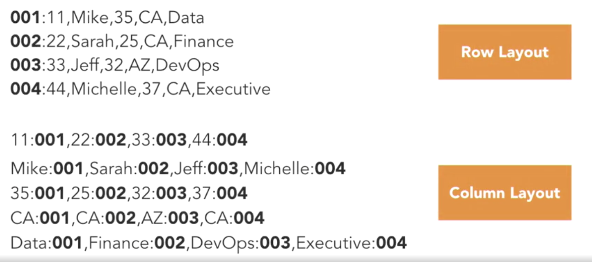
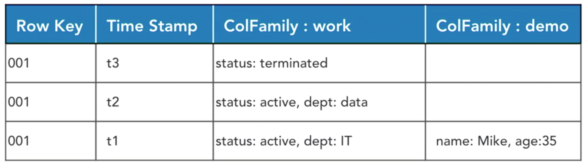

## Lynda: HBase Essential Training

### what is HBase

##### Origins of HBase

hadoop的限制：

​	无结构的数据，没有一条数据的概念，是文件，无法查询，要全都读取

​	没有随机读写

​	面向批处理的（慢）

​	不支持事务

​	文件是不可变的


hbase：

​	数据有结构，数据仍然是分布式的

​	有基于内存的组件（快）

​	支持随机读取，可以只读取某些行

​	支持增删改查	


##### Who is using HBase

##### Overview of NoSQL databases

CAP定理

一致性，可用性，分布式忍受度（一些节点会挂掉）

一个平台只能满足两条


一致性，可用性：SQL server, mysql

一致性，分布式忍受度：hbase, mongodb

可用性，分布式忍受度：cassandra, couchDB


NoSQL: 

​	key-value (mongoDB)

​	document storage (hdfs)

​	graph databases (Neo4j)

​	column families (HBase)


### HBase versus RDBMS

##### Evolution of the RDBMS

通常RDBMS包括以下几部分：

​	tables and views

​	rows and columns

​	PK, FK, etc

​	data types

​	SQL (stuctured query language)


RDBMS的缺点：

​	死板，需要提前定义表结构

​	导致开发速度慢

​	可扩展性差


NoSql的优点：

​	无模式，schemaless

​	支持分布式

​	对硬件错误容忍度高


##### Interface with HBase

shell JRuby

java api

apache phoenix：是单独的系统，支持标准SQL和JDBC，有完整的acid事务能力；相当于在hbase上有一个常规的DB，然后还有hadoop的所有好处


##### Columnar vs. row layout

处理更快，使用更少空间，更加灵活没有schema，如果没有值，就什么都不会存储





### The HBase Data Model

##### HBase terminology


namespace：是一组table

version：在时间线上回望的能力


##### how data is stored in HBase

物理上是怎么存储的


时间戳是整一个row的概念



用json来表示

```json
{
    "001": {
        work: {
            t3:status:"terminated"
            t2:status:"active",dept:"data"
            t1:status:"active",dept"IT
        }
        demo: {
        t1:name:"Mike",age:"35"
    	}
    }
}
```

由于使用了 sparsely populated data（解析填充数据），所以demo列族只有一份拷贝，没有t2 t3的数据；查询时，在解析的时候会返回t2 t3的数据

实际上column family是分开存储的，如下：

```json
file A
{
    "001": {
        work: {
            t3:status:"terminated"
            t2:status:"active",dept:"data"
            t1:status:"active",dept"IT
        }
    }
}

file B
{
    "001": {
        demo: {
        t1:name:"Mike",age:"35"
    	}
    }
}
```


##### HBase namespaces

```bash
这个概念有点像数据库中的一个choose database
create_namespace 'people'

如果不特别指定，那么有一个默认的namespace default
create 'people:employees','work','demo'

drop_namespace 'people'

alter_namespace 'people',{METHOD => 'set', 'PROPERTY_NAME' => 'PROPERTY_VALUE'}
```


##### Data model operations in HBase


```bash
查：
-获取row key 为1的数据
get 'iemployee','1'
```


```bash
-获取全部row的数据
scan 'iemployee'
```


```bash
增 改 upsert
put
     表      row     column          value
put 'sales','5099','order:orderID','US-2014-16955AA'
```


```bash
删
delete
delete '<table name>','<row>','<column name>','<time stamp>'

delete 'iemployee','1','personal:city'
deleteall 'iemployee','1'
```


##### version with timestamps in HBase


### Architecture

##### HBase architecture overview

master: 

​	Name Node: 保存了信息，数据放在HBase集群的哪里了

​	zookeeper：管理集群各个server的状态，保持各部分通信，zookeeper和HMaster通信

​	HMaster：处理所有region server，在操作HBase的时候，实际上是直接操作了HMaster

slave

​	region server：region，和HDFS data node一起，HBase中所有的数据存储在HDFS data node里


##### regions and region servers

region server：

​	admin of regions、分割 region、压缩 region

​	region：不超过1000个，region是最基础的元素，表都存在这里；好的方式是存储20-200个大region（5-20G一个region），而不是一堆小region；负载均衡


##### coprocessor overview

在region server上运行定制化代码

例子：计算平均值，要把所有数据取出来计算，这些可以在存储新数据的时候同步计算

observer and endpoint：什么样的数据来了要执行命令，然后执行命令

coprocessor让数据处理的效率更高


### Hortonworks Sandbox Setup

##### install the Hortonworks Sandbox

把sandbox下载下来，import到vBox，启动


##### start HBase using Ambari

```bash
# add sandbox.hortonworks.com to host file
mac = echo '127.0.0.1 sandbox.hortonworks.com' | sudo tee -a /private/etc/hosts

windows = echo '127.0.0.1 sandbox.hortonworks.com' >> C:\Windows\System32\Drivers\etc\hosts


# ssh into vm and change root password
ssh root@127.0.0.1 -p 2222
(default password: hadoop)

# set admin password for Ambari
ambari-admin-password-reset

# login to Ambari from browser
http://127.0.0.1:8080

# turn on HBase
```


##### Log into HBase

```bash
# login to server
ssh root@127.0.0.1 -p 2222

# switch to hbase user
su hbase

# launch hbase shell
hbase shell

# check basic hbase commands
hbase(main):001:0> help
hbase(main):004:0> version
hbase(main):004:0> whoami
hbase(main):004:0> status
hbase(main):004:0> status 'summary'
hbase(main):004:0> status 'simple'
```


### Creating Tables in HBase

##### create a new table in HBase

```bash
# view list of tables
list

# create table with column family
create 'sales','order’

# inspect table
!describe "sales”

# inspect iemployee table
!describe 'iemployee'
```


##### upload data to HBase

```bash
# from ssh as root
# download data from github and store in sales.csv
# -o output
curl -o ~/sales.csv https://raw.githubusercontent.com/bsullins/data/master/salesOrders.csv

# inspect our file
head sales.csv

# remove header row ，删除第一行
sed -i '1d' sales.csv

# updload to hadoop
hadoop fs -copyFromLocal ~/sales.csv /tmp

# view file in hdfs
hadoop fs -ls /tmp
```


##### load data into a table in HBase

```bash
# import CSV file using ImportTsv MapReduce method
hbase org.apache.hadoop.hbase.mapreduce.ImportTsv -Dimporttsv.separator=, -Dimporttsv.columns="\
HBASE_ROW_KEY, \
order:orderID, \
order:orderDate, \
order:shipDate, \
order:shipMode, \
order:profit, \
order:quantity, \
order:sales" sales hdfs://sandbox.hortonworks.com:/tmp/sales.csv

# check table after, from hbase shell
scan 'sales'

# add new row using put
put 'sales','5010','order:orderID','US-2014-169552'
put 'sales','5010','order:orderDate','2017-10-01'
put 'sales','5010','order:shipDate','2017-10-13 03:25:03.567'
put 'sales','5010','order:shipMode','Standard'
put 'sales','5010','order:profit','237.76'
put 'sales','5010','order:quantity','15'
put 'sales','5010','order:sales','745.93'

# see our new row
get 'sales','5010'

# fix the shipMode
put 'sales','5010','order:shipMode','Standard Class'

# verify our change
get 'sales','5010'
```
