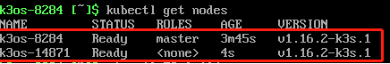
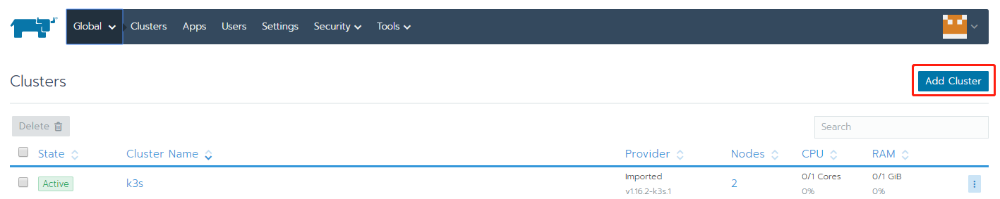
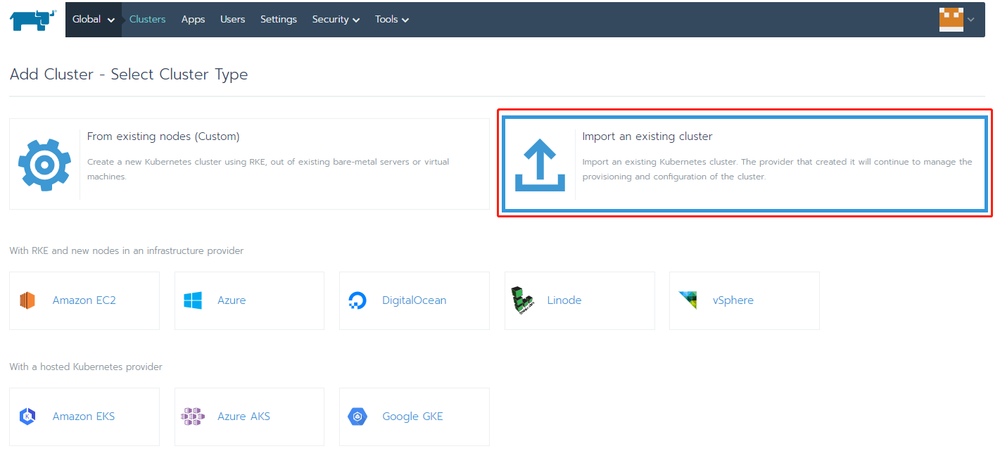
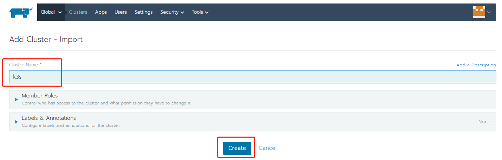
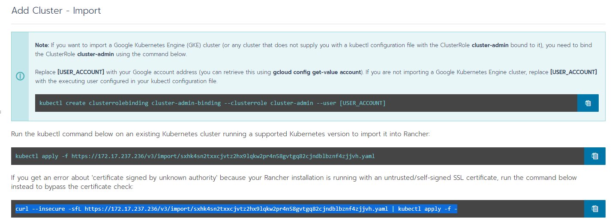
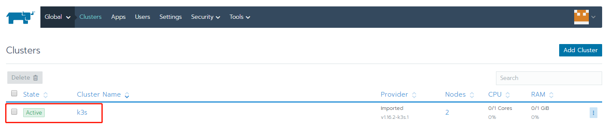

# rancher

rancher-web
rancher-desktop


## 网页

- [官网](https://rancher.com/)
- [官网 doc](https://ranchermanager.docs.rancher.com/?_gl=1*es3brl*_ga*MTkzNjEwNjk4My4xNjg0MTIxNjc4*_ga_Y7SFXF9L00*MTY4NDIyNTg2Ni4zLjEuMTY4NDIyNTg4MS40NS4wLjA.)
- [github](https://github.com/rancher/rancher)
- [支持的rancher版本](https://www.suse.com/suse-rancher/support-matrix/all-supported-versions/rancher-v2-7-3/)


## 安装rancher

rancher/server 1.x
rancher/rancher 2.x

```bash
docker run -d --name rancher\
  --restart=unless-stopped \
  -p 80:80 -p 443:443 \
  --privileged \
  rancher/rancher:stable

docker logs container-id 2>&1 | grep "Bootstrap Password:"

docker logs -f --tail 500 dreamy_morse
```

把azure的aks加入rancher中

https://rancher.com/docs/rancher/v2.x/en/cluster-provisioning/hosted-kubernetes-clusters/aks/


## rancher app商店换源

https://www.bookstack.cn/read/rancher-2.4.4-zh/4202e6686942ae51.md


## rancher domain规则

kube-dns.kube-system.svc.cluster.local

service.namespace.svc.cluster.local


## 无法删除namespace，卡在removing

https://github.com/rancher/rancher/issues/14715

```bash
kubectl delete namespace vault --force --grace-period=0

# This is a known issue with removing an imported cluster (and in the process of being fixed) but you can remove it by running kubectl edit namespace cattle-system and remove the finalizer called controller.cattle.io/namespace-auth then save. Kubernetes won't delete an object that has a finalizer on it.

kubectl edit namespace vault
```


## 要删掉一个节点，然后以全新的节点加进来

先drain


然后delete


然后删掉相关路径：

docker inspect nginx-proxy，kubelet，kube-proxy，share-mnt; 

```bash
docker rm -f $(docker ps -q)
docker container prune
docker system prune
sudo rm -r /etc/kubernetes
sudo rm -r /var/lib/etcd
sudo rm -r /var/lib/kubelet
```


然后加进来


## 安装k3os，设置server agent

在virtualBox里启动一个虚拟机，加载K3OS，网卡选择桥接模式，IP和宿主机同一网段，可访问外网

启动，su os-config，配置k3s相关选项之后，在重启之前把ISO镜像下掉

如果是agent，URL of server是这个：

https://k3s-server:6443 （中间换成对应的IP）

token是server里这个文件的最后一段，在配置server的时候可以输入的，如果不输入会自动生成一个很复杂的token

/var/lib/rancher/k3s/server/node-token

在server输入kubectl get nodes，如下所示，则添加agent成功



Done！

TIPS：

1） 如果get nodes之后没有agent，主要看网段是否一致，是否能访问外网，url和token是否正确

## 部署rancher，添加k3s集群

在virtualBox里启动一个虚拟机，加载rancherOS，网卡选择桥接模式，IP和宿主机同一网段，可访问外网

安装完系统后，执行如下命令安装rancher服务：

docker run -d --restart=unless-stopped \
 -p 80:80 -p 443:443 \
 -v /var/log/rancher/auditlog:/var/log/auditlog \
 -e AUDIT_LEVEL=1 \
 rancher/rancher:latest

 

安装完成后，浏览器访问[https://rancherOS-IP](https://10.72.0.164/):443，即可进入rancher Web界面

 

添加集群



导入现有集群



输入集群名称，点击创建



在k3s的server节点上执行第三条命令



kubectl create clusterrolebinding cluster-admin-binding --clusterrole cluster-admin --user [USER_ACCOUNT]

 

kubectl apply -f https://172.17.237.236/v3/import/sxhk4sn2txxcjvtz2hx9lqkw2pr4n58gvtgq82cjndblbznf4zjjvh.yaml


curl --insecure -sfL https://172.17.237.236/v3/import/sxhk4sn2txxcjvtz2hx9lqkw2pr4n58gvtgq82cjndblbznf4zjjvh.yaml | kubectl apply -f -


会先变成pending，一分钟后变成waiting，再变成active



Done！

