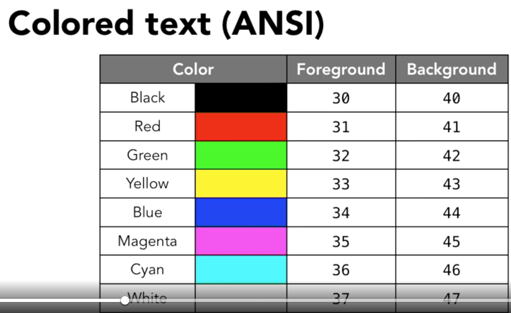
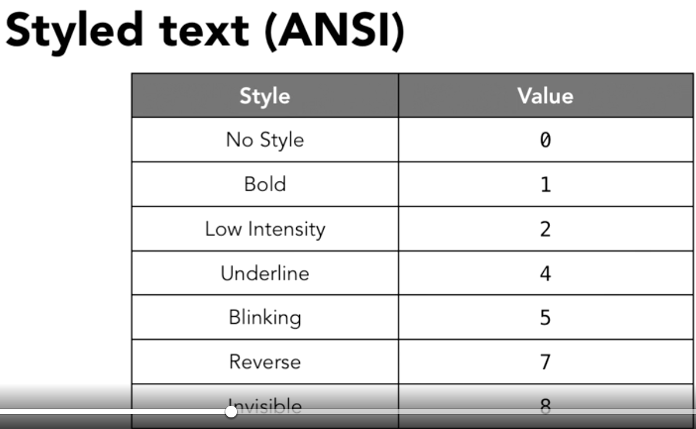
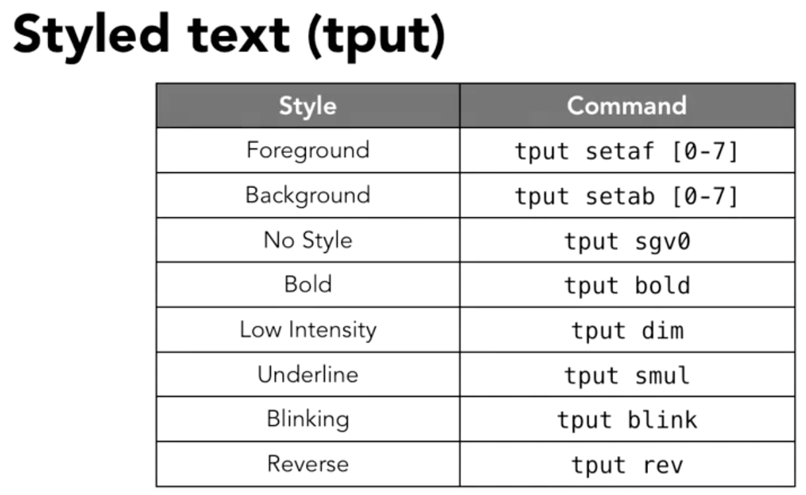
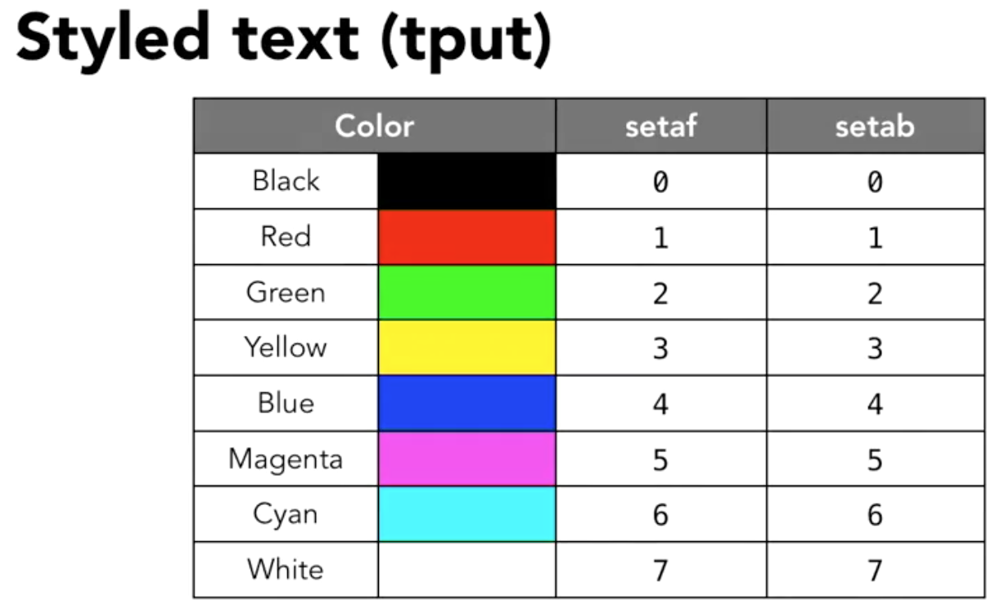

## Lynda: Learning Bash Scripting

```bash
Bourne again Shell -- bash

# ～的特殊含义
cd ~
cd -
echo ~-

# 重复的奥义
touch {apple,banana,cherry}
touch file_{1..1000}
touch file_{01..1000} # 前面自动补全0
echo {1..10}
echo {1..10..2} # 1 3 5 7 9
echo {a..z}
echo {z..a}
echo {a..Z}
echo {w..d..2}
touch {apple,banana,cherry}_{01..1000}{w..d..2}
ls -l | wc -l # 文件数量


# pipe 的奥义
ls | more
# verbose显示详细信息 1代表标准正常输出 2代表标准错误输出 >重定向输出，覆盖文件内容
cp -v * ../otherfolder 1>../success.txt 2>../failure.txt
# &代表1和2，也就是所有输出
cp -v * ../otherfolder &>../log.txt
# 把输出扔掉
ls > /dev/null


# grep awk sed cut
grep -i build-in log.txt | awk '{print $12}'
# 用=分割，要第4个字段
ping -c 1 baidu.com | grep 'bytes from' | cut -d = -f 4


#!/bin/bash

bash xx.sh

chmod +x xx.sh 
./xx.sh

cp xx.sh /bin/xx.sh
xx.sh


# 大话echo
echo $greeting, world \{planet\}!
echo '$greeting, world {planet}!' # 不会去读取变量的内容
echo "$greeting, world {planet}!" # 会读取变量内容
echo "\$greeting, world {planet}!"

# 变量
a=hello
b="hello"
c=15

echo $a
echo $b
echo $c
echo "$a, $b"

declare -i d=123 # 声明变量是一个int类型
declare -r e=456 # 声明变量为只读
declare -l f="LOLCats" # 声明变量为小写
declare -u g="LOLCats" # 声明变量为大写

# 内建的变量
echo $HOME
echo $PWD
echo $MACHTYPE # 显示机器型号
echo $HOSTNAME
echo $BASH_VERSION
echo $SECONDS # 显示bash会话的开启时间 shell脚本开始运行算起
echo $0 # 显示脚本的名字
echo $USER

d=$(pwd) # 脚本中保存命令的执行结果 空格要删掉，否则报command not found
echo $d

d=$(ping -c 1 baidu.com | grep 'bytes from' | cut -d = -f 4)
echo $d

# 数学计算(()) +-*/% **
a=2
b=$((a+2))
((b++))
((b--))
((b+=3))
echo $b
b+3 # 做了字符拼接，直接b3，仍然可以当作数字用
echo $((1/3)) # 0, bash只支持整数运算

a=$(echo 1/3 | bc -l)
echo 1/3 | bc -l # .333333


# 比较语句 [[]] 
# string的比较 > < >= <= == !=
[["cat"=="cat"]]
echo $? # 0 代表true

[["cat"="dog"]] # == 或者 = 都可以判断是否等于
echo $? # 1 代表false

# 数字的比较 -lt -gt -le -ge -eq -ne
[[20>100]] # true，因为是按照string比较的
[[20 -gt 100]]

# 逻辑运算 || && !
# 判断是否为null或者"" -z -n [[-z $a]] zero , not null
a=""
[[-z $a]] # true


# string奥义
echo "Basic "$(echo -n your_account:your_pwd | base64)

# 拼接
a="hello"
b="world"
c=$a$b
echo ${#a} # 显示string长度

# 截取
d=${c:3} # 从0开始计算index，截取c的第三个字符到最后
d=${c:3:4} # 截取c的第三个字符开始的4个字符
d=${c: -4} # 从最后开始，取最后4个字符，空格不能少，否则不work
d=${c: -4:3} # -4定义起点，取后面三个字符

# 替换
fruit="apple banana banana cherry"
echo ${fruit/banana/durian} # 把第一个banana替换成durian
echo ${fruit//banana/durian} # 把所有banana替换成durian
echo ${fruit/#apple/durian} # apple在string开始的位置，所以替换
echo ${fruit/#banana/durian} # banana不会被替换，返回的还是fruit原来的样子
echo ${fruit/%cherry/durian} # cheey在string结束的位置，所以替换
echo ${fruit/a*/durian} # 把符合匹配条件的替换


# echo colored styled 0-8
# ANSI 37和40代表 字体颜色 和 背景颜色
echo -e '\033[37;40m BLABLABLA \033[0m' # -e 转义序列
# 5是字体格式 \033[0m是清理格式字段
echo -e '\033[5;37;40m BLABLABLA \033[0m' # -e 转义序列

# 可以把这些特殊的string作为变量来方便操作
blink="\033[5;37;40m"
none="\033[0m"

# tput 然后再去拼接
blink=$(tput setab 0; tput setaf 1; tput blink)
none=$(tput sgv0)

# date printf
# 格式化date的输出
date
date +"%d-%m-%Y"
date +"%H-%M-%S"
printf "Name:\t%s\nID:\t%04d\n" "Scott" "12"
# printf的输出赋值给变量d
printf -v d "Name:\t%s\nID:\t%04d\n" $USER "12"


# 数组奥义
# 数组声明 数组从0计算index
a=()
b=("apple" "banana" "cherry")
echo ${b[2]}
b[5]="kiwi" # 可以创建稀疏数组
b+=("mongo") # 可以自动加到数组后面
b+="mongo" # 放在第0个位置
echo ${b[@]} # 输出整个数组
echo ${b[@]: -1} # 输出最后一个

# 数组变map
declare -A myarray
myarray[color]=blue
myarray["office building"]="HQ west" # 如果有空格，需要加引号
# 数组没有长度限制


# 读写文件 只能是文本文件
echo "some text" > file.txt # 会创建，会覆盖
> file.txt # 清空文件
echo "some more text" >> file.txt # 会创建，会append到最后

# 一行一行，读取到f
i=1
while read f; do
	echo "Line $i: $f"
	((i++))
done < file.txt

cat < file.txt

ftp.txt:
open mirrors.xmission.com
user anonymouse nothinghere
ascii
cd gutenberg
get GUTINDEX.00

ftp -n < ftp.txt


# here 奥义
cat << EndOfText
This is a
multi line
text string
EndOfText

# -会自动删除前面的空格
cat <<- EndOfText
	This is a
	multi line
	text string
EndOfText

ftp -n <<- DoneWithTheUpdate
	open mirrors.xmission.com
	user anonymouse nothinghere
	ascii
	cd gutenberg
	get GUTINDEX.00
	bye # ftp 命令，来断开连接
DoneWithTheUpdate


cat <<- EOF > file.txt
		hhh
		www
EOF

printf "hhhh" >> file.txt


# if 奥义
if []
if [[]]
if (()) # 数字的比较
if # 也可以没有括号

if expression; then
	echo "hello"
	
if expression
then
	echo "hello"
elif expression; then
	echo "hello"
else
	echo "hello"
fi

# 正则表达式匹配，string中包含这个正则表达式就可以
a="This is my string!"
if [[ $a =~ [0-9]+ ]]; then

# while循环
i=0
while [ $i -le 10 ]; do
	echo i:$i
	((i+=1))
done

# util循环
i=0
util [ $i -le 10 ]; do
	echo i:$i
	((i+=1))
done

# for循环
for i in 1 2 3
do
	echo $i
done

for i in {1..100}
do
	echo $i
done

for i in {1..100..2}
do
	echo $i
done

for (( i=1; i<10; i++ ))
do
	echo $i
done

for i in ${array[@]}
do
	echo $i
done

delcare -A myarray
myarray["name"]="Scott"
myarray["id"]="123"
# key是string，可能有空格，所以用引号包起来
# !表示是key
for i in "${!myarray[@]}"
do
	echo "$i: ${myarray[$i]}"
done

for i in $(ls)
do
	echo $i
done


# case 奥义
a="dog"
case $a in
		cat) echo "Feline";;
		dog|puppy) echo "Canine";;
		*) echo "nothing";;
esac

# function 奥义
function greet {
		echo "hi there"
}
echo "And now, a greeting!"
greet


function greet {
		echo "hi $1"
}
echo "And now, a greeting!"
greet Scott


function numberthins {
		i=1
		for i in $@; do # 代表所有的参数
				echo $i: $f
				((i++))
		done
}
numberthings $(ls)
numberthings apple banana cherry


# 交互的奥义
./my.sh apple banana cherry
echo $1
for i in $@; do # 代表所有的参数
		echo $i: $f
		((i++))
done
echo "There are $# args"


./my.sh -u Scott -p secret -a
while getops u:p:ab option; do # 跟了一个:说明后面有值，如果没有，则只是存不存在
		case $option in
				u) user=$OPTARG;;
				p) pass=$OPTARG;;
				a) echo "";;
				b) echo "";;
		esac
done
echo "User: $user / Pass: $pass" # 里面定义的变量外面可以使用


./my.sh -u Scott -p secret -a -z
while getops :u:p:ab option; do # 前面跟了一个: 说明想获取没有指定的flag之外的flag
		case $option in
				u) user=$OPTARG;;
				p) pass=$OPTARG;;
				a) echo "";;
				b) echo "";;
				?) echo "I don't know $OPTARG1";; # 用? 来获取,会输出"I don't know z"
		esac
done
echo "User: $user / Pass: $pass" # 里面定义的变量外面可以使用


# 边运行边拿参数
echo "What is your name?"
read name

echo "What is your password?"
read -s pass # -s代表不会显示出密码

read -p "what is your animal?" animal # -p 代表提词


select option in "apple" "banana" "cherry" "quit"
do
		case $option in
				apple) echo "";;
				banana) echo "";;
				cherry) echo "";;
				quit) break;;
				*) echo "what?";;
		esac
done


# 防止参数不够
if [[ $# -lt 3]]; then
		echo "at least 3 args"
else
		echo "$1 $2 $3"
fi

# 防止不输入参数
read -p "favorite fruit?" fruit
while [[ -z $fruit ]]; do
	read -p "I need a fruit!" fruit
done

# 构建默认参数
read -p "favorite fruit? [apple]" fruit
if [[ -z $fruit ]]; then
	fruit="apple"
fi

read -p "input a year? [nnnn]" c
if [[ ! $year =~ [0-9]{4} ]]; then
	year="2012"
fi

if [[ 123 =~ [0-9]{4} ]]; then \
	echo "true" \
else \
	echo "false" \
fi


rand=$RANDOM
secret=${rand:0:1} # 生成的数字，从0开始，第1位

if[[$1 =~ game|GAME|Game]]; then
		game
else
		generate
fi

```










