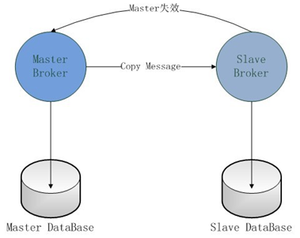
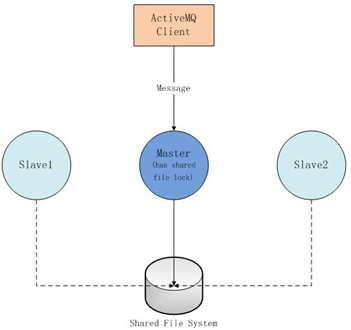
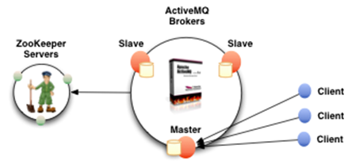

# JMS和ActiveMQ 
JMS（Java Messaging Service）是Java平台上有关面向消息中间件的技术规范，实际上是一套api，它便于消息系统中的Java应用程序进行消息交换,并且通过提供标准的产生、发送、接收消息的接口简化企业应用的开发，ActiveMQ而是这个规范的一个具体实现。

## JMS规范
### JMS对象模型
1）连接工厂。连接工厂负责创建一个JMS连接。
2）JMS连接。JMS连接（Connection）表示JMS客户端和服务器端之间的一个活动的连接，是由客户端通过调用连接工厂的方法建立的。
3）JMS会话。JMS会话（Session）表示JMS客户与JMS服务器之间的会话状态。JMS会话建立在JMS连接上，表示客户与服务器之间的一个会话线程。
4）JMS目的/ Broker。客户用来指定它生产的消息的目标和它消费的消息的来源的对象，一个消息中间件的实例。
5）JMS生产者和消费者。生产者（Message Producer）和消费者（Message Consumer）对象由Session对象创建，用于发送和接收消息。
消息的消费可以采用以下两种方法之一：
• 同步消费。通过调用 消费者的receive 方法从目的地中显式提取消息。receive 方法可以一直阻塞到消息到达。
• 异步消费。客户可以为消费者注册一个消息监听器，以定义在消息到达时所采取的动作。

### JMS规范中的消息
JMS 消息由以下三部分组成：
• 消息头。每个消息头字段都有相应的getter 和setter 方法。
• 消息属性。如果需要除消息头字段以外的值，那么可以使用消息属性。
• 消息体。JMS 定义的消息类型有TextMessage、MapMessage、BytesMessage、
StreamMessage 和 ObjectMessage。ActiveMQ也有对应的实现。
  
### JMS消息模型
#### *Point-to-Point(P2P)  / 点对点*
消息通过称为队列的一个虚拟通道来进行交换。队列是生产者发送消息的目的地和接受者消费消息的消息源。
每条消息通仅会传送给一个接受者。可能会有多个接受者在一个队列中侦听，但是每个队列中的消息只能被队列中的一个接受者消费。
消息存在先后顺序。一个队列会按照消息服务器将消息放入队列中的顺序，把它们传送给消费者当消息已被消费时，就会从队列头部将它们删除。
每个消息只有一个消费者（Consumer）(即一旦被消费，消息就不再在消息队列中)
发送者发送了消息之后，不管接收者有没有正在运行，它不会影响到消息被发送到队列
接收者在成功接收消息之后需向队列应答成功
如果希望发送的每个消息都应该被成功处理的话，使用这个P2P模式。

#### *Topic/ 主题（发布订阅(Pub/Sub) ）*
1、消息生产者（发布）将消息发布到topic中，同时有多个消息消费者（订阅）消费该消息。和点对点方式不同，发布到topic的消息会被所有订阅者消费。
3、如果你希望发送的消息可以不被做任何处理、或者被一个消息者处理、或者可以被多个消费者处理的话，那么可以采用topic模型 

## ActiveMQ
### ActiveMQ安装、部署和运行 
下载 Windows版 ActiveMQ，解压，运行bin目录下的activemq.bat即可。Linux下操作类似（进入bin目录运行./activemq start启动，./activemq stop关闭）。
下载地址：http://activemq.apache.org/activemq-580-release.html
运行后在浏览器中访问http://127.0.0.1:8161/admin，即可看到ActiveMQ的管理控制台
ActiveMQ中，61616为服务端口，8161为管理控制台端口。
### 使用ActiveMQ 
#### 原生API
Maven配置
 
connection.createSession参数解释：
第一个参数是否使用事务:当消息发送者向消息提供者（即消息代理）发送消息时，消息发送者等待消息代理的确认，没有回应则抛出异常，消息发送程序负责处理这个错误。
第二个参数消息的确认模式：
AUTO_ACKNOWLEDGE ： 指定消息接收者在每次收到消息时自动发送确认。消息只向目标发送一次，但传输过程中可能因为错误而丢失消息。
CLIENT_ACKNOWLEDGE ： 由消息接收者确认收到消息，通过调用消息的acknowledge()方法（会通知消息提供者收到了消息）
DUPS_OK_ACKNOWLEDGE ： 指定消息提供者在消息接收者没有确认发送时重新发送消息（这种确认模式不在乎接收者收到重复的消息）。

#### **消费者的接收方式：同步和异步**

### ActiveMQ高级特性和用法
#### 嵌入式ActiveMQ
在自己的应用程序中嵌入一个消息队列。见代码模块 no-spring包embed下。

#### 消息存储的持久化
ActiveMQ的另一个问题就是只要是软件就有可能挂掉，挂掉不可怕，怕的是挂掉之后把信息给丢了，怎么办，可以进行消息的持久化，ActiveMQ提供了几种持久化方式：
1.	AMQ消息存储-基于文件的存储方式，它具有写入速度快和容易恢复的特点。消息存储在一个个文件中，文件的默认大小为32M，如果一条消息的大小超过了32M，那么这个值必须设置大一点。当一个存储文件中的消息已经全部被消费，那么这个文件将被标识为可删除，在下一个清除阶段，这个文件被删除。AMQ适用于ActiveMQ5.3之前的版本。
2.	KahaDB消息存储-提供了容量的提升和恢复能力，是现在的默认存储方式；KahaDB是基于文件的本地数据库储存形式，虽然没有AMQ的速度快，但是它具有强扩展性，恢复的时间比AMQ短，从5.4版本之后KahaDB做为默认的持久化方式。
3.	JDBC消息存储-消息基于JDBC存储的；
4.	Memory消息存储-基于内存的消息存储，由于内存不属于持久化范畴。所以内存存储不在讨论范围内。

##### KahaDB
由于KahaDB是默认的持久化存储方案。所以即使你不配置任何的KahaDB参数信息，ActiveMQ也会启动KahaDB。这种情况下，KahaDB文件所在位置是你的ActiveMQ安装路径下的/data/KahaDB子目录。

##### 关系型数据库存储方案
从ActiveMQ 4+版本开始，ActiveMQ就支持使用关系型数据库进行持久化存储——通过JDBC实现的数据库连接。可以使用的关系型数据库囊括了目前市面的主流数据库。
使用JDBC的方式持久化
- 1、修改配置文件conf/activemq.xml：
将其中的这段配置：
```xml
<persistenceAdapter>
	<kahaDB directory="${activemq.base}/data/kahadb"/>
</persistenceAdapter>
```
修改为：
```xml
<persistenceAdapter>
       <jdbcPersistenceAdapter  dataSource="#mysql-ds "/>
</persistenceAdapter>
```
- 2、然后在</broker>标签后，增加数据源的配置：
```xml
    <bean id="mysql-ds" class="org.apache.commons.dbcp2.BasicDataSource" destroy-method="close">
        <property name="driverClassName" value="com.mysql.jdbc.Driver"/>
        <property name="url" value="jdbc:mysql://localhost:3306/activemq?relaxAutoCommit=true&amp;useUnicode=true&amp;characterEncoding=utf-8&amp;serverTimezone=UTC"/>
        <property name="username" value="root"/>
        <property name="password" value="123456"/>
        <property name="poolPreparedStatements" value="true"/>
    </bean>
```
其中?relaxAutoCommit=true必须有，其他的属性根据数据库的配置自行决定。
- 3、将mysql-connector-java-5.1.34-bin.jar（版本可以自行选择）放到ActiveMQ的/ lib目录下。
- 4、在Mysql数据库中增加在连接字符串中设置的数据库名activemq
- 5、运行后，会发现在库中增加了3个表
**activemq_acks**：用于存储订阅关系。如果是持久化Topic，订阅者和服务器的订阅关系在这个表保存，主要数据库字段如下：
container：消息的destination
sub_dest：如果是使用static集群，这个字段会有集群其他系统的信息
client_id：每个订阅者都必须有一个唯一的客户端id用以区分
sub_name：订阅者名称
selector：选择器，可以选择只消费满足条件的消息。条件可以用自定义属性实现，可支持多属性and和or操作
last_acked_id：记录消费过的消息的id
**activemq_lock**：在集群环境中才有用，只有一个Broker可以获得消息，称为Master Broker，其他的只能作为备份等待Master Broker不可用，才可能成为下一个Master Broker。这个表用于记录哪个Broker是当前的Master Broker。
**activemq_msgs**：用于存储消息，Queue和Topic都存储在这个表中。主要的数据库字段如下：
id：自增的数据库主键
container：消息的destination
msgid_prod：消息发送者客户端的主键
msg_seq：是发送消息的顺序，msgid_prod+msg_seq可以组成jms的messageid
expiration：消息的过期时间，存储的是从1970-01-01到现在的毫秒数
msg：消息本体的java序列化对象的二进制数据
priority：优先级，从0-9，数值越大优先级越高

#### 消息的持久化订阅
分别运行订阅模式和P2P模式，可以发现，P2P模式缺省把消息进行持久化，而topic模式是没有的。
##### 一般topic模式实验：
1、	启动两个消费者，启动一个生产者，发送消息，两个消费者都可以收到。
2、	关闭一个消费者，生产者发送消息，活跃的消费者可以收到消息，启动被关闭的消费者，无法收到消息。
3、	关闭所有消费者，生产者发送消息，在ActiveMQ控制台可以看见消息已被接收，关闭再启动ActiveMQ，启动消费者收不到消息。
如果topic模式下，需要消费者在离线又上线后，不管ActiveMQ是否重启过，都保证可以接受到消息，就需要进行持久化订阅。具体代码参见模块no-spirng包durabletopic。

##### 持久Topic消费者端
需要设置客户端id：connection.setClientID("Mark");
消息的destination变为 Topic 
消费者类型变为TopicSubscriber
消费者创建时变为session.createDurableSubscriber(destination,"任意名字，代表订阅名 ");
运行一次消费者，将消费者在ActiveMQ上进行一次注册。然后在ActiveMQ的管理控制台subscribers页面可以看见我们的消费者。
效果：
1、	运行生产者，发布消息，多个消费者可以正常收到。
2、	关闭一个消费者，运行生产者，发布消息后再启动被关闭的消费者，可以收到离线后的消息；
3、	关闭所有消费者，运行生产者，发布消息后，关闭ActiveMQ再启动，启动所有消费者，都可以收到消息。
注意：生产者端无需另外单独配置

##### 消息非持久化
修改messageProducer.setDeliveryMode(DeliveryMode.NON_PERSISTENT);来设置消息本身的持久化属性为非持久化。重复上述实验，可以发现，第1,2点保持不变，但是第三点，当关闭ActiveMQ再启动，消费者关闭后再启动，是收不到消息的。
说明，即使进行了持久订阅，但是消息本身如果是不持久化的，ActiveMQ关闭再启动，这些非持久化的消息会丢失，进行持久订阅的消费者也是收不到自身离线期间的消息的。

#### 消息的可靠性
消息发送成功后，接收端接收到了消息。然后进行处理，但是可能由于某种原因，高并发也好，IO阻塞也好，反正这条消息在接收端处理失败了。而点对点的特性是一条消息，只会被一个接收端给接收，只要接收端A接收成功了，接收端B，就不可能接收到这条消息，如果是一些普通的消息还好，但是如果是一些很重要的消息，比如说用户的支付订单，用户的退款，这些与金钱相关的，是必须保证成功的，那么这个时候要怎么处理呢？必须要保证消息的可靠性，除了消息的持久化，还包括两个方面，一是生产者发送的消息可以被ActiveMQ收到，二是消费者收到了ActiveMQ发送的消息。

##### 生产者
###### send方法
在生产者端，我们会使用send() 方法向ActiveMQ发送消息，默认情况下，持久化消息以同步方式发送，send() 方法会被阻塞，直到 broker 发送一个确认消息给生产者，这个确认消息表示broker已经成功接收到消息，并且持久化消息已经把消息保存到二级存储中。
实验send()方法：在模块no-spring包msgreliability下的JmsMsgReliablitySendProducer中send方法上打一个断点，可以看到send方法每执行一次，ActiveMQ管理控制台增加一条入队消息，数据库中增加一条消息。

###### 事务消息
事务中消息（无论是否持久化），会进行异步发送，send() 方法不会被阻塞。但是commit 方法会被阻塞，直到收到确认消息，表示broker已经成功接收到消息，并且持久化消息已经把消息保存到二级存储中。
实验事务消息：在模块no-spring包msgreliability下的JmsMsgReliablityTranProducer中在session.commit()打一个断点，可以看到send方法每执行一次，ActiveMQ管理控制台和数据库中没有任何变化，只有执行完session.commit()后ActiveMQ管理控制台和数据库中才增加。

###### 总结
非持久化又不在事务中的消息，可能会有消息的丢失。为保证消息可以被ActiveMQ收到，我们应该采用事务消息或持久化消息。

##### 消费者
对消息的确认有4种机制
1、	AUTO_ACKNOWLEDGE = 1    自动确认
2、	CLIENT_ACKNOWLEDGE = 2    客户端手动确认   
3、	DUPS_OK_ACKNOWLEDGE = 3    自动批量确认
4、	SESSION_TRANSACTED = 0    事务提交并确认
ACK_MODE描述了Consumer与broker确认消息的方式(时机),比如当消息被Consumer接收之后,Consumer将在何时确认消息。所以ack_mode描述的不是producer于broker之间的关系，而是customer于broker之间的关系。
对于broker而言，只有接收到ACK指令,才会认为消息被正确的接收或者处理成功了,通过ACK，可以在consumer与Broker之间建立一种简单的“担保”机制.
session = connection.createSession(false, Session.AUTO_ACKNOWLEDGE);
第一个参数:是否支持事务，如果为true，则会忽略第二个参数，自动被jms服务器设置为SESSION_TRANSACTED

###### AUTO_ACKNOWLEDGE  
自动确认
    “同步”(receive)方法返回message给消息时会立即确认。
     在"异步"(messageListener)方式中,将会首先调用listener.onMessage(message)，如果onMessage方法正常结束,消息将会正常确认。如果onMessage方法异常，将导致消费者要求ActiveMQ重发消息。此外需要注意，消息的重发次数是有限制的，每条消息中都会包含“redeliveryCounter”计数器，用来表示此消息已经被重发的次数，如果重发次数达到阀值，将导致broker端认为此消息无法消费,此消息将会被删除或者迁移到"dead letter"通道中。
     因此当我们使用messageListener方式消费消息时，可以在onMessage方法中使用try-catch,这样可以在处理消息出错时记录一些信息，而不是让consumer不断去重发消息；如果你没有使用try-catch,就有可能会因为异常而导致消息重复接收的问题,需要注意onMessage方法中逻辑是否能够兼容对重复消息的判断。
实验方法：在模块no-spring包msgreliability下的JmsMsgReliablityConsumerAsyn中onMessage方法中增加一条throw语句，出现消息重发的现象。

###### CLIENT_ACKNOWLEDGE : 
客户端手动确认，这就意味着AcitveMQ将不会“自作主张”的为你ACK任何消息，开发者需要自己择机确认。可以用方法： message.acknowledge()，或session.acknowledge()；效果一样。
如果忘记调用acknowledge方法，将会导致当consumer重启后，会接受到重复消息，因为对于broker而言，那些尚未真正ACK的消息被视为“未消费”。
我们可以在当前消息处理成功之后，立即调用message.acknowledge()方法来"逐个"确认消息，这样可以尽可能的减少因网络故障而导致消息重发的个数；当然也可以处理多条消息之后，间歇性的调用acknowledge方法来一次确认多条消息，减少ack的次数来提升consumer的效率，不过需要自行权衡。
实验方法：在模块no-spring包msgreliability下的JmsMsgReliablityConsumerAsyn中将session模式改为Session.CLIENT_ACKNOWLEDGE，，启动两个消费者，发送消息后，可以看到JmsMsgReliablityConsumerAsyn接收了消息但不确认。当JmsMsgReliablityConsumerAsyn重新启动后，会再一次收到同样的消息。加入message.acknowledge()后该现象消失。

###### DUPS_OK_ACKNOWLEDGE
类似于AUTO_ACK确认机制，为自动批量确认而生，而且具有“延迟”确认的特点，ActiveMQ会根据内部算法，在收到一定数量的消息自动进行确认。在此模式下，可能会出现重复消息，什么时候？当consumer故障重启后，那些尚未ACK的消息会重新发送过来。

###### SESSION_TRANSACTED
当session使用事务时，就是使用此模式。当决定事务中的消息可以确认时，必须调用session.commit()方法，commit方法将会导致当前session的事务中所有消息立即被确认。在事务开始之后的任何时机调用rollback()，意味着当前事务的结束，事务中所有的消息都将被重发。当然在commit之前抛出异常，也会导致事务的rollback。

##### 通配符式订阅
Wildcards 用来支持联合的名字分层体系（federated name hierarchies）。它不是JMS 规范的一部分，而是ActiveMQ 的扩展。ActiveMQ 支持以下三种
wildcards：
• "." 用于作为路径上名字间的分隔符。
• "*" 用于匹配路径上的任何名字。
• ">" 用于递归地匹配任何以这个名字开始的destination。
订阅者可以明确地指定destination 的名字来订阅消息，或者它也可以使用wildcards 来定义一个分层的模式来匹配它希望订阅的 destination。
具体情况参见代码，在模块no-spirng包wildcards下。

##### 死信队列
用来保存处理失败或者过期的消息。 
出现下面情况时，消息会被重发： 
i.	事务会话被回滚。
ii.	事务会话在提交之前关闭。
iii.	会话使用CLIENT_ACKNOWLEDGE模式，并且Session.recover()被调用。 
iv.	自动应答失败
当一个消息被重发超过最大重发次数（缺省为6次，消费者端可以修改）时，会给broker发送一个"有毒标记“，这个消息被认为是有问题，这时broker将这个消息发送到死信队列，以便后续处理。 
在配置文件(activemq.xml)来调整死信发送策略。
 
可以单独使用死信消费者处理这些死信。参见代码，在模块no-spirng包dlq下。
注意，该代码中展示了如何配置重发策略。同时，重试策略属于ActiveMQ的部分，所以有部分connectionFactory，connection的声明等等不能使用接口，必须使用ActiveMQ的实现。
 
##### Mirrored Queue 镜像队列(了解即可)
ActiveMQ每一个queue中消息只能被一个消费者消费，然而，有时候，你希望能够监视生产者和消费者之间的消息流。
MirroredQueue: Broker会把发送到某一个队列上的所有消息转发到一个名称类似的topic,因此监控程序只需要订阅这个topic.为启用MirroredQueue，首先要将BrokerService的useMirroredQueues属性设置为true：
```xml
<broker xmlns=http://activemq.apache.org/schema/core useMirroredQueue="true">
</broker>
```
 然后可以通过destinationInterceptors设置其属性，如mirrortopic的前缀，缺省是VritualTopic.Mirror.
修改后缀的配置示例：
```xml
<broker xmlns="http://activemq.apache.org/schema/core">
       <destinationInterceptors>
              <mirroredQueue copyMessage="true" postfix=".qmirror" prefix="" />
       </destinationInterceptors>
</broker>
```

##### 消费者集群下需要考虑的问题
我们现实中往往有这样的需求：
1. 消息接收方和发送方都是集群。 
2. 同一个消息的接收方可能有多个集群进行消息的处理。
3. 不同集群对于同一条消息的处理不能相互干扰。
希望可以达到如下的效果：
 
对于集群消息，采用单独采用queue或者topic都不满足要求。
采用Queue模型导致：单独的queue，消息可能被其他集群消费
 
采用Topic模型导致，采用topic消息可能被同一集群的相同应用重复消费。：
 
###### 解决方案一，级联
将Jms的Topic和Queue进行级联使用
 
缺点，实现方式繁重，需要独立的中转的消息订阅者来完成，多了一次消息的投递和一次消息消费过程，对效率有影响，增加了消息中间件负载压力。

###### 解决方案二
ActiveMQ提供了虚拟主题和组合Destinations都可以达到这个效果。

##### 虚拟Destination
对于消息发布者来说，就是一个正常的Topic，名称以VirtualTopic.开头。例如VirtualTopic.vtgroup
对于消息接收端来说，是个队列，不同应用里使用不同的前缀作为队列的名称，即可表明自己的身份即可实现消费端应用分组。
  例如Consumer.A.VirtualTopic. vtgroup，说明它是名称为A群组的消费端，同理Consumer.B.VirtualTopic. vtgroup说明是一个名称为B群组的客户端。
默认虚拟主题的前缀是 ：VirtualTopic.
 消费虚拟地址默认格式：Consumer.*.VirtualTopic.
参见代码，在模块no-spirng包virtualtopic下

##### 组合Destination
组合队列允许用一个虚拟的destination代表多个destinations。这样就可以通过composite destinations在一个操作中同时向多个destination发送消息。
多个destination之间采用“,”分割。例如：
```java
  Queue queue = new ActiveMQQueue("FOO.A,FOO.B,FOO.C");
  //或
  Destination destination = session.createQueue("my-queue,my-queue2");
```
如果希望使用不同类型的destination，那么需要加上前缀如queue:// 或topic://，例如：
```java
    Queue queue = new ActiveMQQueue("cd.queue,topic://cd.mark");
```
参见代码，在模块no-spirng包compositedest下

### ActiveMQ实战之二  限时订单
#### 轮询数据库会带来什么问题？ 
轮询数据库在实现限时订单上是可行的，而且实现起来很简单。写个定时器去每隔一段时间扫描数据库，检查到订单过期了，做适当的业务处理。
但是轮询会带来什么问题？
1、轮询大部分时间其实是在做无用功，我们假设一张订单是45分钟过期，每分钟我们扫描一次，对这张订单来说，要扫描45次以后，才会检查到这张订单过期，这就意味着数据库的资源（连接，IO）被白白浪费了；
2、处理上的不及时，一个待支付的电影票订单我们假设是12:00:35过期，但是上次扫描的时间是12:00:30，那么这个订单实际的过期时间是什么时候？12:01:30，和我本来的过期时间差了55秒钟。放在业务上，会带来什么问题？这张电影票，假设是最后一张，有个人12:00:55来买票，买得到吗？当然买不到了。那么这张电影票很有可能就浪费了。如果缩短扫描的时间间隔，第一只能改善不能解决，第二，又会对数据库造成更大的压力。 
那么我们能否有种机制，不用定时扫描，当订单到期了，自然通知我们的应用去处理这些到期的订单呢？ 

#### 来自Java本身的解决方案 
java其实已经为我们提供了问题的方法。我们想，要处理限时支付的问题，肯定是要有个地方保存这些限时订单的信息的，意味着我们需要一个容器，于是我们在Java容器中去寻找。Map? List? Queue? 
看看java为我们提供的容器，我们是个多线程下的应用，会有多个用户同时下订单，所以所有并发不安全的容器首先被排除，并发安全的容器有哪些？一一排除，很巧，java在阻塞队列里为我们提供了一种叫延迟队列delayQueue的容器，刚好可以为我们解决问题。
DelayQueue： 阻塞队列（先进先出）
1）支持阻塞的插入方法：意思是当队列满时，队列会阻塞插入元素的线程，直到队列不满。2）支持阻塞的移除方法：意思是在队列为空时，获取元素的线程会等待队列变为非空。
延迟期满时才能从中提取元素（光队列里有元素还不行）。
Delayed接口使对象成为延迟对象，它使存放在DelayQueue类中的对象具有了激活日期。该接口强制实现下列两个方法。
•	CompareTo(Delayed o)：Delayed接口继承了Comparable接口，因此有了这个方法。让元素按激活日期排队
•	getDelay(TimeUnit unit):这个方法返回到激活日期的剩余时间，时间单位由单位参数指定。

#### 从系统可用性角度考虑：应用重启了怎么办？ 
- 应用重启带来的问题：
保存在Queue中的订单会丢失，这些丢失的订单会在什么时候过期，因为队列里已经没有这个订单了，无法检查了，这些订单就得不到处理了。 
已过期的订单不会被处理，在应用的重启阶段，可能会有一部分订单过期，这部分过期未支付的订单同样也得不到处理，会一直放在数据库里，过期未支付订单所对应的资源比如电影票所对应的座位，就不能被释放出来，让别的用户来购买。
- 解决之道 ：在系统启动时另行处理

#### 从系统伸缩性角度考虑：应用集群化了怎么办？ 
集群化了会带来什么问题？应用之间会相互抢夺订单，特别是在应用重启的时候，重新启动的那个应用会把不属于自己的订单，也全部加载到自己的队列里去，一是造成内存的浪费，二来会造成订单的重复处理，而且加大了数据库的压力。
- 解决方案 
让应用分区处理
1、	给每台服务器编号，然后在订单表里登记每条订单的服务器编号；2，更简单的，在订单表里登记每台服务器的IP地址，修改相应的sql语句即可。
几个问题：如果有一台服务器挂了怎么办？运维吃干饭的吗？服务器挂了赶紧启动啊。如果是某台服务器下线或者宕机，起不来怎么搞？这个还是还是稍微有点麻烦，需要人工干预一下，手动把库里的每条订单数据的服务器编号改为目前正常的服务器的编号，不过也就是一条sql语句的事，然后想办法让正常的服务器进行处理（重启正常的服务器）。

#### 能不能同时解决伸缩性和扩展性问题？
用delayqueue是队列，分布式情况我们何不直接引入消息中间件呢？一举解决我们应用的伸缩性和扩展性问题

##### ActiveMQ的延迟和定时投递
修改配置文件(activemq.xml)，增加延迟和定时投递支持
```xml
<broker xmlns="http://activemq.apache.org/schema/core" brokerName="localhost" dataDirectory="${activemq.data}" schedulerSupport="true">
```
需要把几个描述消息定时调度方式的参数作为属性添加到消息，broker端的调度器就会按照我们想要的行为去处理消息。
一共有4个属性
1：AMQ_SCHEDULED_DELAY ：延迟投递的时间
2：AMQ_SCHEDULED_PERIOD ：重复投递的时间间隔
3：AMQ_SCHEDULED_REPEAT：重复投递次数
4：AMQ_SCHEDULED_CRON：Cron表达式
ActiveMQ也提供了一个封装的消息类型：org.apache.activemq.ScheduledMessage，可以使用这个类来辅助设置，使用例子如：延迟60秒
MessageProducer producer = session.createProducer(destination);
TextMessage message = session.createTextMessage("test msg");
long time = 60 * 1000;
message.setLongProperty(ScheduledMessage.AMQ_SCHEDULED_DELAY, time);
producer.send(message);

例子：延迟30秒，投递10次，间隔10秒：
TextMessage message = session.createTextMessage("test msg");
long delay = 30 * 1000;
long period = 10 * 1000;
int repeat = 9;
message.setLongProperty(ScheduledMessage.AMQ_SCHEDULED_DELAY, delay);
message.setLongProperty(ScheduledMessage.AMQ_SCHEDULED_PERIOD, period);
message.setIntProperty(ScheduledMessage.AMQ_SCHEDULED_REPEAT, repeat);
也可使用 CRON 表达式，如message.setStringProperty(ScheduledMessage.AMQ_SCHEDULED_CRON, "0 * * * *");

##### 代码的变化
1、	保存订单SaveOrder.java的时候，作为生产者往消息队列里推入订单，展示和修改MqProducer，这个类当然是要继承IDelayOrder
2、	消息队列会把过期订单发给消费者MqConsume，由它来负责检查订单是否已经支付和过期，来进行下一步处理。
消息队列本身又如何保证可用性和伸缩性？这个就需要ActiveMQ的集群化。

### 构建ActiveMQ集群 
#### ActiveMQ的集群方式综述
ActiveMQ的集群方式主要由两种：Master-Slave和Broker Cluster

##### Master-Slave
Master-Slave方式中，只能是Master提供服务，Slave是实时地备份Master的数据，以保证消息的可靠性。当Master失效时，Slave会自动升级为Master，客户端会自动连接到Slave上工作。Master-Slave模式分为四类：Pure Master Slave、Shared File System Master Slave和JDBC Master Slave，以及Replicated LevelDB Store方式 。
Master-Slave方式都不支持负载均衡，但可以解决单点故障的问题，以保证消息服务的可靠性。

##### Broker Cluster
Broker Cluster主要是通过network of Brokers在多个ActiveMQ实例之间进行消息的路由。Broker Cluster模式支持负载均衡，可以提高消息的消费能力，但不能保证消息的可靠性。所以为了支持负载均衡，同时又保证消息的可靠性，我们往往会采用Msater-Slave+Broker Cluster的模式。


#### Pure Master Slave方式
ActiveMQ5.8以前支持，自从Activemq5.8开始，Activemq的集群实现方式取消了传统的Pure Master Slave方式，并从Activemq5.9增加了基于zookeeper+leveldb的实现方式。


 
使用两个ActiveMQ服务器，一个作为Master，Master不需要做特殊的配置；另一个作为Slave，配置activemq.xml文件，在<broker>节点中添加连接到Master的URI和设置Master失效后不关闭Slave。具体配置参考页面：http://activemq.apache.org/pure-master-slave.html

#### Shared File System Master Slave方式
 


就是利用共享文件系统做ActiveMQ集群，是基于ActiveMQ的默认数据库kahaDB完成的，kahaDB的底层是文件系统。这种方式的集群，Slave的个数没有限制，哪个ActiveMQ实例先获取共享文件的锁，那个实例就是Master，其它的ActiveMQ实例就是Slave，当当前的Master失效，其它的Slave就会去竞争共享文件锁，谁竞争到了谁就是Master。这种模式的好处就是当Master失效时不用手动去配置，只要有足够多的Slave。
如果各个ActiveMQ实例需要运行在不同的机器，就需要用到分布式文件系统了。

#### Shared  JDBC Master Slave
JDBC Master Slave模式和Shared File Sysytem Master Slave模式的原理是一样的，只是把共享文件系统换成了共享数据库。我们只需在所有的ActiveMQ的主配置文件中activemq.xml添加数据源，所有的数据源都指向同一个数据库。
然后修改持久化适配器。这种方式的集群相对Shared File System Master Slave更加简单，更加容易地进行分布式部署，但是如果数据库失效，那么所有的ActiveMQ实例都将失效。

配置修改清单 ......

#### Replicated LevelDB Store
ActiveMQ5.9以后才新增的特性，使用ZooKeeper协调选择一个node作为master。被选择的master broker node开启并接受客户端连接。 其他node转入slave模式，连接master并同步他们的存储状态。slave不接受客户端连接。所有的存储操作都将被复制到连接至Master的slaves。 
如果master死了，得到了最新更新的slave被允许成为master。推荐运行至少3个replica nodes。 
 


*LevelDB解释*
Leveldb是一个google实现的非常高效的kv数据库，目前的版本1.2能够支持billion级别的数据量了。 在这个数量级别下还有着非常高的性能，采用单进程的服务，性能非常之高，在一台4核Q6600的CPU机器上，每秒钟写数据超过40w，而随机读的性能每秒钟超过10w。由此可以看出，具有很高的随机写，顺序读/写性能，但是随机读的性能很一般，也就是说，LevelDB很适合应用在查询较少，而写很多的场景。LevelDB应用了LSM (Log Structured Merge) 策略，通过一种类似于归并排序的方式高效地将更新迁移到磁盘，降低索引插入开销。
**限制：**1、非关系型数据模型（NoSQL），不支持sql语句，也不支持索引；2、一次只允许一个进程访问一个特定的数据库；3、没有内置的C/S架构，但开发者可以使用LevelDB库自己封装一个server；
