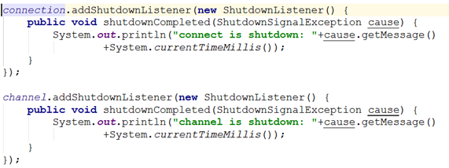
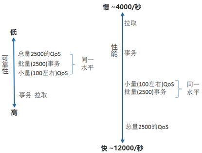
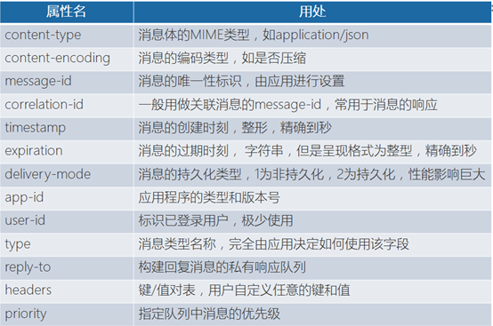

# AMQP概论 
## AMQP 
是应用层协议的一个开放标准,为面向消息的中间件设计。基于此协议的客户端与消息中间件可传递消息，并不受客户端/中间件不同产品，不同的开发语言等条件的限制。目标是实现一种在全行业广泛使用的标准消息中间件技术，以便降低企业和系统集成的开销，并且向大众提供工业级的集成服务。主要实现有 RabbitMQ。
## 包括的要素
### 生产者、消费者、消息
**生产者**:消息的创建者，发送到rabbitmq；
**消费者**：连接到rabbitmq，订阅到队列上，消费消息，持续订阅(basicConsumer)和单条订阅(basicGet).
**消息**：包含有效载荷和标签，有效载荷指要传输的数据，，标签描述了有效载荷，并且rabbitmq用它来决定谁获得消息，消费者只能拿到有效载荷，并不知道生产者是谁。

### 信道
信道，概念：信道是生产消费者与rabbit通信的渠道，生产者publish或是消费者subscribe一个队列都是通过信道来通信的。信道是建立在TCP连接上的虚拟连接，什么意思呢？就是说rabbitmq在一条TCP上建立成百上千个信道来达到多个线程处理，这个TCP被多个线程共享，每个线程对应一个信道，信道在rabbit都有唯一的ID ,保证了信道私有性，对应上唯一的线程使用。
疑问：为什么不建立多个TCP连接呢？原因是rabbit保证性能，系统为每个线程开辟一个TCP是非常消耗性能，每秒成百上千的建立销毁TCP会严重消耗系统。所以rabbitmq选择建立多个信道（建立在tcp的虚拟连接）连接到rabbit上。

### 交换器、队列、绑定、路由键
队列通过路由键（routing  key，某种确定的规则）绑定到交换器，生产者将消息发布到交换器，交换器根据绑定的路由键将消息路由到特定队列，然后由订阅这个队列的消费者进行接收。**一个队列可以绑定多个路由键。**


#### *常见问题*
**如果消息达到无人订阅的队列会怎么办？**消息会一直在队列中等待，RabbitMq默认队列是无限长度的。
**多个消费者订阅到同一队列怎么办？**消息以循环的方式发送给消费者，每个消息只会发送给一个消费者。
**消息路由到了不存在的队列怎么办？**一般情况下，凉拌，RabbitMq会忽略，当这个消息不存在，也就是这消息丢了。
### 消息的确认
**消费者收到的每一条消息都必须进行确认（自动确认和自行确认），到达队列即确认，不是消费者消费后才确认。**
消费者在声明队列时，可以指定autoAck参数，当autoAck=false时，RabbitMQ会等待消费者显式发回ack信号后才从内存(和磁盘，如果是持久化消息的话)中移去消息。否则，RabbitMQ会在队列中消息被消费后立即删除它。
采用消息确认机制后，只要令autoAck=false，消费者就有足够的时间处理消息(任务)，不用担心处理消息过程中消费者进程挂掉后消息丢失的问题，因为RabbitMQ会一直持有消息直到消费者显式调用basicAck为止。
当autoAck=false时，对于RabbitMQ服务器端而言，队列中的消息分成了两部分：一部分是等待投递给消费者的消息；一部分是已经投递给消费者，但是还没有收到消费者ack信号的消息。如果服务器端一直没有收到消费者的ack信号，并且消费此消息的消费者已经断开连接，则服务器端会安排该消息重新进入队列，等待投递给下一个消费者（也可能还是原来的那个消费者）。
RabbitMQ不会为未ack的消息设置超时时间，**它判断此消息是否需要重新投递给消费者的唯一依据是消费该消息的消费者连接是否已经断开**。这么设计的原因是RabbitMQ允许消费者消费一条消息的时间可以很久很久。
## 交换器类型
共有四种direct,fanout,topic,headers，其种headers(几乎和direct一样)不实用，可以忽略。
### Direct
路由键完全匹配，消息被投递到对应的队列，每个amqp的实现都必须有一个direct交换器，包含一个空白字符串名称的默认交换器。声明一个队列时，会自动绑定到默认交换器，并且以队列名称作为路由键：channel->basic_public($msg,’ ’,’queue-name’)
### Fanout
消息广播到绑定的队列
### Topic
通过使用“\*”和“#”，使来自不同源头的消息到达同一个队列，”.”将路由键分为了几个标识符，“\*”匹配1个，“#”匹配一个或多个。例如日志处理：
假设有交换器log-exchange，
日志级别有error,info,warning，
应用模块有user,order,email，
服务器有 A、B、C、D
路由键的规则为 服务器+“.”+日志级别+“.”+应用模块名，如：A. info .email。
1、要关注A服务器发送的所有应用错误的消息，怎么做？
声明队列名称为“a-app-error-queue”并绑定到交换器上：channel. queueBind (‘a-app-error-queue’,’logs-change’,’A.error.\*’)
2、关注B服务器发送的的所有日志，怎么办？
声明队列名称为“b-all-queue”并绑定到交换器上：channel. queueBind (b-all-queue’,’logs-change’,’ B.#’)或channel. queueBind (b-all-queue’,’logs-change’,’ B.\*.\*’)
3、关注所有服务器发送的email的所有日志，怎么办？
声明队列名称为“email-all-queue”并绑定到交换器上：channel. queueBind (email -all-queue’,’logs-change’,’ \*.\*.emal’)
4、想要接收所有日志：channel->queue_bind(‘all-log’,’logs-change’,’#’)

## 虚拟主机
**相当于namespace或者java的不同的包，做隔离用，隔离出来几个mq。**
虚拟消息服务器，vhost，本质上就是一个mini版的mq服务器，有自己的队列、交换器和绑定，最重要的，自己的权限机制。Vhost提供了逻辑上的分离，可以将众多客户端进行区分，又可以避免队列和交换器的命名冲突。Vhost必须在连接时指定，rabbitmq包含缺省vhost：“/”，通过缺省用户和口令guest进行访问。
rabbitmq里创建用户，必须要被指派给至少一个vhost，并且只能访问被指派内的队列、交换器和绑定。Vhost必须通过rabbitmq的管理控制工具创建。

# 原生Java客户端进行消息通信
## Direct
参见代码no-spring模块包cn.enjoyedu.exchange.direct中：
DirectProducer：direct类型交换器的生产者
NormalConsumer：普通的消费者
MulitBindConsumer：队列绑定到交换器上时，是允许绑定多个路由键的，也就是多重绑定
MulitChannelConsumer：一个连接下允许有多个信道
MulitConsumerOneQueue：一个队列多个消费者，则会表现出消息在消费者之间的轮询发送。
## Fanout
消息广播到绑定的队列
参见代码no-spring模块包cn.enjoyedu.exchange.fanout中：
通过测试表明，不管我们如何调整生产者和消费者的路由键，都对消息的接受没有影响。
## Topic
参见代码no-spring模块包cn.enjoyedu.exchange.topic中：
通过使用“\*”和“#”，使来自不同源头的消息到达同一个队列，"."将路由键分为了几个标识符，“\*”匹配1个，“#”匹配一个或多个。例如日志处理：
假设有交换器log-exchange，
日志级别有error,info,warning，
应用模块有user,order,email，
服务器有 A、B、C、D
路由键的规则为 服务器+“.”+日志级别+“.”+应用模块名，如：A. info .email。
1、要关注A服务器发送的所有应用错误的消息，怎么做？
声明队列名称为“a-app-error-queue”并绑定到交换器上：channel. queueBind (‘a-app-error-queue’,’logs-change’,’A.error.\*’)
2、关注B服务器发送的的所有日志，怎么办？
声明队列名称为“b-all-queue”并绑定到交换器上：channel. queueBind (b-all-queue’,’logs-change’,’ B.#’)或channel. queueBind (b-all-queue’,’logs-change’,’ B.\*.\*’)
3、关注所有服务器发送的email的所有日志，怎么办？
声明队列名称为“email-all-queue”并绑定到交换器上：channel. queueBind (email -all-queue’,’logs-change’,’ \*.\*.emal’)
4、想要接收所有日志：channel->queue_bind(‘all-log’,’logs-change’,’#’)

# 消息发布时的权衡(消息可靠性的保证机制) 


消息发布主要关注的是**生产者!!**

## 失败确认
在发送消息时设置mandatory标志，告诉RabbitMQ，如果消息不可路由，应该将消息返回给发送者，并通知失败。可以这样认为，开启mandatory是开启故障检测模式。
注意：它只会让RabbitMQ向你通知失败，而不会通知成功。如果消息正确路由到队列，则发布者不会受到任何通知。带来的问题是无法确保发布消息一定是成功的，因为通知失败的消息可能会丢失。（*比如发送失败通知的时候，网络故障，导致收不到失败通知，但是失败通知已发出*。）


channel.addConfirmListener则用来监听RabbitMQ发回的信息。
如何使用，参见代码no-spring模块包cn.enjoyedu.mandatory中。
## 监听器的小甜点
在信道关闭和连接关闭时，还有两个监听器可以使用



## 事务
事务的实现主要是对信道（Channel）的设置，主要的方法有三个：
1.	channel.txSelect()声明启动事务模式；
2.	channel.txComment()提交事务；
3.	channel.txRollback()回滚事务；
在发送消息之前，需要声明channel为事务模式，提交或者回滚事务即可。
开启事务后，客户端和RabbitMQ之间的通讯交互流程：
•	客户端发送给服务器Tx.Select(开启事务模式)
•	服务器端返回Tx.Select-Ok（开启事务模式ok）
•	推送消息
•	客户端发送给事务提交Tx.Commit
•	服务器端返回Tx.Commit-Ok
以上就完成了事务的交互流程，如果其中任意一个环节出现问题，就会抛出IoException移除，这样用户就可以拦截异常进行事务回滚，或决定要不要重复消息。
那么，既然已经有事务了，为何还要使用发送方确认模式呢，原因是因为事务的性能是非常差的。根据相关资料，*事务会降低2~10倍的性能*。
## 发送方确认模式 
基于事务的性能问题，RabbitMQ团队为我们拿出了更好的方案，即采用发送方确认模式，该模式比事务更轻量，性能影响几乎可以忽略不计。 
原理：生产者将信道设置成confirm模式，一旦信道进入confirm模式，所有在该信道上面发布的消息都将会被指派一个唯一的ID(从1开始)，由这个id在生产者和RabbitMQ之间进行消息的确认。
不可路由的消息，当交换器发现，消息不能路由到任何队列，会进行确认操作，表示收到了消息。如果发送方设置了mandatory模式,则会先调用addReturnListener监听器。


可路由的消息，要等到**消息被投递到所有匹配的队列之后（注意不是消费者受到消息之后）**，broker会发送一个确认给生产者(包含消息的唯一ID)，这就使得生产者知道消息**已经正确到达目的队列了，如果消息和队列是可持久化的，那么确认消息会在将消息写入磁盘之后发出**，broker回传给生产者的确认消息中delivery-tag域包含了确认消息的序列号。


confirm模式最大的好处在于他可以是异步的，一旦发布一条消息，生产者应用程序就可以在等信道返回确认的同时继续发送下一条消息，当消息最终得到确认之后，生产者应用便可以通过回调方法来处理该确认消息，如果RabbitMQ因为自身内部错误导致消息丢失，就会发送一条nack消息，生产者应用程序同样可以在回调方法中处理该nack消息决定下一步的处理。
Confirm的三种实现方式：
方式一：channel.waitForConfirms()普通发送方确认模式；消息到达交换器，就会返回true。
方式二：channel.waitForConfirmsOrDie()批量确认模式；使用同步方式等所有的消息发送之后才会执行后面代码，只要有一个消息未到达交换器就会抛出IOException异常。
方式三：channel.addConfirmListener()异步监听发送方确认模式；
如何使用，参见代码no-spring模块包cn.enjoyedu. producerconfirm中。

## 备用交换器

在第一次声明交换器时被指定，用来提供一种预先存在的交换器，如果主交换器无法路由消息，那么消息将被路由到这个新的备用交换器。
如果发布消息时同时设置了mandatory会发生什么？如果主交换器无法路由消息，RabbitMQ并不会通知发布者，因为，向备用交换器发送消息，表示消息已经被路由了。注意，新的备用交换器就是普通的交换器，没有任何特殊的地方。
使用备用交换器，向往常一样，声明Queue和备用交换器，把Queue绑定到备用交换器上。然后在声明主交换器时，通过交换器的参数，alternate-exchange,，将备用交换器设置给主交换器。
建议备用交换器设置为faout类型，Queue绑定时的路由键设置为“#”
如何使用，参见代码no-spring模块包cn.enjoyedu. backupexchange中。

# 消息的消费 
## 消息的获得方式
### 拉取Get
属于一种轮询模型，发送一次get请求，获得一个消息。如果此时RabbitMQ中没有消息，会获得一个表示空的回复。总的来说，这种方式性能比较差，很明显，每获得一条消息，都要和RabbitMQ进行网络通信发出请求。而且对RabbitMQ来说，RabbitMQ无法进行任何优化，因为它永远不知道应用程序何时会发出请求。具体使用，参见代码no-spring模块包cn.enjoyedu.GetMessage中。对我们实现者来说，要在一个循环里，不断去服务器get消息。
### 推送Consume
属于一种推送模型。注册一个消费者后，RabbitMQ会在消息可用时，自动将消息进行推送给消费者。这种模式我们已经使用过很多次了，具体使用，参见代码no-spring模块包cn.enjoyedu.exchange.direct中。

## 消息的应答
前面说过，消费者收到的每一条消息都必须进行确认。消息确认后，RabbitMQ才会从队列删除这条消息，RabbitMQ不会为未确认的消息设置超时时间，它判断此消息是否需要重新投递给消费者的唯一依据是消费该消息的消费者连接是否已经断开。这么设计的原因是RabbitMQ允许消费者消费一条消息的时间可以很久很久。
### 自动确认
消费者在声明队列时，可以指定autoAck参数，当autoAck=true时，一旦消费者接收到了消息，就视为自动确认了消息。如果消费者在处理消息的过程中，出了错，就没有什么办法重新处理这条消息，所以我们很多时候，需要在消息处理成功后，再确认消息，这就需要手动确认。
### 自行手动确认
当autoAck=false时，RabbitMQ会等待消费者显式发回ack信号后才从内存(和磁盘，如果是持久化消息的话)中移去消息。否则，RabbitMQ会在队列中消息被消费后立即删除它。
采用消息确认机制后，只要令autoAck=false，消费者就有足够的时间处理消息(任务)，不用担心处理消息过程中消费者进程挂掉后消息丢失的问题，因为RabbitMQ会一直持有消息直到消费者显式调用basicAck为止。
当autoAck=false时，对于RabbitMQ服务器端而言，队列中的消息分成了两部分：一部分是等待投递给消费者的消息；一部分是已经投递给消费者，但是还没有收到消费者ack信号的消息。如果服务器端一直没有收到消费者的ack信号，并且消费此消息的消费者已经断开连接，则服务器端会安排该消息重新进入队列，等待投递给下一个消费者（也可能还是原来的那个消费者）。
如何使用，参见代码no-spring模块包cn.enjoyedu. ackfalse中。
通过运行程序，启动两个消费者A、B，都可以收到消息，但是其中有一个消费者A不会对消息进行确认，当把这个消费者A关闭后，消费者B又会收到本来发送给消费者A的消息。所以我们一般使用手动确认的方法是，将消息的处理放在try/catch语句块中，成功处理了，就给RabbitMQ一个确认应答，如果处理异常了，就在catch中，进行消息的拒绝，如何拒绝，参考《消息的拒绝》章节。

## QoS预取模式
在确认消息被接收之前，消费者可以预先要求接收一定数量的消息，在处理完一定数量的消息后，批量进行确认。如果消费者应用程序在确认消息之前崩溃，则所有未确认的消息将被重新发送给其他消费者。所以这里存在着一定程度上的可靠性风险。
这种机制一方面可以实现限速（将消息暂存到RabbitMQ内存中）的作用，一方面可以保证消息确认质量（比如确认了但是处理有异常的情况）。
注意：消费确认模式必须是非自动ACK机制（这个是使用baseQos的前提条件，否则会Qos不生效），然后设置basicQos的值；另外，还可以基于consume和channel的粒度进行设置（global）。
具体使用，参见代码no-spring模块包cn.enjoyedu. qos中。我们可以进行批量确认，也可以进行单条确认。
basicQos方法参数详细解释：
prefetchSize：最多传输的内容的大小的限制，0为不限制，但据说prefetchSize参数，rabbitmq没有实现。
prefetchCount：会告诉RabbitMQ不要同时给一个消费者推送多于N个消息，即一旦有N个消息还没有ack，则该consumer将block掉，直到有消息ack
global：true\false 是否将上面设置应用于channel，简单点说，就是上面限制是channel级别的还是consumer级别。
如果同时设置channel和消费者，会怎么样？AMQP规范没有解释如果使用不同的全局值多次调用basic.qos会发生什么。 RabbitMQ将此解释为意味着两个预取限制应该彼此独立地强制执行; 消费者只有在未达到未确认消息限制时才会收到新消息。
channel.basicQos(10, false); // Per consumer limit
channel.basicQos(15, true);  // Per channel limit
channel.basicConsume("my-queue1", false, consumer1);
channel.basicConsume("my-queue2", false, consumer2);
也就是说，整个通道加起来最多允许15条未确认的消息，每个消费者则最多有10条消息。

## 消费者中的事务
使用方法和生产者一致
假设消费者模式中使用了事务，并且在消息确认之后进行了事务回滚，会是什么样的结果？
结果分为两种情况：
1.	autoAck=false手动应对的时候是支持事务的，也就是说即使你已经手动确认了消息已经收到了，但RabbitMQ对消息的确认会等事务的返回结果，再做最终决定是确认消息还是重新放回队列，如果你手动确认之后，又回滚了事务，那么以事务回滚为准，此条消息会重新放回队列；
2.	autoAck=true如果自动确认为true的情况是不支持事务的，也就是说你即使在收到消息之后在回滚事务也是于事无补的，队列已经把消息移除了。

## 可靠性和性能的权衡



# 消息的拒绝 
## Reject和Nack
消息确认可以让RabbitMQ知道消费者已经接受并处理完消息。但是如果消息本身或者消息的处理过程出现问题怎么办？需要一种机制，通知RabbitMQ，这个消息，我无法处理，请让别的消费者处理。这里就有两种机制，Reject和Nack。
Reject在拒绝消息时，可以使用requeue标识，告诉RabbitMQ是否需要重新发送给别的消费者。不重新发送，一般这个消息就会被RabbitMQ丢弃。Reject一次只能拒绝一条消息。
Nack则可以一次性拒绝多个消息。这是RabbitMQ对AMQP规范的一个扩展。
具体使用，参见代码no-spring模块包cn.enjoyedu. rejectmsg中。通过RejectRequeuConsumer可以看到当requeue参数设置为true时，消息发生了重新投递。
## 死信交换器DLX
RabbitMQ对AMQP规范的一个扩展。被投递消息被拒绝后的一个可选行为，往往用在对问题消息的诊断上。
消息变成死信一般是以下几种情况：
•	消息被拒绝，并且设置 requeue 参数为 false
•	消息过期
•	队列达到最大长度
死信交换器仍然只是一个普通的交换器，创建时并没有特别要求和操作。在创建队列的时候，声明该交换器将用作保存被拒绝的消息即可，相关的参数是x-dead-letter-exchange。
具体使用，参见代码no-spring模块包cn.enjoyedu.dlx中。
通过运行程序可以看到，生产者产生了3条消息，分别是error,info,warn，两个消费者WillMakeDlxConsumer和WillMakeWarnDlxConsumer都拒绝了两条消息，而投送到死信队列后，可以发现根据投送死信时的路由键，不同的消费者有些可以接受到消息，有些则不行。
### 和备用交换器的区别
1、备用交换器是主交换器无法路由消息，那么消息将被路由到这个新的备用交换器，而死信交换器则是接收过期或者被拒绝的消息。
2、备用交换器是在声明主交换器时发生联系，而死信交换器则声明队列时发生联系。

# 控制队列 
参见代码no-spring模块包cn.enjoyedu. setQueue中
## 临时队列
### 自动删除队列
自动删除队列和普通队列在使用上没有什么区别，唯一的区别是，当消费者断开连接时，队列将会被删除。自动删除队列允许的消费者没有限制，也就是说当这个队列上最后一个消费者断开连接才会执行删除。
自动删除队列只需要在声明队列时，设置属性auto-delete标识为true即可。系统声明的随机队列，缺省就是自动删除的。
 
### 单消费者队列
普通队列允许的消费者没有限制，多个消费者绑定到多个队列时，RabbitMQ会采用轮询进行投递。如果需要消费者独占队列，在队列创建的时候，设定属性exclusive为true。
 
### 自动过期队列
指队列在超过一定时间没使用，会被从RabbitMQ中被删除。什么是没使用？
一定时间内没有Get操作发生
没有Consumer连接在队列上
特别的：就算一直有消息进入队列，也不算队列在被使用。
通过声明队列时，设定x-expires参数即可，单位毫秒。
 


## 永久队列
### 队列的持久性
持久化队列和非持久化队列的区别是，持久化队列会被保存在磁盘中，固定并持久的存储，当Rabbit服务重启后，该队列会保持原来的状态在RabbitMQ中被管理，而非持久化队列不会被保存在磁盘中，Rabbit服务重启后队列就会消失。
非持久化比持久化的优势就是，由于非持久化不需要保存在磁盘中，所以使用速度就比持久化队列快。即是非持久化的性能要高于持久化。而持久化的优点就是会一直存在，不会随服务的重启或服务器的宕机而消失。
在声明队列时，将属性durable设置为“false”，则该队列为非持久化队列，设置成“true”时，该队列就为持久化队列
 
## 队列级别消息过期
就是为每个队列设置消息的超时时间。只要给队列设置x-message-ttl 参数，就设定了该队列所有消息的存活时间，时间单位是毫秒。如果声明队列时指定了死信交换器，则过期消息会成为死信消息。
 
## 队列保留参数列表 
参数名 	目的 
x-dead-letter-exchange 	死信交换器 
x-dead-letter-routing-key 	死信消息的可选路由键 
x-expires 	队列在指定毫秒数后被删除 
x-ha-policy 	创建HA队列 
x-ha-nodes 	HA队列的分布节点 
x-max-length 	队列的最大消息数 
x-message-ttl 	毫秒为单位的消息过期时间，队列级别 
x-max-priority 	最大优先值为255的队列优先排序功能 

## 消息的属性 
 


在发送消息时，我们还可以对消息的属性做更细微的控制，比如构建Request-Response模式，参见代码no-spring模块包cn.enjoyedu. setmsg。
### 消息存活时间
当队列消息的TTL 和消息TTL都被设置，时间短的TTL设置生效。如果将一个过期消息发送给RabbitMQ，该消息不会路由到任何队列，而是直接丢弃。
为消息设置TTL有一个问题：RabbitMQ只对处于队头的消息判断是否过期（即不会扫描队列），所以，很可能队列中已存在死消息，但是队列并不知情。这会影响队列统计数据的正确性，妨碍队列及时释放资源。
### 消息的持久化
默认情况下，队列和交换器在服务器重启后都会消失，消息当然也是。将队列和交换器的durable属性设为true，缺省为false，但是消息要持久化还不够，还需要将消息在发布前，将投递模式设置为2。消息要持久化，必须要有持久化的队列、交换器和投递模式都为2。
消息属性的设置方法，包括如何将消息的持久化，参见代码no-spring模块包cn.enjoyedu.MsgDurable中

# 集成和实战 
## 实战-应用解耦
### 场景：
用户下订单买商品，订单处理成功后，去扣减库存，在这个场景里，订单系统是生产者，库存系统是消费者。
库存是必须扣减的，在业务上来说，有库存直接扣减即可，没库存或者低于某个阈值，可以扣减成功，不过要通知其他系统（如通知采购系统尽快采购，通知用户订单系统我们会尽快调货）。
### RPC实现
通过RPC的实现，可以看到RPC会造成耦合。一旦库存系统失败，订单系统也会跟着失败。我们希望库存系统本身的失败，不影响订单系统的继续执行，在业务流程上，进行订单系统和库存系统的解耦。
### 消息中间件的实现
对于我们消息模式的实现，为保证库存必须有扣减，我们要考虑几个问题：
1、订单系统发给Mq服务器的扣减库存的消息必须要被Mq服务器接收到，意味着需要使用发送者确认。
2、Mq服务器在扣减库存的消息被库存服务正确处理前必须一直保存，那么需要消息进行持久化。
3、某个库存服务器出了问题，扣减库存的消息要能够被其他正常的库存服务处理，需要我们自行对消费进行确认，意味着不能使用消费者自动确认，而应该使用手动确认。
所以生产者订单系统这边需要 ，配置文件中队列和交换器进行持久化，消息发送时的持久化，发送者确认的相关配置和代码。
所以消费者库存系统这边要进行手动确认。

## SpringBoot整合RabbitMQ
1、	maven依赖
2、	application.properties文件
3、	基本的配置，如声明RabbitTemplate、队列、各种交换器如fanout，topic等、队列和交换器绑定的使用
4、	发送者确认模式的使用
5、	消费者确认模式的使用，类UserReceiver
访问方法：http://localhost:8080/rabbit/hello等

# RabbitMQ安装 
## 安装过程
在Linux(以CentOS7为例)下安装RabbitMQ
1、wget https://packages.erlang-solutions.com/erlang-solutions-1.0-1.noarch.rpm
2、rpm -Uvh erlang-solutions-1.0-1.noarch.rpm
3、yum install epel-release
4、yum install erlang
5、wget http://www.rabbitmq.com/releases/rabbitmq-server/v3.6.6/rabbitmq-server-3.6.6-1.el7.noarch.rpm
6、yum install rabbitmq-server-3.6.6-1.el7.noarch.rpm
## RabbitMQ常用端口
client端通信端口： 5672      
管理端口 ： 15672   
server间内部通信端口： 25672
## 可能的问题
如端口出现不能访问，考虑是否防火墙问题，可以使用形如以下命令开启或直接关闭防火墙：
firewall-cmd --add-port=15672/tcp --permanent
运行rabbitmqctl status出现Error: unable to connect to node rabbit@controller: nodedown之类问题考虑如下几种解决办法： 
1、重启服务 
service rabbitmq-server stop
service rabbitmq-server start
2、检查/var/lib/rabbitmq中是否存在.erlang.cookie，没有则新建一个，里面随便输入一段字符串 
3、重新安装服务 
4、百度或者Google一下 

# 管理RabbitMQ 
## 管理
### 日志一般存放位置 
/var/log/rabbitmq/rabbit@centosvm.log 
/var/log/rabbitmq/rabbit@centosvm-sasl.log 
### 管理虚拟主机 
rabbitmqctl add_vhost [vhost_name] 
rabbitmqctl list_vhosts 
### 启动和关闭rabbitmq
以服务方式
service rabbitmq-server stop
service rabbitmq-server start
service rabbitmq-server status
以应用程序方式
rabbitmq-server会启动Erlang节点和Rabbitmq应用 
rabbitmqctl stop会关闭Erlang节点和Rabbitmq应用 
rabbitmqctl status 可以检查消息节点是否正常
Rabbitmq配置文件放在 /etc/rabbitmq 下，名为rabbitmq.config，没有且需要使用则可以自己新建一个
单独关闭RabbitMQ应用
rabbitmqctl stop_app关闭Rabbitmq应用 
rabbitmqctl start_app启动Rabbitmq应用
### 用户管理 
rabbitmqctl add_user [username] [pwd]
rabbitmqctl delete_user [username]
rabbitmqctl  change_password  Username  Newpassword
rabbitmqctl  list_users
### 用户权限控制 
guest用户
guest是默认用户，具有默认virtual host "/"上的全部权限，仅能通过localhost访问RabbitMQ包括Plugin，建议删除或更改密码。可通过将配置文件中loopback_users来取消其本地访问的限制：[{rabbit, [{loopback_users, []}]}]
用户权限
用户仅能对其所能访问的virtual hosts中的资源进行操作。这里的资源指的是virtual hosts中的exchanges、queues等，操作包括对资源进行配置、写、读。配置权限可创建、删除、资源并修改资源的行为，写权限可向资源发送消息，读权限从资源获取消息。比如：
exchange和queue的declare与delete分别需要：exchange和queue上的配置权限
queue的bind与unbind需要：queue写权限，exchange的读权限
发消息(publish)需exchange的写权限
获取或清除(get、consume、purge)消息需queue的读权限
对何种资源具有配置、写、读的权限通过正则表达式来匹配，具体命令如下：
rabbitmqctl set_permissions [-p <vhostpath>] <user> <conf> <write> <read>
如用户Mark在虚拟主机logHost上的所有权限： 
rabbitmqctl set_permissions –p logHost Mark  '.*'  '.*'  '.*' 
### 设置用户角色：
rabbitmqctl  set_user_tags  User  Tag
User为用户名， Tag为角色名(对应于下面的administrator，monitoring，policymaker，management)
RabbitMQ的用户角色分类
none、management、policymaker、monitoring、administrator
none
不能访问 management plugin，通常就是普通的生产者和消费者
management
普通的生产者和消费者加：
列出自己可以通过AMQP登入的virtual hosts  
查看自己的virtual hosts中的queues, exchanges 和 bindings
查看和关闭自己的channels 和 connections
查看有关自己的virtual hosts的“全局”的统计信息，包含其他用户在这些virtual hosts中的活动。
policymaker 
management可以做的任何事加：
查看、创建和删除自己的virtual hosts所属的policies和parameters
monitoring  
management可以做的任何事加：
列出所有virtual hosts，包括他们不能登录的virtual hosts
查看其他用户的connections和channels
查看节点级别的数据如clustering和memory使用情况
查看真正的关于所有virtual hosts的全局的统计信息
administrator   
policymaker和monitoring可以做的任何事加:
创建和删除virtual hosts
查看、创建和删除users
查看创建和删除permissions
关闭其他用户的connections
## 查看
### 查看队列 
rabbitmqctl list_queues
### 查看交换器 
rabbitmqctl list_exchanges
### 查看绑定 
rabbitmqctl list_bindings 

# RabbitMQ集群 
## RabbitMQ內建集群
### 內建集群的设计目标
1、允许消费者和生产者在节点崩溃的情况下继续运行；2、通过添加节点线性扩展消息通信的吞吐量。
*可以保证消息的万无一失吗？*
不行，当一个节点崩溃时，该节点上队列的消息也会消失，rabbitmq默认不会将队列的消息复制到整个集群上。

### 集群中的队列和交换器
#### 队列
集群中队列信息只在队列的所有者节点保存队列的所有信息，其他节点只知道队列的元数据和指向所有者节点的指针，节点崩溃时，该节点的队列和其上的绑定信息都消失了。
为什么集群不复制队列内容和状态到所有节点：1）存储空间；2）性能，如果消息需要复制到集群中每个节点，网络开销不可避免，持久化消息还需要写磁盘。
所以其他节点接收到不属于该节点的队列的消息时会将该消息传递给该队列的所有者节点上。
#### 交换器
本质上是个这个交换器的名称和队列的绑定列表，可以看成一个类似于hashmap的映射表，所以交换器会在整个集群上复制。
#### 元数据
队列元数据：队列名称和属性（是否可持久化，是否自动删除）
交换器元数据：交换器名称、类型和属性
绑定元数据：交换器和队列的绑定列表
vhost元数据：vhost内的相关属性，如安全属性等等

### 集群中的节点
要么是内存节点，要么是磁盘节点。怎么区分？就是节点将队列、交换器、用户等等信息保存在哪里？单节点肯定是磁盘类型。集群中可以有内存节点，为了性能的考虑，全部是磁盘节点，当声明队列、交换器等等时，rabbitmq必须将数据保存在所有节点后才能表示操作完成。
Rabbitmq只要求集群中至少有一个磁盘节点，从高可用的角度讲每个集群应该至少配备两个磁盘节点。因为只有一个磁盘节点的情况下，当这个磁盘节点崩溃时，集群可以保持运行，但任何修改操作，比如创建队列、交换器、添加和删除集群节点都无法进行。

## 构建我们自己的集群
### 集群常用命令
rabbitmqctl join_cluster [rabbit@node1]将节点加入集群
rabbitmqctl cluster_status 查询集群状态
rabbitmqctl reset 严格来说，不属于集群命令，reset的作用是将node节点恢复为空白状态，包括但不限于，比如，用户信息，虚拟主机信息，所有持久化的消息。在集群下，通过这个命令，可以让节点离开集群。
### 集群下的注意事项
元数据的变更，我们知道，这些消息都要记录在磁盘节点上。当有节点离开集群时，所有的磁盘节点上都要记录这个信息。如果磁盘节点在离开集群时不用reset命令，会导致集群认为该节点发生了故障，并会一直等待该节点恢复才允许新节点加入，所以，当磁盘节点是被暴力从集群中脱离时，有可能导致集群永久性的无法变更。
### 本机集群(建议不要随意尝试)：
RABBITMQ_NODE_PORT=5672 RABBITMQ_NODENAME=rabbit rabbitmq-server -detached 
RABBITMQ_NODE_PORT=5673 RABBITMQ_NODENAME=rabbit_1 rabbitmq-server -detached 
RABBITMQ_NODE_PORT=5674 RABBITMQ_NODENAME=rabbit_2 rabbitmq-server -detached 
rabbitmqctl -n rabbit_1@centosvm stop_app
rabbitmqctl -n rabbit_1@centosvm reset
rabbitmqctl -n rabbit_1@centosvm join_cluster rabbit@centosvm
rabbitmqctl -n rabbit_1@centosvm start_app
rabbitmqctl cluster_status
rabbitmqctl -n rabbit_2@centosvm stop_app
rabbitmqctl -n rabbit_2@centosvm reset
rabbitmqctl -n rabbit_2@centosvm join_cluster rabbit@centosvm --ram 
rabbitmqctl -n rabbit_2@centosvm start_app
rabbitmqctl cluster_status
从外部要访问虚拟机中的mq记得在防火墙中打开端口
firewall-cmd --add-port=5673/tcp --permanent  
firewall-cmd --add-port=5674/tcp --permanent  

rabbitmqctl add_user mq mq
rabbitmqctl set_permissions mq ".*" ".*" ".*"
rabbitmqctl set_user_tags mq administrator
rabbitmq-plugins -n rabbit_1@centosvm enable rabbitmq_management
### 多机下的集群
Rabbitmq集群对延迟非常敏感，只能在本地局域网内使用。
1、	修改 /etc/hosts
192.168.1.1 node1
192.168.1.2 node2
192.168.1.3 node3
2、Erlang Cookie 文件：/var/lib/rabbitmq/.erlang.cookie。将 node1 的该文件复制到 node2、node3，由于这个文件权限是 400，所以需要先修改 node2、node3 中的该文件权限为 777，然后将 node1 中的该文件拷贝到 node2、node3，最后将权限和所属用户/组修改回来。
3、运行各节点
4、在node2、node3上分别运行
[root@node2 ~]# rabbitmqctl stop_app
[root@node2 ~]./rabbitmqctl reset
[root@node2 ~]# rabbitmqctl join_cluster rabbit@node1
[root@node2 ~]# rabbitmqctl start_app
rabbitmqctl cluster_status
内存节点则是rabbitmqctl join_cluster rabbit@node1 --ram
### 移除集群中的节点
[root@node2 ~]# rabbitmqctl stop_app
[root@node2 ~]./rabbitmqctl reset
[root@node2 ~]# rabbitmqctl start_app

# RabbitMQ集群高可用
## 镜像队列
### 什么是镜像队列
如果RabbitMQ集群是由多个broker节点构成的，那么从服务的整体可用性上来讲，该集群对于单点失效是有弹性的，但是同时也需要注意：尽管exchange和binding能够在单点失效问题上幸免于难，但是queue和其上持有的message却不行，这是因为queue及其内容仅仅存储于单个节点之上，所以一个节点的失效表现为其对应的queue不可用。
引入RabbitMQ的镜像队列机制，将queue镜像到cluster中其他的节点之上。在该实现下，如果集群中的一个节点失效了，queue能自动地切换到镜像中的另一个节点以保证服务的可用性。在通常的用法中，针对每一个镜像队列都包含一个master和多个slave，分别对应于不同的节点。slave会准确地按照master执行命令的顺序进行命令执行，故slave与master上维护的状态应该是相同的。除了publish外所有动作都只会向master发送，然后由master将命令执行的结果广播给slave们，故看似从镜像队列中的消费操作实际上是在master上执行的。
RabbitMQ的镜像队列同时支持publisher confirm和事务两种机制。在事务机制中，只有当前事务在全部镜像queue中执行之后，客户端才会收到Tx.CommitOk的消息。同样的，在publisher confirm机制中，向publisher进行当前message确认的前提是该message被全部镜像所接受了。

### 镜像队列的配置
#### 代码
```java
Map<String, Object> args = new HashMap<String, Object>();
args.put("x-ha-policy", "all");
```
在声明队列时传入channel.queueDeclare(queueName,false,false, false, args);

#### 控制台
镜像队列的配置通过添加policy完成，policy添加的命令为：
rabbitmqctl set_policy [-p Vhost] Name Pattern Definition [Priority]
-p Vhost： 可选参数，针对指定vhost下的queue进行设置
Name: policy的名称
Pattern: queue的匹配模式(正则表达式)
Definition：镜像定义，包括三个部分ha-mode, ha-params, ha-sync-mode
    ha-mode:指明镜像队列的模式，有效值为 all/exactly/nodes
        all：表示在集群中所有的节点上进行镜像
        exactly：表示在指定个数的节点上进行镜像，节点的个数由ha-params指定
        nodes：表示在指定的节点上进行镜像，节点名称通过ha-params指定
    ha-params：ha-mode模式需要用到的参数
    ha-sync-mode：进行队列中消息的同步方式，有效值为automatic和manual
priority：可选参数，policy的优先级
例如，对队列名称以“queue_”开头的所有队列进行镜像，并在集群的两个节点上完成进行，policy的设置命令为：
rabbitmqctl set_policy ha-queue-two "^queue_" '{"ha-mode":"exactly","ha-params":2,"ha-sync-mode":"automatic"}'
windows下将单引号改为双引号(rabbitmqctl set_policy ha-all “^ha.” “{“”ha-mode”“:”“all”“}”)
补充：
可通过如下命令确认哪些salve在同步：
rabbitmqctl list_queues name slave_pids synchronised_slave_pids
手动同步queue：
rabbitmqctl sync_queue name
取消queue同步：
rabbitmqctl cancel_sync_queue name

## RabbitMQ的Web控制台
运行rabbitmq-plugins enable rabbitmq_management  
重启RabbitMQ
在浏览中打开http://localhost:15672
