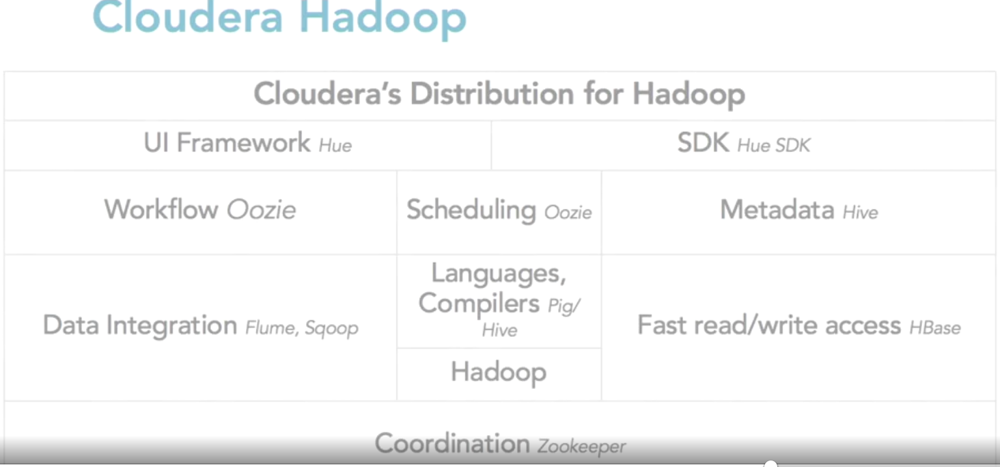
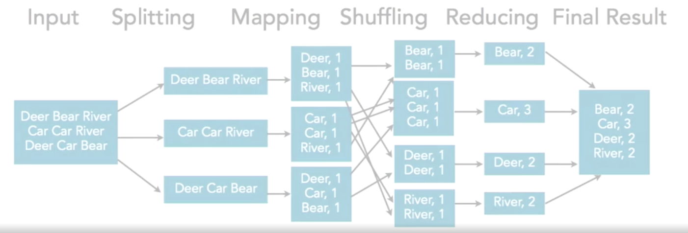

## Lynda: Learning Hadoop（2015）

### 1 why move away from relational database

##### understanding the limits of relational database management systems

传统关系型数据库缺点：

扩展性

速度

其他

​	查询能力

​	复杂处理


hadoop被设计出来是为了解决传统关系型数据库之外的问题的，不是取代关系


数据库的可选项：

​	文件系统（xml）

​		other fields

​		HDFS（Hadoop Distributed File System）用来取代现有的操作系统，可以在文件系统里进行复杂的数据管理

​	数据库

​		NoSQL（key/value redis, columnstore MongoDB, etc.）

​		RDBMS（MySQL）

​	

谷歌的GFS和HDFS是很像的，开源社区根据谷歌的文档开发出来的HDFS


Hadoop使用HDFS

HBase是NoSQL db（wide columnstore）


##### introducing CAP(consistency, availability, partitioning)

consistency

​	transactions

availability

​	up-time

partitioning

​	可扩展性


传统数据库只能满足三个中的两个

hadoop有：

​	可扩展性（可分区）

​		廉价存储

​	灵活性（高可用）

​		可无限扩展


##### understanding big data

数据分类

LOB（line for business）

​	通常是事务的，不适合hadoop

behavioral data

​	适合hadoop


### 2 what is hadoop

##### introducing hadoop

两个核心组件+其他项目或库

hdfs

mapreduce

hbase，hive，pig，etc


hadoop的发行版本

​	开源：apache hadoop

​	商业版：cloudera，hortonworks，MapR

​	cloud：AWS，widows azure HDInsight（不是所有的商业版都有云版本的）


选择hadoop的原因

​	便宜：扩展到PB

​	更快：并行数据处理

​	更好：适合特定类型的大数据


##### understanding the difference between hbase and hadoop

hbase不是hadoop的，它们是分开的

类比：

mapreduce - hadoop

c++ - 面向对象编程


##### exploring the future of hadoop


### 3 understanding hadoop core components

##### understanding java virtual machines(JVMs)

hadoop的进程运行在不同的jvm中

jvm之间不分享状态

jvm进程 hadoop1和hadoop2区别很大


##### exploring hadoop distributed file system(HDFS) and other file systems

【hdfs，默认数据三份拷贝

​	分布式的（给三个拷贝），假分布式的（为了测试，只在一个机器上一个节点）

【普通文件系统

​	standalone（standalone模式，对于学习mapreduce来说很方便）

【cloud 文件系统（类似于standalone模式）

​	aws：S3

​	azure：blob storage


single node

​	本地文件系统

​	单个jvm

假分布式的

​	使用hdfs

​	jvm守护进程运行所有进程，在单个机器上

分布式的

​	使用hdfs

​	jvm守护进程运行在不同的机器上


##### introducing hadoop cluster components


yarn：Yet Another Resource Negotiator

mapreduce2不是建立在mapreduce1之上的





##### exploring the apache and cloudera hadoop distributions

##### exploring the hortonworks and mapR hadoop distributions

##### exploring cloudera hadoop via cloudera live

基于web的开放尝试平台确实挺好的，可以快速直观感受到不同库工具的作用


##### understanding hadoop versions

最初的release版本在2007

稳定大版本release

​	1.0版本，2011

​	2.2版本，2013，yarn（mapreduce 2）

​	2.4版本，2014，企业特性


基于云的hadoop发行版

优化的，部分管理的发行版，不需要管理，只要操作就可以了

​	AWS：Elastic MapReduce

​	Microsoft：HDInsight


##### using amazon web services(AWS) and microsoft cloud-hosted hadoop

aws可以选择，在价格低于多少的时候执行job，否则就不执行，这种方式可以省钱


### 4 setting up the hadoop development environment

##### understanding the parts and pieces

【选择什么发行版

【选择哪个版本

【安装在哪里

​	本地

​	虚拟机

​	上云

【设置hadoop的数据存储

​	local

​		文件系统（单机）

​		hdfs（假分布式、分布式）

​	cloud

​		云文件系统（S3，BLOB）

​		hdfs

【设置hadoop的lib

​	mapreduce

​		1.0 or 2.0

​	other lib

​	dev tools


##### hosting hadoop locally with the cloudera developer distribution

可以使用cloudera的virtual box来加速搭建hadoop


##### setting up the cloudera hadoop developer virtual machine(VM)

##### adding hadoop libraries to your test environment

hive：sql-like query，创建批处理任务（mapreduce）

pig：ETL-like 脚本语言

impala：sql-like query，和进程交互，在内存中


Mahout：机器学习算法

spark：计算内存里的分布式数据集

storm：复杂事件处理


##### picking your programming language and IDE

java

python

R


##### exploring the cloudera VM IDE


### 5 understanding mapreduce 1.0

##### understanding MapReduce 1.0

数据有三份，map方法会在这三份数据上都执行，在每个节点上都执行

reduce只会在一些node上执行

hello world for mapreduce：word count


##### exploring the components of a mapreduce job

mapreduce是api，是一些库

​	job - mapreduce的工作实例单元

​	map task - 在每个节点上运行

​	reduce task - 在一些节点上运行

​	source data - HDFS 或其他地方


mapreduce daemons and services

jvms or services - 孤立的进程

​	job tracker - one（controller and scheduler）

​	task tracker - one per cluster（监控任务）

job 配置

​	为任务实例指定输出输出的位置

​	job client提交要执行的任务


mapreduce编程范式

​	standard - 使用java写

​	hadoop streaming - java base

​		其他语言来实现mapper reducer的逻辑

​	hadoop pips - 使用 c++

​	抽象的lib

​		hive，pig，etc（高层次的语言）；然后会生成底层的mapreduce


mapreduce的方式

| Lib    | 语言        |
| ------ | ----------- |
| HBase  | Java        |
| Hive   | HiveQL(HQL) |
| Pig    | Pig Latin   |
| Sqoop  | Python      |
| Oozie  | C#          |
| Mahout | JavaScript  |
| Others | R           |


hdfs数据是不可变的，不能修改旧的，只能生成新的；但是其他的文件系统可以覆盖

hdfs上的文件，经常添加时间戳后缀来保证唯一


##### working with the hadoop file system

hadoop的一些命令

```bash
hadoop fs -cat file:///file2
hadoop fs -mkdir /user/hadoop/dir1 /user/hadoop/dir2
hadoop fs -copyFromLocal <fromDir> <toDir>
hadoop fs -put <localfile> hdfs://nn.example.com/hadoop/hadoopfile
sudo hadoop jar <jarFileName> <method> <fromDir> <toDir>
hadoop fs -ls
# 也可以在hue web上看到file browser，hdfs的文件
hadoop fs -ls /user/hadoop/dir1
hadoop fs -cat hdfs://nn1.example.com/file1
hadoop fs -get /user/hadoop/file <lcoalfile>
```


##### using the console to run a mapreduce job

hue web界面

​	file browser，job browser


##### reviewing the code for a mapreduce wordcount job

word count示例




map和reduce一定是自己写，其他部分可以默认，也可以覆盖

mapreduce api版本

v1

​	org.apache.hadoop.mapred

v2

​	org.apache.hadoop.mapreduce


mapreduce lib

```java
import org.apache.hadoop.fs.Path;
import org.apache.hadoop.conf.*;
import org.apache.hadoop.io.*;
import org.apache.hadoop.mapred.*;
import org.apache.hadoop.util.*;
```


关键组件

- input/output(data) - writable/write comparable
- mapper
- reducer
- partitioner
- reporter
- outputCollector


hdfs里的文件都是不可变的，那么我们做循环的聚合呢，那就使用特殊的数据类型——writable data types

- BooleanWritable 1Byte , （排序策略）false before,true after
- ByteWritable 1Byte, ascending
- DoubleWritable 8Byte, ascending
- FloatWritable 4Byte, ascending
- IntWritable 4Byte, ascending
- LongWritable

可以自己实现writable接口，来实现自己的包装类


Input types

| Format                       | Description                                                  |
| ---------------------------- | ------------------------------------------------------------ |
| TextInputFormat              | 文本文件中的每一行都是一条记录<LongWritable(offset of line), Text(content of line)> |
| KeyValueTextInputFormat      | 每一行是一条记录，第一个分隔符划分这条记录(默认是\t) <Text(分隔符之前), Text(分隔符之后)> |
| SequenceFileInputFormat<K,V> | reading files的序列                                          |
| NLineInputFormat             | 像TextInputFormat，每个分割有刚好N行 <LongWritable, Text>    |


output types

| Format                        | 描述                                                         |
| ----------------------------- | ------------------------------------------------------------ |
| TextOutputFormat              | 每条记录都写成一行文本，key和value都是字符串，被\t分割       |
| SequenceFileOutputFormat<K,V> | 把键值对写在sequence file format，和SequenceFileInputFormat一起使用 |
| NullOutputFormat<K,V>         | 没有输出                                                     |


##### running and tracking hadoop jobs

在生产环境下，需要配置JobConf的很多选项，输入路径，输出路径等等

在开发环境下，可以使用测试框架只在ide里跑

在开发环境下，可以打好jar包，在命令行里跑，指定jar、输入、输出

​	hadoop jar filename.jar input output

通过GUI（Hue，HDInsight console）


任务执行优化措施

​	投机执行 - 杀掉long-run的任务，基于设置的参数，环境中（常用）或代码中


### 6 tuning mapreduce

##### tuning by physical methods

优化mapreduce

​	任务执行前优化 - 数据预处理

​	数据导入时优化 - 进行压缩，这样数据会小一些

​	map阶段

​	shuffle阶段 - 很难，也很少见

​	reduce阶段

​	任务执行后 - 把一个大任务分成两个小任务，第一个任务可以更好的并行，这样第二个任务不用等很久


任务执行前优化

​	file size

​	压缩比 - 如果map计算任务轻，压缩比选大些；map任务重，压缩比轻一些；让cpu不闲也不超载

​	加密


##### tuning a mapper

combiner - 本地的reducer，可以减少数据在网络的传输

reduce -  (k2,list(v2))  -> (k3,v3)


每个方法越简单越好，如果很复杂就拆分，然后链式起来

每个map任务的时间最好控制在1-3分钟

定制partitioner：默认是hash partitioner

减少数据量，通过去除坏数据，无效数据

记录日志，监控数据溢出率（内存不够了，放到了磁盘里）（目标是map的输出数据等于放到磁盘里的数据）

定义map-only任务，没有reducer - 如照片处理


压缩比，不同的hadoop提供商不一样，找到当前提供商最高效的压缩比


写自己的input type，需要自己实现比较器、input分割器、定制partitioner


该用文本类型就用文本类型，该用数字类型就用数字类型；执行效率有差别


##### tuning a reducer

优化方式：

​	拆分大任务成小任务

​	日志和debug

​	二次排序

​	设置临界值，暂停任务，kill long run任务


​	在不需要reduce的时候就不要reduce

​	使用combiner


##### using a cache for lookups

使用分布式的缓存来缓存需要的文件

使用hdfs:// 或者 http:// JobConf设置里

在执行任务的时候，这些文件会被拷贝到每个datanode上

org.apache.hadoop.mapreduce.filecache.DistributedCache


数字类型的处理比text类型的快


### 7 understanding mapreduce 2.0/yarn

##### understanding mapreduce 2.0

1.0的缺点：

- 只能批处理，意味着没有交互，一个sql的结果要好久之后才能返回
- mapreduce任务的编码很复杂，开发人员少，任务不能满足所有的商业场景
- 缺少很多企业级特性（安全，高可用）


2.0

| mapreduce | 其他引擎 |
| --------- | -------- |
| yarn      | yarn     |
| hdfs      | hdfs     |

yarn的作用是在计算框架和hdfs之间抽象出了一个中间层，这样既有廉价存储，又有更快的处理速度


mapreduce 2带来了什么：

- yarn，通过yarn支持了很多框架，mapreduce不再是必需（甚至完全不需要底层生成mapreduce）
- 拆分了jobTracker的角色，变成了（资源管理+任务生命周期管理）
- 更多的便利（可扩展性）：分布式任务生命周期管理；支持多个hadoop mapreduce api版本在一个集群里
- 批处理或者实时处理（更加有交互的处理）
- 增加了企业级特性（安全，高可用）
- 执行时获得更多的灵活和控制
- 升级了分布式缓存：可以用来给任务分布缓存只读文件


##### coding a basic wordcount in java using mapreduce 2.0


```java
import java.io.IOException;
import java.util.*;
        
import org.apache.hadoop.fs.Path;
import org.apache.hadoop.conf.*;
import org.apache.hadoop.io.*;
import org.apache.hadoop.mapreduce.*;
import org.apache.hadoop.mapreduce.lib.input.FileInputFormat;
import org.apache.hadoop.mapreduce.lib.input.TextInputFormat;
import org.apache.hadoop.mapreduce.lib.output.FileOutputFormat;
import org.apache.hadoop.mapreduce.lib.output.TextOutputFormat;
        
public class WordCount {
        
 public static class Map extends Mapper<LongWritable, Text, Text, IntWritable> {
    private final static IntWritable one = new IntWritable(1);
    private Text word = new Text();
        
    public void map(LongWritable key, Text value, Context context) throws IOException, InterruptedException {
        String line = value.toString();
        StringTokenizer tokenizer = new StringTokenizer(line);
        while (tokenizer.hasMoreTokens()) {
            word.set(tokenizer.nextToken());
            context.write(word, one);
        }
    }
 } 
        
 public static class Reduce extends Reducer<Text, IntWritable, Text, IntWritable> {
    public void reduce(Text key, Iterator<IntWritable> values, Context context) 
      throws IOException, InterruptedException {
        int sum = 0;
        while (values.hasNext()) {
            sum += values.next().get();
        }
        context.write(key, new IntWritable(sum));
    }
 }
        
 public static void main(String[] args) throws Exception {
    Configuration conf = new Configuration();
        
        Job job = new Job(conf, "wordcount");
    
    job.setOutputKeyClass(Text.class);
    job.setOutputValueClass(IntWritable.class);
        
    job.setMapperClass(Map.class);
    job.setReducerClass(Reduce.class);
        
    job.setInputFormatClass(TextInputFormat.class);
    job.setOutputFormatClass(TextOutputFormat.class);
        
    FileInputFormat.addInputPath(job, new Path(args[0]));
    FileOutputFormat.setOutputPath(job, new Path(args[1]));
        
    job.waitForCompletion(true);
 }       
}
```


##### exploring advanced wordcount in java using mapreduce 2.0

可以加一些变量来做控制

可以使用分布式缓存：DistributedCache.getLocalCacheFiles(job);


### 8 understanding hive

##### introducing hive and hbase

hive：

类似sql的查询语言，会生成一个或多个mapreduce任务；

是facebook开发的库，facebook有不错的文档；HQL，H-SQL；

很像sql，但和sql并不完全兼容，目标是最终兼容；

是批处理，不是交互的；

经常和HBase一起使用；

需要开启hive 服务；

管理metastore db：用来存储hive table的元数据；可以是嵌入式db，本地db，远程db；schema tool


HBase：宽列 NoSQL DB；在HDFS 数据上使用create table；通过hive进行查询


HBase 和Hive（包含HQL）整合在一起了；商业发行版的hadoop已经整合了hbase hive，但是apache hadoop没有整合，需要单独下载


##### understanding hive

##### revisiting wordcount using hive

sql中join操作在hive里是非常吃资源的

```sql
CREATE TABLE wordcount AS
SELECT word, count(1) AS count
FROM (SELECT EXPLODE(SPLIT(LCASE
         (REGEXP_REPLACE
            (line,'[\\p{Punct},\\p{Cntrl}]',''))
AS word FROM myinput) words
GROUP BY word
ORDER BY count DESC, word ASC
```


##### understanding more about hql query optimization

hive的查询优化：

- partitioning, bucketizing, sampling(using subsets)
- cost-based optimization(CBO)
- using column-based statistics(like indexing)


可以使用命令看hive的具体执行步骤

```bash
explain select count(*) from customer_address;
```


##### exploring hive tools in the cloudera distribution and the hue web console

在Hue web界面里，可以直接进入Hive界面，执行hql，explain hql


### 9 understanding pig

##### introducing pig

pig 

- hadoop 的 ETL lib；抽取、转换、载入
- 生成mapreduce任务
- yahoo开发的
- pig lib 使用 pig latin语言：Oink Grunt


在有需要ETL任务的时候，使用pig，pig是专门处理这类任务的

ETL process and flow 代码如下：

```
LOAD <file>
FILTER, JOIN, GROUP BY, FOREACH, GENERATE
<values>
DUMP <to screen for testing>
STORE <new file>
```


##### understanding pig

pig 中的概念：

【数据】

- field：一个数据
- tuple：数据的集合，如key value
- bag：tuple的集合	
- relation：一个完整的数据库

【filter】

- FILTER <set> BY <value>=<number>, FILTER A BY quantity > 2000;
- 支持的运算：逻辑运算- NOT AND OR，关系运算：>, <, ==, !=, >=, <=

【方法，函数】

pig有一个强大的函数库：

- General: AVG, MAX, TOKENIZE
- Relational: FILTER, MAPREDUCE （在pig脚本里调用mr任务，可以是python写的，java写的）
- String: LOWER, SUBSTRING
- Math:ABS, LOG, ROUND
- Loading/Storage:JSONLOADER

【UDFs】User Defined Functions

如果觉得pig提供的方法性能不够高，可以自己写函数，作为一项优化

写函数，注册函数，测试函数；函数可以用java或者python写


##### exploring use cases for pig

运行pig的方式：

- scripte/batch mode: hadoop shell上运行
- Grunt/Interactive mode: pig shell上运行
- 内嵌mode: 在java里运行


wordcount pig脚本

```
lines = LOAD '/user/hadoop/HDFS_File.txt' AS (line:chararray);
words = FOREACH lines GENERATE FLATTEN(TOKENIZE(line)) as word;
group = GROUP words BY word;
wordcount = FOREACH grouped GENERATE group, COUNT(words);
DUMP wordcount;
```

需要能够分析出来在哪一步生成map和 reduce


##### exploring pig tools in the cloudera distribution

Hue web，pig tool，pig example

可以在pig脚本里注册jar，也就是一个mapreduce任务，然后和pig 脚本一起执行


### 10 understanding workflows and connectors

##### introducing Oozie（驯象人）

是hadoop任务(pig, hive)的工作流调度者的库

可以基于时间或者其他因素（有新的数据到了集群）来调度


优化 Oozie 工作流：

不同的提供商可能有更好的调度者（Luigi，Azkaban），所以不一定使用Oozie


命令行语法：围绕任务和一组任务；oozie start, stop, suspend, resume, info；核心语法是xml

Hue web Oozie tool：更方便


##### building a workflow with Oozie

Hue - workflow - dashboard


##### introducing Sqoop

命令行工具，用来在关系数据库和hadoop（hdfs）之间导入导出数据

也可以直接导入Hive or HBase 表

connectors for：Oracle，SQL Server， 其他


在sqoop1的时候，有oracle和sql server的连接器；在sqoop2，抛弃了，直接使用jdbc连接器来连接所有关系数据库

```bash
sqoop import
	--connect <JDBC connection string>
	--table <tablename>
	--username <username>
	--password <password>
	--hive-import
```


优化sqoop的方式：

- direct dump（速度快），JDBC，指定数据库的连接器
- 监控并行连接的数量
- 使用其他类似sqoop的产品
- sqoop1的特性比sqoop2的多


##### inporting data with Sqoop（舀水）

Hue，data browser，sqoop，sqoop脚本是包在一个Oozie工作流里的


##### introducing Flume（水槽）

一个处理日志数据（日志文件）的库

使用流式数据（传感器）

Flume使用了复杂的架构（复杂且强大），关键组件：agent和channels


支持的datasink

- Avro/Thrift
- HTTP/Twitter
- JMS(ActiveMQ)
- Others


在大多数发行版中，Flume不是默认安装的

不要低估了Flume的复杂程度，必需正确安装，必须定义架构，必须大规模测试


##### introducing zookeeper（动物园管理员）

- hadoop配置信息的中心服务
- 让分布式应用成为可能
- 允许应用“合唱”


为什么使用zookeeper：

分布式的内存内计算：client节点之间有数据共享；数据同步很重要；有很多object，比如locking，sync，queues，其他；


优化zookeeper

- 在生产环境搭建zk很复杂：必须正确设置；必须用生产级别的负载来测试
- 经常会使用第三方的zk替代产品


##### using zookeeper to coordinate workflows

Hue，Data Browser，zookeeper


### 11 other hadoop libraries

##### introducing impala（黑斑羚）

由于有速度的需求，而诞生impala

交互版本的Hive：快10-100倍

in-memory，columnstore；因为在内存中计算，所以不能太大

是hive的补充，但不是pig的替代

不会使用mapreduce api，也就不会生成mapreduce任务

是cloudera特有的库

依赖共享的metastore（hive也依赖），如果修改了hadoop data，需要更新metastore，否则impala不能用；run ‘invalidate metadata’ 后 refresh；因为在impala的view下，metadata不会自动更新，hive的view下，会自动更新metadata


优化impala：

- query tuning: hints, timeouts, zipped data
- 使用其他的替代品：hortonworks的Stinger


##### using impala

Hue，Query Editors，Impala


##### introducing mahout（驯象人）

一个常用的机器学习算法的库

许多数据挖掘的算法（推荐系统，类似的：Pandora；分类；聚类）

mahout是为hadoop这种大数据设计的


mahout概念：

- data as vectors
- 数据挖掘算法


如何使用mahout：常常放在java项目中，通过maven

如何优化mahout：可以使用RHadoop库（mahout类似的库）


##### introducing storm

复杂的事件处理场景（比如通过分析数据，保证油井挖掘机不宕机）

用在接近实时的场景中

因为处理的场景很特殊，没有默认包含在大多数发行版中

记住：Flume用来处理日志，storm用来处理流


### 12 unserstanding spark

##### introducing apache spark

基于内存的分布式的数据处理库

目标是加速任务的执行，比如：批处理，机器学习，交互式查询

impala是开发商添加的功能，spark是开源社区添加的功能

在很多发行版中默认包含，如cloudera

impala：宽列的，规则数据的聚合等操作

spark：基于内存优化所有hadoop的任务负载


Hue，Query Editors，spark


##### understanding the hive landscape

人们想用sql类似的语法，hive不够快，mapreduce不能解决现实世界的全部问题

现实：

- 库增加了复杂度：只有需要用到库才用，选择成熟的高性能库
- 企业经常在开源库上测试，但花钱买产品


hadoop生态都是免费开源——这是个神话。

Google发布了下一代hadoop产品：BigQuery：Query-as-a-Service；目标是处理PB级数据，基本兼容sql的语法

开源版本：Dremel，apache Drill

Drill是Google Dremel系统的开源版本，可作为称为Google BigQuery的基础设施服务使用。


### 13 visualizing hadoop output with tools

##### using tableau, excel, and traditional tools

1 在excel里安装power query -- from other source -- from hadoop file（HDFS）/ from microsoft azure HDInsight / from microsoft azure blob storage

2 tableau desktop app


##### using D3, bigML, and new tools

splunk, hunk (hadoop on splunk): 把日志上传上去，然后处理，然后可视化，付费服务；

d3: js lib

Circos.ca: 制作的图表确实太好看了，不是传统的表格、折线图、直方图，而是复杂的多维展示

datameer: 

bigML:


### conclusion

两个大方向：

​	开发，分析：写查询语句

​	管理：监控，安全


