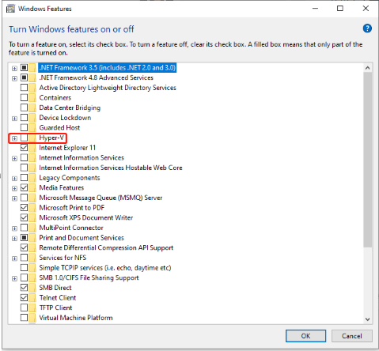
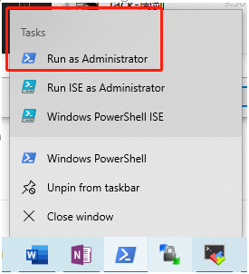
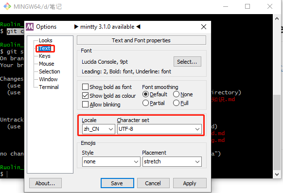

# Problems


## chrome缓存disable

https://blog.csdn.net/xinghuo0007/article/details/72637762


## 把typora改为微软雅黑+Consolas

https://www.cnblogs.com/asheng2016/p/8979282.html


## 如何卸掉Hyper-v

首先关闭这个



然后执行命令 bcdedit /set hypervisorlaunchtype off



然后重启，再安装virtualBox即可


## java.security.InvalidAlgorithmParameterException: the trustAnchors parameter must be non-empty

https://bugs.eclipse.org/bugs/show_bug.cgi?id=532056

lib\security\cacerts

 

## java.security.InvalidKeyException:illegal Key Size

[https://gitee.com/jfinal/jfinal-weixin/wikis/%E6%B6%88%E6%81%AF%E7%9A%84%E5%8A%A0%E8%A7%A3%E5%AF%86%E6%8E%A5%E5%8F%A3JCE%E6%97%A0%E9%99%90%E5%88%B6%E6%9D%83%E9%99%90%E7%AD%96%E7%95%A5](https://gitee.com/jfinal/jfinal-weixin/wikis/消息的加解密接口JCE无限制权限策略)


## How do I activate a Spring Boot profile when running from IntelliJ?

-Dspring.profiles.active=dev_local


## git bash中git status中文乱码解决方案

**windows版本解决方案：**

git config --global core.quotepath false

git bash右键，设置




**mac版本解决方案**

https://www.cnblogs.com/ayseeing/p/4268655.html

git config --global core.quotepath false

1、打开oh-my-zsh配置文件 ~/.zshrc 
2、在文件最后面添加如下代码：

```
export LC_ALL=en_US.UTF-8
export LANG=en_US.UTF-8
```

3、重启下终端（terminal）或输入 source ~/.zshrc


## git commit -m加备注时如何换行

先输入英文的双引号，但是不要输入后面的双引号，然后就可以输入多行了

直到最后输入英文的双引号，再回车就是结束


## git 修改上一次的commit备注

git commit --amend -m "通过amend修改commit备注"


## git 修改user.email

git config --global --unset user.email

git config --global --replace-all user.email "输入你的邮箱"

git config --global user.email "输入你的邮箱"

git config -l


## 加速github的访问速度

Q：为什么访问速度会很慢？

A：GitHub的CDN域名遭到DNS污染。

GitHub在中国大陆访问速度慢的问题原因有很多，但最直接和最主要的原因是GitHub的分发加速网络的域名遭到DNS污染。

由于GitHub的加速分发CDN域名assets-cdn.github.com遭到DNS污染，导致无法连接使用GitHub的加速分发服务器，才使得中国大陆访问速度很慢。


Q：如何解决DNS污染？

A：通过修改Hosts解决污染问题。

一般的DNS问题都可以通过修改Hosts文件来解决，GitHub的CDN域名被污染问题也不例外，同样可以通过修改Hosts文件解决。

将域名解析直接指向IP地址来绕过DNS的解析，以此解决污染问题。


1、打开网站： https://www.ipaddress.com


2、查询网址的IP

```
# GitHub Start

140.82.113.4 github.com
192.30.253.119 gist.github.com
185.199.108.153 assets-cdn.github.com
185.199.109.153 assets-cdn.github.com
185.199.110.153 assets-cdn.github.com
185.199.111.153 assets-cdn.github.com

199.232.5.194 github.global.ssl.fastly.net

199.232.28.133 githubusercontent.com
199.232.28.133 raw.githubusercontent.com
199.232.28.133 gist.githubusercontent.com
199.232.28.133 cloud.githubusercontent.com
199.232.28.133 camo.githubusercontent.com
199.232.28.133 avatars0.githubusercontent.com
199.232.28.133 avatars1.githubusercontent.com
199.232.28.133 avatars2.githubusercontent.com
199.232.28.133 avatars3.githubusercontent.com
199.232.28.133 avatars4.githubusercontent.com
199.232.28.133 avatars5.githubusercontent.com
199.232.28.133 avatars6.githubusercontent.com
199.232.28.133 avatars7.githubusercontent.com
199.232.28.133 avatars8.githubusercontent.com
# GitHub End
```


3、加入host文件

```
C:\Windows\System32\drivers\etc\hosts （需要管理员权限)

or

/etc/hosts
```


4、windows刷新缓存 ipconfig /flushdns


## 公司电脑突然无法开机，主机指示灯是开机的样子，但是没有视频信号

原因：主板里有静电，断开电源，按一下电脑开关，将静电放掉

解决方法：电脑电源线拔下来，按一下电脑开关，然后接上电源开机


## redis 登录客户端命令

https://blog.csdn.net/shixiaoguo90/article/details/80196009


## mysql磁盘读写高

sync_binlog

https://www.cnblogs.com/z-books/p/7324949.html

set GLOBAL sync_binlog=0;


innodb_flush_log_at_trx_commit


## 登录mysql

https://blog.csdn.net/helloxiaozhe/article/details/76229074


## kubelet日志报错

orphaned pod "9fb9d758-4bfa-41d2-b97e-599a87258a49" found, but volume paths are still present on disk : There were a total of 1 errors similar to this. Turn up verbosity to see them.


解决办法：


cd /var/lib/kubelet/pods

rm -rf 9fb9d758-4bfa-41d2-b97e-599a87258a49


## 查看文件夹下所有文件的大小

du -sh


## 查看网络io

iftop


## 查看磁盘io

iostat

iotop -oP


## docker容器内执行bash命令

docker exec -it docker_name /bin/bash


## 研究下载方式原理

https://www.jianshu.com/p/72b7a64e5be1


方式大全：

​	**传统中心式下载**：http、ftp、sftp；依赖CDN减少延迟

​	**BT种子**：BitTorrent、BT、比特流；对等文件共享（`P2P`）的通信协议，对等网络系统；下载时，BT客户端首先解析种子文件得到 Tracker 地址，然后连接Tracker 服务器。Tracker 服务器回应下载者的请求，提供其他下载者（包括发布者）的IP。下载者再连接其他下载者，根据种子文件，两者分别告知对方自己已经有的块，然后交换对方所没有的数据。此时不需要其他服务器参与，分散了单个线路上的数据流量，因此减轻了服务器负担。如何制作种子：https://jingyan.baidu.com/article/b24f6c82e06df186bfe5dad6.html。

​	**hash码磁链**（BT下载新形式）：DHT 网络技术，可以在无 Tracker 服务器的情况下下载；全称为分布式哈希表（Distributed Hash Table），是一种分布式存储方法。在不需要服务器的情况下，每个客户端负责一个小范围的路由，并负责存储一小部分数据，从而实现整个 DHT 网络的寻址和存储。使用支持该技术的 BT 下载软件，用户无需连上 Tracker 就可以下载，因为软件会在 DHT 网络中寻找下载同一文件的其他用户并与之通讯，开始下载任务。--- 磁力链接是一种特殊链接，但是它与传统基于文件的位置或名称的普通链接不一样，它只是通过不同文件内容的Hash结果生成一个纯文本的“数字指纹”，并用它来识别文件。

通常：magnet:?xt=urn:btih:开头的都是磁力


## 配置foxmail客户端

https://service.mail.qq.com/cgi-bin/help?subtype=1&&id=28&&no=371


## vs code上js的插件

https://blog.fundebug.com/2018/11/20/10-must-have-vs-code-extensions-for-javascript-developers/


## iphone 连接 mac，不断重连

把iphone设置成省电模式即可


## mac上teams启动失败

等待teams启动循环失败后，点击注销，然后重新输入账号登陆，如果又失败，点击重试


## mac突然无法上网

多半是chrome崩溃了，需要重启电脑